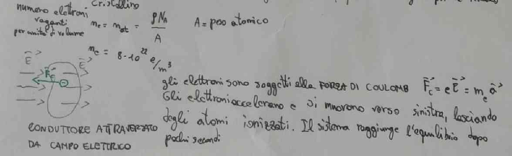
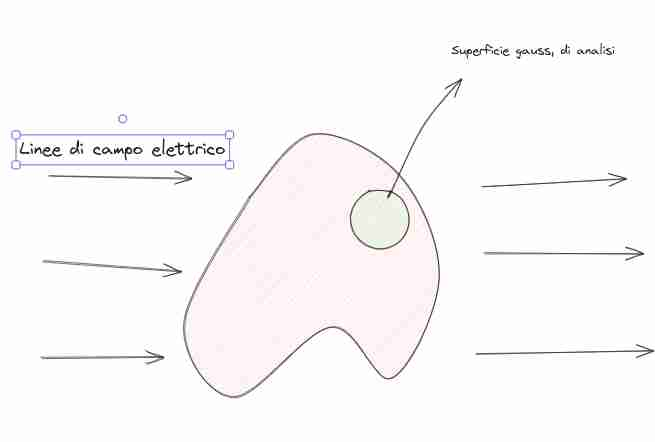
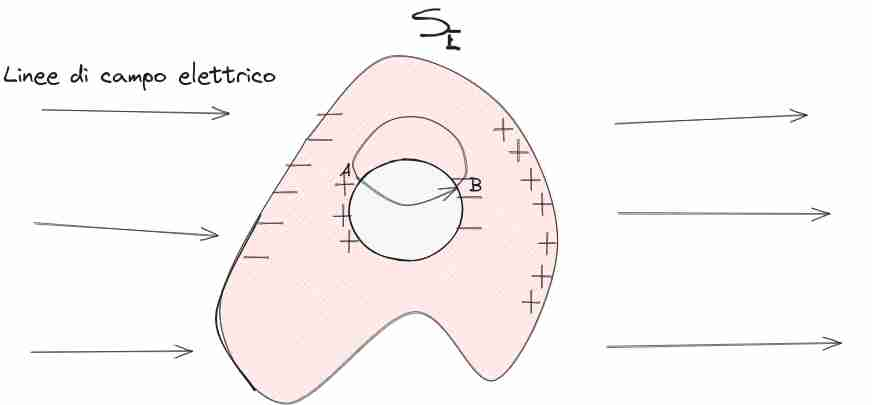
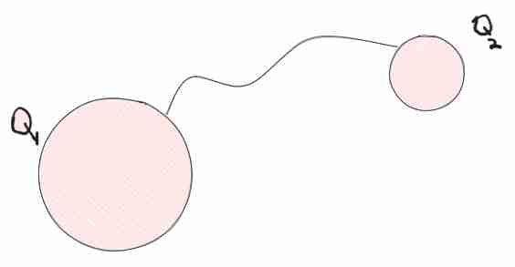
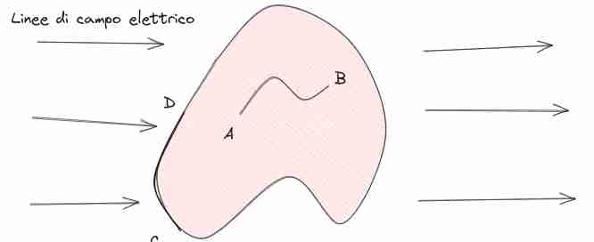

## Campo elettrico nei materiali

Se prendiamo un **conduttore**, gli elettroni in questi materiali sono liberi, significa che sono liberi di muoversi come vogliono, si può dire che "vadano in giro" (per esempio questo vale per il rame).

il **reticolo cristallino** è al struttura regolare che è comune nei materiali, in cui gli atomi sono sempre a distanza costante (o comunque a pattern regolari) uno dall'altro $r$ per esempio.

### Campo e materiali (6)
#### Schermatura del campo (!) 
Quando un materiale conduttore è sottoposto a un campo elettrico *gli elettroni si mettono in modo da **schermare*** il campo esterno, in modo tale da raggiungere un equilibrio.

Se andiamo a chiamare $\vec{E}_{i}$ il campo elettrico indotto dentro il materiale, allora avremo che 

$$
0 = \vec{F}_{0} = e(\vec{E}_{i} + \vec{E}) \implies\vec{E}_{i} = -\vec{E}
$$

L'osservazione principale che porta a questo risultato è il fatto che nel *primo momento* c'è uno **spostamento di carica**. Questo è l'unico risultato sperimentale che abbiamo.
Le cariche sono **ferme** all'interno del conduttore.

Ma questa carica da dove origina? Dove sono posizionate? Sono sulla superficie o anche dentro il materiale?

#### Cariche non sono dentro al conduttore (!) 
> In ogni punto interno al conduttore, all'equilibrio la carica elettrica è nulla, come avveniva in assenza del campo elettrico.

Questo implica che da dentro il conduttore non cambia niente.

Si può dimostrare con la [[Divergenza e Circuitazione|divergenza]], praticamente che la densità di carica volumetrica resta nulla, perché il campo elettrico totale è ancora nullo.

$$
\vec{\nabla} \cdot\vec{E}_{T} = \frac{\rho}{\varepsilon_{0}} \land \vec{E}_{T} = 0 \implies \rho=0
$$
Si può anche dimostrare usando [[Legge di Gauss]] per i campi elettrici

#### Cariche si spostano in superficie 
> Lo spostamento di cariche elettriche determinato dal campo elettrico esterno **all'equilibrio** si risolve in un ri-arrangiamento di carica che interessa solo la superficie del conduttore 

La componente **tangente** non esiste sulla superficie, perché altrimenti le cariche si muoverebbero, invece la *componente normale* esiste sigma su $\varepsilon_{0}$, Nel caso di cariche positiva c'è proprio una forza **sempre** normale alla superficie, che spinge cariche fuori, in presenza di campo elettrico

Un altra spiegazione per cui è sempre normale è riguardante la differenza di potenziale, sappiamo che 
$$
dV = \nabla V \cdot ds = -\vec{E} \cdot ds
$$
Sappiamo che per una componente tangenziale su superficie equipotenziale la variazione di $V$ è nulla, quindi non esiste nessuna componente tangenziale, solamente quella normale.
Possiamo anche scrivere

$$
\nabla V = \frac{dV}{dn}
$$
dove $\hat{n}$ è il vettore normale alla superficie equipotenziale

Se è negativa è esattamente il contrario

#### Influenza sul campo elettrico 
![[Materiali e campo elettrico-1697449430923.jpeg|400]]

> Dato un conduttore immerso in un campo elettrico esterno, all'equilibrio, altera le linee di campo **anche** all'esterno del conduttore. 
> Il cambiamento delle linee di campo dipende dalla **geometria** del conduttore.
> Le linee di campo sulla superficie del conduttore sono **normali** e hanno modulo $\frac{\sigma}{\varepsilon_{0}}$

Questo implica -> **cambio del campo elettrico**.
L'induzione elettrostatica cambia il campo elettrico esterno, perché serve per schermare all'esterno.
Quindi basta anche un conduttore neutro per cambiare il campo esterno
2. Un altro modo per cambia il campo è introdurre nuove cariche.

Questo è anche un modo per **testare la conduttività di un materiale**, le linee di campo *DEVONO* essere 90 gradi ad entrare

#### Superficie equipotenziale come conduttore 
> La superficie del conduttore è equipotenziale, così come l'interno

Per avere questo risultato vedere sotto [[#Potenziale sulla superficie]].

#### Campo elettrico in geometria cava 

> Se un conduttore cavo viene immerso in un campo elettrico esterno, all'equilibrio, il campo elettrico all'interno della cavità è nullo e **non vi sono cariche elettriche indotte** sulla superficie della cavità

Poniamo che la nostra geometria abbia un buco, è corretto che certe cariche si mettono sulla superficie della nostra geometria?

Se proviamo a considerare Gauss una superficie che comprende tutta la superficie, la **carica totale** della nostra superficie è 0, ma non mi dà informazioni su come sono messe le cariche, stessa cosa probabilmente per la divergenza utilizzato in questo caso.

Consideriamo in questo caso la [[Divergenza e Circuitazione|circuitazione]], allora
$$
\oint_{\Gamma}\vec{E} \cdot d\vec{r} = 0 = \int _{A}^{B} \vec{E} \, d\vec{r} + \int _{B}^{A} \vec{E} \, d\vec{r}  = \int _{A}^{B} \vec{E} \, d\vec{r} 
$$
Questo perché la forza è conservativa, prendo una circuitazione che *si  muova SULLA* linea di campo e si chiuda dentro al conduttore. (l'integrale dentro il conduttore è nullo perché il campo stesso è nullo.)

Mentre nel buco il campo è normale, quindi avremmo che

$$
 \int _{A}^{B} \vec{E} \, d\vec{r}  =  \int _{A}^{B} \lvert \vec{E} \rvert  \, dr \cos 0 \neq 0, \text{ nel caso in cui il campo sia presente}
$$

Quindi $\vec{E} = 0$, questo è il **principio di schermatura**, se abbiamo qualcosa di conduttore, non passa.
Negli ascensori se varia troppo in fretta, non viene fermato, perché gli elettroni ci mettono un po' a rimettersi in sesto. Un altro motivo è che non è puramente metallica (conduttrice) questo ascensore.

### Altri fenomeni
#### Singola Carica elettrica in geometria cava 
![[Materiali e campo elettrico-1697452550332.jpeg|300]]
Le cariche si sposteranno, e cercheranno anche in questo caso di schermare.
Se considero una superficie che li rinchiude, in questo caso avrò un campo elettrico.
$$
\oint_{\Sigma} \vec{E} d\vec{s} = \frac{Q_{T}}{\varepsilon_{0}} = \frac{1}{\varepsilon_{0}} (Q + Q_{I}) = 0 \implies Q_{I} = Q
$$
Ossia la carica sulla superficie è **esattamente uguale alla carica nel buco**, per questo motivo scherma, il motivo per cui fa 0 è perché direttamente sulla superficie

Flusso esterno:
$$
\oint_{\Sigma} \vec{E} d\vec{s} = \frac{1}{\varepsilon_{0}} (Q + Q_{C}) = \frac{Q}{\varepsilon_{0}}
$$
Perché la carica del conduttore è neutra, per ipotesi non era carica. $Q_{C} = Q_{I} + Q_{E}$ ossia carica interna (sul buco interno e sul buco esterno), ma in questo caso allora posso concludere che 
$Q_{E} = -Q_{I} = Q$, ossia sia una superficie esterna, sia la superficie interna vengono influenzate da questa carica.

#### Induzione completa 
![[Materiali e campo elettrico-1697452550332.jpeg|200]]
Fenomeno descritto in precedenza è **l'induzione completa** come fenomeno. Nel caso in cui **tutte le linee di campo** entrano nel conduttore.
In un certo senso se stai fuori dal materiale conduttore, è come se lasciasse passare il campo senza problemi (se sto molto lontano **sembra singola carica**) (invece di renderlo radiale, sto cambiando leggermente la\ direzione del campo *sulla superficie* se sto vicino).
**Il campo interno non viene schermato**

#### Materiale conduttore carico 
Supponiamo di avere un materiale conduttore carico, anche in assenza di campo elettrico.
Nel caso precedente avevamo analizzato il caso di un conduttore neutro in campo elettrico, la differenza qui è che è il conduttore stesso che è carico

Posso avere esattamente le stesse proprietà dette prima per conduttore immerso in campo elettrico
1. Le cariche sono ferme
2. Potenziale elettrico è costante
3. La carica elettrica dentro il conduttore è 0
4. campo elettrico è normale sulla superficie ed è $\frac{\sigma}{\varepsilon_{0}}$
5. Le cariche sono sulla superficie (si provano e repellere il più possibile).
6. Se il conduttore è cavo allora le cariche restano su quella esterna.

Una altra applicazione è il **parafulmine** perché la carica si distribuisce sempre all'esterno.

#### Distribuzione di carica e densità superficiale in conduttori connessi ---

Supponiamo di avere due sfere connesse da un filo conduttore (quindi la carica è libera di connettersi), ci andiamo a chiedere che se metto $Q$ in questo sistema, in che modo si distribuisce?
Io so che $R_{1} = 2R_{2}$
Noi sappiamo che il **potenziale sulla superficie** è uguale, i due potenziali devono essere uguali anche nel nostro caso (altrimenti forse non è bilanciato)
$$
V(1) = V(2) \implies \frac{1}{4\pi\varepsilon_{0}} \frac{Q_{1}}{2R_{2}} = \frac{1}{4\pi\varepsilon_{0}} \frac{Q_{2}}{R_{2}} \implies \frac{Q_{1}}{Q_{2}} = \frac{R_{1}}{R_{2}} \implies Q_{1} = 2Q_{2}
$$
Dove abbiamo definito che 
$$
V(1) = V(R_{1}) - V(\infty) = V(R_{1}) = \int _{R_{1}}^{\infty} \vec{E}\, d\vec{r} = \int _{R_{1}} ^{\infty}  \lvert \vec{E} \rvert \, dr = \int _{R_{1}} ^{\infty}  \frac{Q}{4\pi\varepsilon_{0}} \frac{1}{ r^{2}} \, dr = \frac{Q}{4\pi\varepsilon_{0}}  -\frac{1}{r} | _{R_{1}}^{\infty} = \frac{1}{4\pi\varepsilon_{0}} \frac{Q}{R_{1}}
$$
**Densità superficiale:**

Qui andiamo ad analizzare come cambia la distribuzione di densità superficiale per cose connesse, noi sappiamo per definizione che
$$
\sigma = \frac{Q}{S} = \frac{Q}{4\pi R^{2}} \implies Q_{1} = \sigma_{1} 4\pi R_{1}^{2}
$$
Questo vale anche per $Q_{2}$ ossia abbiamo che 
$$
\frac{\sigma_{1}4\pi R_{1}^{2}}{
\sigma_{2} 4\pi R_{2}^{2}} = \frac{Q_{1}}{Q_{2}} = \frac{R_{1}}{R_{2}} \implies \frac{\sigma_{1}}{\sigma_{2}} = \frac{R_{2}}{R_{1}}
$$

In cui la densità superficiale è **maggiore**! Questo spiega anche i casi in cui più è piccola la superficie, la densità superficiale è maggiore, e questo spiega il motivo per cui nei temporali non piace stare in cose sottili. Se il raggio di curvatura è piccola, la carica sarà molto più densa. (punta = raggio di curvatura infinitesimo).
Sembra in qualche modo questo concetto una naturale ottimizzazione che segue [[Sampling Techniques|lola voronoi]] perché se una cosa è appuntita, cambia in fretta, ha bisogno di più punti per essere descritta, sembra che in modo naturale avviene anche in questo caso :).

Questa cosa funziona anche per la **Terra stessa**, e si potrebbe considerare come quantità infinita di carica, ed è questo il significato di mettere a terra (si può scaricare a terra carica in eccesso).

### Potenziale nei conduttori in equilibrio
#### Potenziale interno al conduttore 
Si può dimostrare, senza molta difficoltà che il potenziale è sempre 0 all'interno del conduttore.

$$
\Delta V = V(A) - V(B) = \int _{A}^{B}\vec{E} \cdot  \, d\vec{r} = 0 
$$
Perché il campo elettrico è 0.
-

#### Potenziale sulla superficie 

Per risultato precedente, è sempre perpendicolare col campo, quindi è sempre 0, perché stiamo considerando il prodotto coseno. 
Si può concludere che in questo caso l'intera superficie è equipotenziale.
$$
\Delta V = V(C) - V(D) = \int _{C}^{D} \vec{E} \, d\vec{r} = 0 
$$

