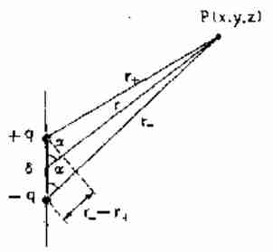
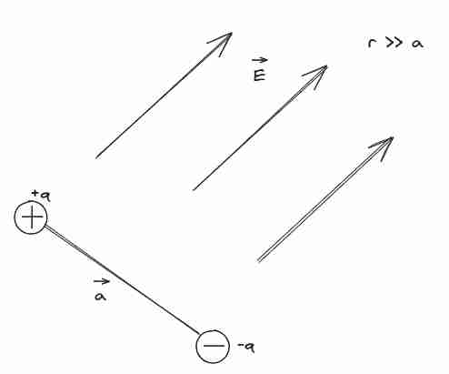
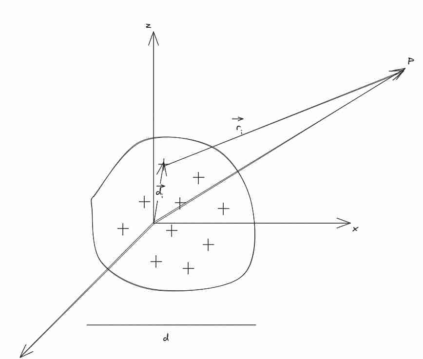

Questo problema è stato trattato in modo un po' più semplificato (nel caso in cui la carica era esattamente a metà in [[Campo elettrico#Dipolo elettrico]]).
Questo problema è stato storico, utilizzato per analizzare l'atomo.
### Potenziale del dipolo elettrico 🟩--

Per il **principio di sovrapposizione** possiamo affermare che 
$$
V(P) = V_{r^{+}} + V_{r^{-}} = \frac{q}{4\pi\varepsilon_{0}}\left( \frac{1}{r^{+}} - \frac{1}{r^{-}} \right)
$$
Ora possiamo fare certe approssimazioni, supponendo che $r \gg a$ con $r$ la congiungente fra il centro del dipolo e il nostro punto e $a$ la distanza fra le cariche, possiamo affermare che
$$
r^{+} - r^{-} = -a \cos \theta
$$
Sappiamo che l'angolo è lo stesso (più o meno), perché sappiamo che i due reggi sono ora paralleli (come assunsione di semplificazione)
Inoltre abbiamo che $r^{+}r^{-} = r^{2}$ perché il punto è molto lontano allora possiamo affermare che 
$$
\left( \frac{1}{r^{+}} - \frac{1}{r^{-}} \right) = \frac{a\cos \theta}{r^{2}}
$$
a
$$
V(P) 
= \frac{1}{4\pi\varepsilon_{0}}\frac{qa\cos \theta}{r^{2}}
= \frac{1}{4\pi\varepsilon_{0}}\frac{P\cos \theta}{r^{2}}
= \frac{1}{4\pi\varepsilon_{0}} \frac{\vec{P}\cdot \hat{r}}{r^{2}}
$$
1. Direttamente proporzionale al momento di tipolo
2. Inversamente proporzionale al quadrato del raggio.

### Campo elettrico nel dipolo
Abbiamo che è uguale a
$$
\vec{E} = \frac{1}{4\pi\varepsilon_{0}} \vec{P} \cdot \frac{\hat{r}}{r^{3}}
$$
Per trovare questo basta calcolare
$$
\vec{E} = -\vec{\nabla} V
$$

#### Componente parallela 🟩
Basta osservare che 
$$
\vec{E} = - \vec{\nabla}V = -\frac{\delta V}{\delta x}\hat{i}  -\frac{\delta V}{\delta y}\hat{j} -\frac{\delta V}{\delta z}\hat{k}
$$
Sappiamo che $\vec{P} = P\hat{k}$ e $\vec{r} = x\hat{i} + y \hat{j} + z \hat{k}$ allora abbiamo che $\vec{P} \cdot \vec{r} = Pz$
Poi abbiamo che $z = r \cos \theta$

Una volta esplicitato abbiamo che
$$
E_{z} 
= - \frac{\delta V}{\delta z} 
= -\frac{\delta}{\delta z} \left[ \frac{1}{4\pi\varepsilon_{0}} \frac{Pz}{(x^{2} + y^{2} + z^{2})^{3/2}} \right]  = -\frac{P}{4\pi\varepsilon_{0}}\left[ \frac{1}{(x^{2} + y^{2} + z^{2})^{3/2}} + z \left( -\frac{3}{2} \right) \frac{2z}{(x^{2} + y^{2} + z^{2})^{5/2}} \right] 
$$
$$
= \frac{1}{4\pi\varepsilon_{0}}\frac{P}{r^{3}}\left[ \frac{3z^{2}}{r^{2}} - 1 \right]  =  \frac{1}{4\pi\varepsilon_{0}}\frac{P}{r^{3}}\left[ \frac{3r^{2} \cos ^{2} \theta}{r^{2}} - 1 \right] = \frac{1}{4\pi\varepsilon_{0}}\frac{P}{r^{3}}\left[ 3 \cos ^{2} \theta - 1 \right]
$$
Nota : $E_{z} = E_{\parallel}$ dato che è **parallela al dipolo**.

#### Componente perpendicolare 🟨+
$$
E_{\perp} = \sqrt{ E_{x}^{2} + E_{y} ^{2} }
$$
Calcoliamo $E_{x}$ che si può scoprire che è simmetrico rispetto $y$
$$
E_{x} = - \frac{\delta V}{\delta x} = \frac{\delta}{\delta x} \left[ \frac{1}{4\pi\varepsilon_{0}} \frac{Pz}{(x^{2} + y^{2} + z^{2})^{3/2}} \right]  = -\frac{Pz}{4\pi\varepsilon_{0}}\left[ -\frac{3}{2} \frac{2x}{r^{5}} \right]  = \frac{1}{4\pi\varepsilon_{0}} \frac{3xPz}{r^{5}}
$$
e in modo equivalente con $y$
$$
E_{y} =  \frac{1}{4\pi\varepsilon_{0}} \frac{3yPz}{r^{5}}
$$

In questo modo otteniamo che
$$
E_{\perp} 
= \frac{3}{4\pi\varepsilon_{0}} \frac{Pz}{r^{5}}\sqrt{ y^{2} + x^{2} }
= \frac{3}{4\pi\varepsilon_{0}} \frac{P}{r^{5}}r\sin \theta \, r\cos \theta
= \frac{3}{4\pi\varepsilon_{0}} \frac{P}{r^{3}}\sin \theta \, \cos \theta
$$
Passaggi sopra sono giustificati perché $\sqrt{  y^{2} + x^{2}} = r \sin \theta$ e anche che $z = r\cos \theta$
Che ha senso perché c'è **simmetria circolare** su quel piano.
E vale praticamente per ogni punto nello spazio.

#### Analisi dei risultati (non fare)
$\theta=0$ abbiamo che $E_{\perp} = 0$ e rimane solamente 
$$E_{\parallel} 
= \frac{1}{4\pi\varepsilon_{0}} \frac{2P}{r^{3}}  
$$
Quindi è positivo, il campo.

$\theta=90$ questo è il caso trattato precedentemente. Abbiamo ancora che $E_{\perp} = 0$ 
e che 
$$
E_{\perp} = -\frac{1}{4\pi\varepsilon_{0}}\frac{P}{r^{3}}
$$
Che è coerente col risultato che abbiamo calcolato tempo fa.

**Esercizio:** In quale angolo si annulla $E_{\parallel}$ (analiticamente, basta l'angolo che annulla $3 \cos ^{2} \theta - 1$)
Che è uguale a 54.71 gradi.
Domanda: perché si annulla in qu
#### Con coordinate polari 🟥
Vedere 58 del Mazzoldi avremo che
$$
E = \frac{p}{4\pi\varepsilon_{0}r^{3}}(2\cos \theta \hat{r}+ \sin \theta \hat{\theta})
$$

Si può riscrivere anche il momento di dipolo in coordinate polari, e questo permette una scrittura ancora più clean, in cui risalta che è la componente radiale del momento di dipolo la parte di interesse nella relazione:

Perché possiamo riscrivere il momento di dipolo in coordinate polari e usare quello:
$$
\vec{p} = p\cos \theta \hat{r} - \sin \theta \hat{\theta}
$$
Se si riesce a riscriverlo in questa forma, la cosa diventa molto clean, posso trovare le componenti asse e piano mediano del dipolo subito, plug and play diciamo.
Infatti avremo che
$$\vec{E} = \frac{1}{4\pi\varepsilon_{0}r^{3}}(3p\cos \theta \hat{r} - \vec{p} )$$
### Dipolo immerso in campo elettrico

**NOTA:** Posso *assumere* il valore di $\vec{E}$ come **costante** sulle due cariche perché tanto varia molto molto poco. Anche se non ho capito esattamente il ragionamento.

Supponiamo che la carica negativa sia posta su $\vec{r}$ *quindi il sistema di riferimento è qualunque* e che $r \gg a$.

#### Energia potenziale del dipolo 🟩
Usando esattamente il metodo trattato in [[Condensatori nel vuoto]], basta applicare
$$
U(P) 
= qV(\vec{r} + \vec{a}) - qV(\vec{r})
= q\left[ V(x + a_{x}, y + a_{y}, z + a_{z}) - V(x, y, z) \right] 
$$
Si può notare che con l'assunzione $r \gg a$ è infinitesimo quindi è un **differenziale** di V
Quindi
$$
U(P) = q \, dV(x, y, z)
$$
Applicando il teorema che 
$$
dV = \frac{\delta V}{\delta x}dx + \frac{\delta V}{\delta y}dy + \frac{\delta V}{\delta z}dz
= \frac{\delta V}{\delta x}a_{x} + \frac{\delta V}{\delta y}a_{y} + \frac{\delta V}{\delta z}a_{z}
=-E_{x}a_{x} -E_{y}a_{y} -E_{z}a_{z}
$$
Quindi abbiamo che 
$$
U(P) = q(-E_{x}a_{x} -E_{y}a_{y} -E_{z}a_{z}) = - P_{x}E_x  - P_{y}E_y - P_{z}E_z = -\vec{P} \cdot \vec{E} = - PE\cos \theta
$$
Mentre 0 allora l'energia è minima (se è minima allora è stabile in meccanica poi, seguendo questa giustificazione, allora diventa stabile quando $\theta = 0 deg$ quindi tende a stare **parallelo al campo**. L'equilibrio è instabile se è diverso da 0 gradi. **Stabile se è 0**

#### Momento di dipolo 🟩
$$
\vec{F}_{T} = q\vec{E}_{+} - q\vec{E}_{-} = 0 \iff \vec{E}_{+} =\vec{E}_{-} = \vec{E}
$$
Per qualche motivo, il momento può essere calcolato rispetto a qualunque sistema di riferimento 
$$
\vec{M}_{T} 
= \vec{r}_{+}\times \vec{F}_{+} + \vec{r}_{-}\times \vec{F}_{-} 
= \vec{r}_{+}\times q\vec{E} - \vec{r}_{-}\times q\vec{E}
= (\vec{r}_{+} - \vec{r}_{-})\times q\vec{E}
= \vec{a} \times q\vec{E} 
= \vec{P} \times \vec{E}
$$
Quindi abbiamo che
$$
\lvert \vec{M}_{T} \rvert = PE\sin \theta
$$

Questo è coerente con i valori di equilibrio instabile e stabile presenti per l'energia.
Ossia possiamo scrivere:
$$
\vec{M} = \vec{P} \times \vec{E}
$$
### Distribuzione di carica

Prendiamo una distribuzione di carica qualunque nello spazio, di dimensione $d$ massima
#### Momento di dipolo elettrico del sistema
#### Potenziale di sistema 🟨+
Abbiamo che $\vec{r} = \vec{r}_{i} + \vec{d}_{i}$, allora posso assumere che $\vec{r}$ e $\vec{r}_{i}$ siano paralleli e dire che 
$$
r_{i} = r - d_{i}\cos \theta_{i}
= r - \vec{d}_{i} \cdot \hat{r}
$$
E con questo possiamo semplificare molte cose, ma guardiamo:

$$
V(P) = \frac{1}{4\pi\varepsilon_{0}} \sum_{i=1}^{N} \frac{q_{i}}{r_{i}}
= \frac{1}{4\pi\varepsilon_{0}} \sum_{i=1}^{N} \frac{q_{i}}{r  - \vec{d}_{i}\hat{r}}
= \frac{1}{4\pi\varepsilon_{0}} \sum_{i=1}^{N} \frac{q_{i}(r  + \vec{d}_{i}\hat{r})}{r^{2}  - d_{i}^{2}} 
\approx \frac{1}{4\pi\varepsilon_{0}} \sum_{i=1}^{N} \frac{q_{i}(r  + \vec{d}_{i}\hat{r})}{r^{2}} 
$$
Per concludere definisco $\vec{P} = \sum_{i=1}^{N}q_{i}\vec{d}_{i}$ questo è il **momento di dipolo elettrico del sistema**, perché sto semplicemente sommando il dipolo di tutte le singole cariche.

$$
V(P) =  \frac{1}{4\pi\varepsilon_{0}} \sum_{i=1}^{N} \frac{q_{i}}{r}  +
  \frac{1}{4\pi\varepsilon_{0}} \sum_{i=1}^{N} \frac{q_{i}\vec{d}_{i}\hat{r}}{r^{2}} 
  =
  \frac{Q}{4\pi\varepsilon_{0}r} + \frac{\vec{P} \cdot \hat{r}}{4\pi\varepsilon_{0}r^{2}}
$$
Il primo di questi si chiama **termine di monopolo** $V_{0}$, mentre il secondo è il **termine di dipolo** $V_{DP}$.
Il primo spiega Potenziale con sé stesso al centro, *indipendente dalla distribuzione*. Come se stessi ammassando tutta la carica in un punto e calcolando il potenziale lì.
Il secondo termine mi dà informazioni del potenziale *al variare della distribuzione di carica*. (concettualmente dice prof. Zoccoli che questo è equivalente alla torque nei corpi rigidi, che concentri tutta la massa sull'asse per calcolare la torque)

**Conseguenza importante:**  *Anche un atomo neutro può generare un campo elettrico nello spazio, che è dato dal termine di dipolo*

#### Monopolo vs Dipolo grandezza 🟩--
Abbiamo con una approssimazione che
$$
\lvert \vec{P} \rvert = \left\lvert  \sum_{i} q_{i}\vec{d}_{i}  \right\rvert 
\approx \left\lvert  \sum_{i} q_{i}  \right\rvert d = Qd
$$
Se usiamo questa approssimazione allora abbiamo che
$$
\frac{V_{DP}}{V_{O}} 
= \frac{Qd}{4\pi\varepsilon_{0}r^{2}} \frac{4\pi\varepsilon_{0}r}{Q}
= \frac{d}{r} \ll 1
$$
Ma nel caso in cui è neutro, allora l'unico campo che c'è è il termine di dipolo! Quindi bisogna contare per avere il campo.

#### Termine dipolo nullo 🟩
Abbiamo che 
$$
Q_{T} = 0 = Q_{+} + Q_{-} = \sum_{i}\lvert q_{i}^{+} \rvert  - \sum_{i}\lvert q_{i}^{-} \rvert 
$$
Allora abbiamo che 
$$
\vec{P} = \sum_{i}^{N}q_{i}\vec{a}_{i} = \sum_{i}^{N}\lvert q_{i}^{+} \rvert \vec{d}_{i}^{+} - \sum_{i}^{N} \lvert q_{i}^{-} \rvert \vec{d}_{i}^{-}
$$
Simile alla media pesata di tutte le masse per la massa totale, mi trovo ora qui il **centro di massa** per le cariche, lo faccio per positive e negative in modo separato.
$$
\vec{d}^{+} = \frac{1}{Q}\sum_{i=1}^{N} \lvert q_{i}^{+} \rvert \vec{d}_{i}^{+}
$$
Esattamente la stessa cosa per $\vec{d}^{-}$.
Scritto in questo modo abbiamo che
$$
\vec{P} = Q\vec{d}^{+} - Q\vec{d}^{-} = Q(\vec{d}^{+} - \vec{d}^{-}) = Q\vec{\delta}
$$
Ossia il termine di dipolo si può riassumere come differenza del **centro fra le cariche positive e negative**.
Se non hanno stesso centro allora ho un campo elettrico (questo è coerente col caso classico di dipolo a due cariche!).
E questo è **vero sempre!** è anche il motivo per cui l'acqua è carica, perché ha un momento di dipolo!
## Note di ripasso
- Cosa è il termine di **monopolo**? Cosa dice fisicamente?
- Cosa è il termine di **dipolo**? Cosa dice fisicamente?

| Data | Commenti |
| ---- | ---- |
| 10/24/2023 | Dovrei mettermi proprio mezza oretta a rifare tutte le derivazioni, che è un esercizio utile per me |
| 11/14/2023 | Dovrei studiarmi un po' meglio la parte del momento, però ci siamo buona roba diciamo |
| 12/27/2023 | Ho fatto un po' fatica con la versione in coordinate polari resto dovrebbe essere ok. Nemmeno l'analisi dell'insieme dipolo mi è venuto naturale (alla fine io credo di ricordare molte cosa a memoria senza capirle sul serio) |
