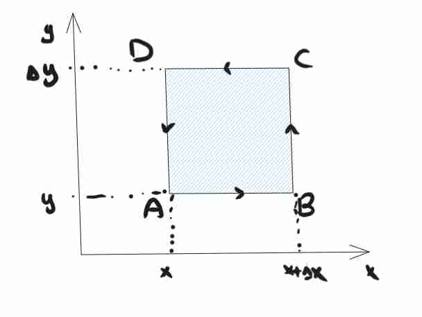

### Scalare

#### Scalare e gradiente 🟩
Un campo scalare assegna a **ogni punto dello spazio un valore reale**, quindi è naturalmente rappresentabile tramite una funzione 
$$
\varphi(x, y, z) : \mathbb{R}^{3} \to \mathbb{R}
$$

Un esempio abbastanza naturale è il **gradiente del valore scalare** che si indica con $$\vec{\nabla}\varphi = ( \frac{\delta\varphi}{\delta x}, \frac{\delta\varphi}{\delta y}, \frac{\delta\varphi}{\delta z}) =  \frac{\delta\varphi}{\delta x} \hat{i} +  \frac{\delta\varphi}{\delta y} \hat{j} + \frac{\delta\varphi}{\delta z} \hat{k}$$
Se consideriamo il gradiente da solo è un campo vettoriale (dice la direzione della derivata multidimensionale).

#### Gradiente in coordinate polari 🟨
Questo è un po' più difficile da gestire, però è abbastanza facile una volta che si fanno certe osservazioni. 
Sappiamo che $dV  = \vec{\nabla} V \cdot d\vec{s}$, TODO: finire la dimostrazione, è descritta bene a pagina 47 del mazzoldi.

Comunque si finisce con

$$
\vec{\nabla} = \frac{\delta}{\delta r} u_{r} + \frac{1}{r}\frac{\delta}{\delta \theta}u_{\theta} + \frac{1}{r\sin \theta}u_{\phi}
$$
A volte questo può risultare utile se proviamo a fare cose come calcolare il campo elettrico attraverso il gradiente.

NOTA: la divergenza però assume una forma diversa, che non so bene spiegare il motivo in questo momento però.

#### Gradiente in coordinate cilindriche

$$
\vec{\nabla} =  \frac{\delta}{\delta r} u_{r} + \frac{1}{r}\frac{\delta}{\delta \theta}u_{\theta} + \frac{\delta}{\delta \phi}u_{\phi}
$$
### Vettoriale

#### Superfice di separazione 🟩
Per la definizione di questo, è chiaro che il **flusso su una superficie di separazione** è nulla, quindi posso dividere superfici come mi pare internamente, tanto su queste è nulla, o posso *considerare solamente la superficie più esterna che li racchiude*
(è nulla perché avrò due versioni uguali e contrarie).

TODO: scrivere il ragionamento in formule

#### Integrale per un campo: teorema del gradiente 🟨++

In analisi abbiamo studiato il [[Integrali#8.4.6 Teorema di Torricelli (fondamentale del calcolo integrale)|teorema di torricelli]], ma possiamo estenderlo senza troppa fatica (almeno intuitivamente), nel caso in più dimensioni!

torricelli ci dice che (mettere condizioni qui di esistenza integrale) $f(B) - f(A) = \int _{A}^{B} f'(x) \, dx$,
Poniamo il concetto di **differenziale** ossia piccolo rettangolino nell'integrale di rieman come $df = f'dx$, attraverso questo abuso di notazione, allora diventa molto naturale estenderlo nelle 3 dimensioni come
$d\varphi(x, y, z) = \vec{\nabla}\varphi \cdot d\vec{l}$  usando il prodotto scalare, in pratica ho il prodotto scalare amplificato per quello che mi serve.
Allora diventa intuitivo che nel caso tridimensionale l'integrale sia

$$
\varphi(B) - \varphi(A) = \int _{A}^{B} \vec{\nabla}\varphi \cdot d\vec{l}
$$

È da notare che nel nostro caso, *se abbiamo un campo conservativo*, questo integrale è dipendente solamente da inizio e fine, **non dipende dal percorso**, il che implica che il campo è conservativo.

#### Teorema della divergenza (!!) 🟩-

Dal ragionamento precedente abbiamo capito che potrei dividere la superficie con quante superfici di separazione mi pare, tanto il flusso esterno non cambia, questo mi permette di *dividere in tanti volumetti* e cercare il flusso con questi volumetti

$$
\phi_{s}(\vec{F}) = \sum_{i=1}^{N} V_{i} \frac{\oint_{\Sigma} \vec{F} \cdot dS_{i}}{V_{i}}
$$
Andiamo a chiamare la seconda parte la divergenza di F, e sarà il **flusso per unità di volume**, vedremo che questa sarà strettamente vicina al significato di **gradiente** indicato con nabla.
Dato che sto considerando piccolissimi volumi, se la Divergenza è positiva, significa che c'è del flusso che esce da quel punto si dice che sono delle **sorgenti**, perché generano campo, e solitamente queste sono *punti in cui le linee di campo si incontrano*.
Quando è uguale a 0 non si dovrebbero incontrare

Enunciato in modo corretto il teorema afferma:
$$
\phi_{S \text{ chiusa}} = \oint_{S} \vec{F} \cdot d\vec{s} = \iiint_{V}(div \vec{F}) \, dV = \iiint_{V} \vec{\nabla} \cdot \vec{F} \, dV
$$
Che ha il bel risultato di rendere un integrale di superficie (2 dimensioni) come se fosse un integrale di volume.
Assumendo il risultato descritto in [[#Superfice di separazione]] diventa banale però.

**Osservazione**: la divergenza prende in input un campo vettoriale, in output restituisce un campo scalare (che si potrebbe interpretare quasi fosse il modulo del vettore di derivata, con il gradiente ancora scalare).

**Osservazione**: questa forma diventa molto più intuitiva se direttamente andiamo a parlare di cubi infinitesimali (Mencuccini spiega per benino sta parte diciamo e arriva subito al risultato, senza passare per il discorso che non ho capito bene sul flusso in una qualunque forma infinitesimale).

#### Relazione divergenza e intuizione divergenza (!) 🟩+
si avrà che 
$$
\frac{\oint_{\Sigma} \vec{F} \cdot dS}{dV} = div \vec{F} = \text{per il teorema che verrà dimostrato} = \vec{\nabla} \cdot \vec{F}
$$
A parole: il flusso per unità di volume del nostro campo è uguale al gradiente del campo stesso.

Un modo molto più semplice per dimostrare questo, assumendo già di avere fatto la cosa del cubo è notare questo
$$
d\phi = \vec{\nabla}\cdot \vec{E} d\tau \implies \vec{\nabla}\cdot \vec{E} = \frac{d\phi}{d\tau}
$$
E nella seconda parte abbiamo esattamente il flusso per cubo infinitesimo.

**Hint di dimostrazione**
	Mi definisco un cubo, e poi provo ad analizzare il flusso per ogni 6 lato, provo a porre un cubo infinitesimo, e dovrebbe poi tornare Mencuccini pagina 29 è presente, sul Mazzoldi lo trovi a pagina 79.
	

### Circuitazione
#### Intuizione di circuitazione e th separazione 🟩
In questa parte qui ci chiediamo il **flusso lungo una linea CHIUSA**. Probabilmente sarà utile per leggi come Lenz o Faraday.
Anche in questo caso non ha senso considerare linee di separazione, perché avendo direzioni diverse si annullano. (guarda [[#Superfice di separazione]] descritto in precedenza.

#### Definizione di circuitazione
$$
\Gamma = \oint_{L} \vec{F} \cdot d\vec{l}
$$
Che possiamo notare essere una forma molto molto simile rispetto a quanto definito per il flusso [[#Flusso di campo vettoriale]].

Posso fare un giochino (esattamente uguale a quello fatto in precedenza per la divergenza), ma lo faccio per piccole superfici, e flusso che gira attorno a quella superficie allora posso andare a definire il rotore

#### Il rotore e teorema di stokes 🟩-
Dividiamo tutta la nostra superficie con percorso chiuso in un sacco di piccoli pezzettini:
$$
\Gamma_{L} = \sum_{i=1}^{N} \oint_{L_{i}} \vec{F} \cdot d\vec{l_{i}} = \sum_{i=1}^{N} \frac{ \oint_{L_{i}} \vec{F} \cdot d\vec{l_{i}}}{S_{i}} S_{i}
$$

Allora definisco rotore questo:
$$\frac{
\oint_{L_{i}} \vec{F} \cdot d\vec{l_{i}}}{s_{i}} = \vec{rot} \vec{F} \cdot \hat{n}
$$

Che intuitivamente è la circuitazione infinitesimale.

Questo è fatto a pagina 52
##### Teorema di stokes
Da questo ragionamento possiamo osservare che la circuitazione (che è anche il lavoro si potrebbe dire) si può esprimere come il rotore.
$$
\oint \vec{F} \cdot d\vec{l} = \iint_{S_{L}} \vec{rot} \vec{F} \cdot \hat{n} \, ds
$$
Questo è il teorema di stokes, e si può applicare per qualsiasi circuitazione, per qualsiasi superficie che ha come contorno alla fine L.

#### Rotore dimostrazione 🟩
In questa parte proviamo ad esplorare la relazione che c'è fra il rotore, come l'abbiamo definito di sopra, e la divergenza.

Consideriamo un problema come in immagine 

Vogliamo cerca di definire la circuitazione, proviamo ad applicare proprio la definizione, quindi abbiamo che
$$
\oint \vec{F} \cdot d\vec{l} = \int _{A}^{B}F(x, y_{0}) \, dx + \int _{B}^{C}F(x_{0} + \Delta x, y) \, dy + \int _{C}^{D}F(x, y_{0} + \Delta y) \, dx + \int _{D}^{A}F(x_{0}, y) \, dy 
$$

Supponiamo che la nostra funzione sia continua, quindi abbiamo che $\exists c : \int _{A}^{B}F(x, y_{0}) \, dx = (B - A)F(c, y_{0})  = \Delta xF(c, y_{0})$, questa cosa si può utilizzare per ogni singolo addendo della precedente, e scritto facendo in modo da contare anche le direzioni abbiamo che:
$$
\oint \vec{F} \cdot d\vec{l} = \Delta x F(\hat{x}, y_{0}) + \Delta y F(x_{0} +\Delta x, \hat{y}) - \Delta x F(\hat{x}, y_{0} + \Delta y) - \Delta y F(x_{0}, \hat{y}) 
$$

Raccogliendo il delta e facendo tendere sia $x$ che $y$ a 0, possiamo scrivere una cosa del genere:
$$
\Gamma = -\Delta x \left[ \frac{\delta F_{x}}{\delta y} \Delta y \right] + \Delta y \left[ \frac{\delta F_{y}}{\delta x} \Delta x \right] \implies \Delta x\Delta y \left( \frac{\delta F_{y}}{\delta x} - \frac{\delta F_{x}}{\delta y}  \right) 
$$
Si può notare che se intendiamo questo come sopra, durante la dimostrazione per il [[#Teorema di stokes]], allora $\Delta x \Delta y$ è esattamente la superficie, orientata secondo $\hat{n}$, mentre, proprio per matching dei parametri, il rotore diventa $rot \vec{F} = \left( \frac{\delta F_{y}}{\delta x} - \frac{\delta F_{x}}{\delta y}  \right)$ in questo caso, si potrebbe dire da un punto di vista a tre dimensioni, se avessimo il nostro quadratino in più dimensioni allora che

$$
\vec{rot}\vec{F} = \left( \frac{\delta F_{z}}{\delta y} - \frac{\delta F_{y}}{\delta z}  \right) \hat{i} + \left( \frac{\delta F_{x}}{\delta z} - \frac{\delta F_{z}}{\delta x}  \right) \hat{j} + \left( \frac{\delta F_{y}}{\delta x} - \frac{\delta F_{x}}{\delta y}  \right) \hat{z} = \vec{\nabla} \times \vec{F}
$$

Si può notare che questo è strettamente legato al concetto di **velocità angolare**.
#### Divergenza del rotore (!) 🟩
Una volta espresso il rotore matematicamente come in precedenza (e sapendo anche il suo significato intuitivo di circuitazione per superficie), allora possiamo andare a fare cose interessanti come la divergenza che mi va a creare il rotore, ed è molto particolare come i calcoli portano poi alla fine ad affermare che
$$
\oint_{S} (\vec{\nabla} \times \vec{F}) d\vec{s} = \iiint_{V} div (\vec{\nabla} \times \vec{F}) d\vec{s} = \iiint_{V} \vec{\nabla} \cdot (\vec{\nabla} \times \vec{F}) d\vec{s} = 0
$$
L'ultima uguaglianza lo abbiamo per cauchy, perché avremo delle derivate seconde, che si eliminano tutte fra di loro

Fisicamente forse mi sta dicendo che il rotore non crea flusso.
### Note sul gradiente

Per qualche motivo è vero questa cosa:

$$
dV = \frac{\delta V}{\delta x}dx + \frac{\delta V}{\delta y}dy + \frac{\delta V}{\delta z}dz
$$

Questo è un risultato ovvio (che non so perché è ovvio, ma chatGPT https://chat.openai.com/share/c40e539d-9dd2-4bf7-b63d-2fc402751929) e altre ricerche sembrano dire questo del teorema del differenziale totale (che sembra se cercato in inglese ha significato giusto, in italiano diverso boh https://en.wikipedia.org/wiki/Total_derivative).

Comunque è la base matematica per poter utilizzare il gradiente e scrivere cose come

$$
dV = \nabla V \cdot ds
$$
Dove $ds = u_{x}dx + u_{y}dy + u_{z}dz$
## Note di ripasso

| Data | Commenti |
| ---- | ---- |
| 22/10/2023 | Non so bene giustificare la divergenza (derivata a tre dimensioni), non esce come naturale sta forma! |
| 27/12/2023 | Buona roba, non dovrei avere problemi nella dimo di queste cose |
| 12/01/2024 | Tutto bene direi |
