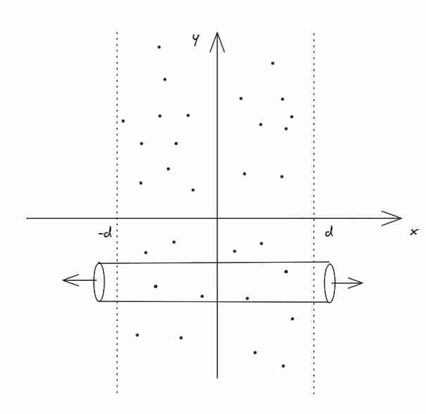
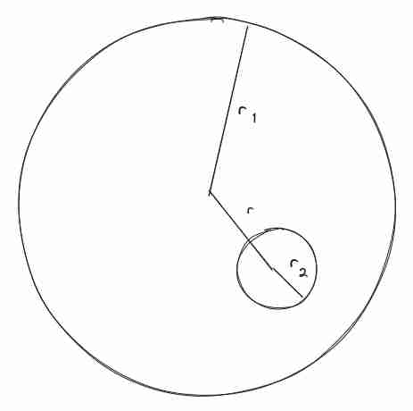
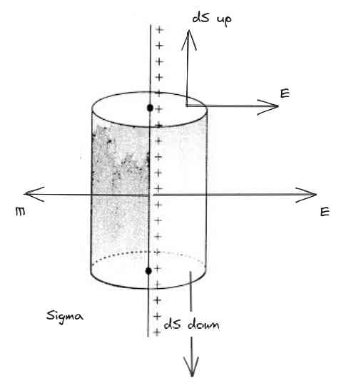
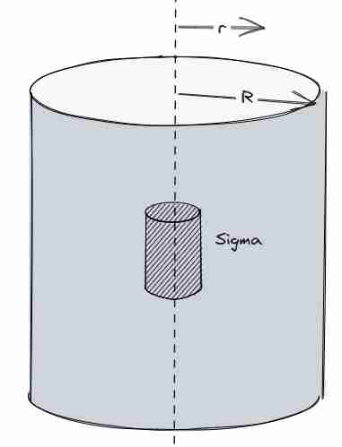
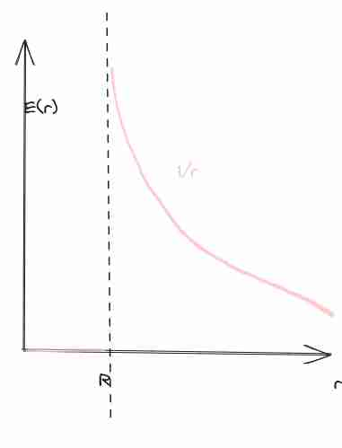
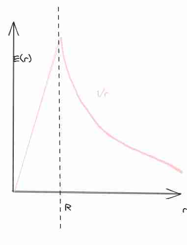
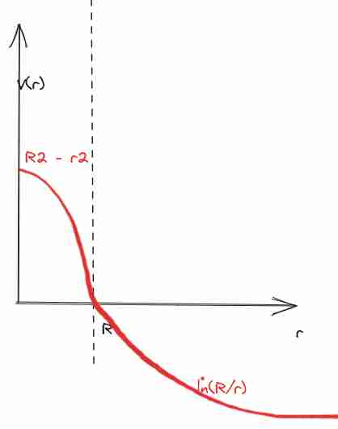
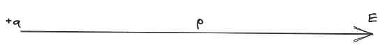

## Esercizi random 18-10
Questi si riferiscono ad esercizi prevalentemente fatti in [[Campo elettrico]]
### Esercizio 1
$$
\vec{E} = - \alpha y^{3} \hat{i} - 3\alpha xy^{2} \hat{j} -3\beta z^{2}\hat{k}
$$
Vogliamo andare a calcolare $V(x, y , z)$
1. check campo conservativo (altrimenti TODO: capire il perché, non riesco a calcolare questo se non è conservativo)
	1. Check del rotore, e si vede che è conservativo.
	2. Probabilmente allora il potenziale dipende dal percorso, ma questa cosa non ci piace affatto (quindi rende senza senso)
2. Scelgo il percorso (e spezzetto tutti i percorsi.)

#### Soluzioni poste
Soluzione sbagliata (facendo 0 da sempre e ho sbagliato anche i vettori):
$$
V(x, y, z) = -\alpha y^{3}P_{x}\hat{i} - \alpha xP_{y}^{3}\hat{j} - \beta P_{z}^{3}\hat{k}
$$

**Soluzione controllata**:
$$
V(x, y , z) = \alpha xy^{3} + \beta z^{2}
$$
Poi questo si può controllare tenendo in mente che $\vec{\nabla}\cdot V = -\vec{E}$

### Esercizio 2 Luglio 2023
Date 3 particelle puntiformi con una carica $Q = 2 \cdot 10^{-6} C$ per tutti e $m = 5 \cdot 10^{-3} Kg$, fissati ai vertici di un triangolo equilatero, con $l = 2cm$ lato.
In un certo instante una particella viene liberata, calcolare
1. Il modulo della velocità a distanza infinita.
2. Quanto vale il modulo della forza su Q_3 quando la sua velocità è la metà della precedente.
#### Soluzioni proposte
1. Cariche ferme, abbiamo un campo elettrostatico, e quindi osserviamo un **campo conservativo**, significa che l'energia cinetica finale sarà la stessa di quella potenziale iniziale.

$$
E_{i} = q_{0}(V_{1} + V_{2}) + 0
$$
0 per dire che non ha energia cinetica all'inizio.

$$v = \lvert Q \rvert \sqrt{ \frac{1}{m\pi\varepsilon_{0}l} }, \implies 37.9\frac{m}{s}$$

**Seconda parte**
Bisogna sempre utilizzare la conservazione dell'energia, calcolare così la distanza in questo caso.
Sarà $\frac{4}{3}l$

Dopo aver ottenuto la distanza, si finisce calcolando il valore della forza che è uguale a
$$
\vec{F} = \frac{1}{2\pi\varepsilon_{0}} \frac{Q^{2}}{\frac{16}{9}l^{2}} \cos \theta
$$
E theta si ottiene facendo cose con angoli (triangolo rettangolo con 4/3 l e 1/2 l)

### Esercizio 3
In un riferimento cartesiano, abbiamo un potenziale di $V = b - ax^{3}$, si consideri il volume delimitato da un cubo di lato $l$ con uno spigolo sull'origine. Calcolare la carica dentro questo cubo.

#### Soluzione proposta
Uso **gauss** su tutte le facce, e noto che in 4 è 0 perché il campo varia solo in $x$, per questo motivo poi calcolando il tutto abbiamo che il flusso è $3al^{4}$ e poi si usa gauss per dire che la soluzione è
$$
Q = 3al^{4}\varepsilon_{0}
$$

**Altra soluzione**
Si prova a calcolare $\rho$ e poi si integra su tutto il cubo, si ottiene risultato uguale a sopra e si usa la divergenza

$$
\vec{\nabla} \cdot \vec{E} = \frac{\rho}{\varepsilon_{0}}
$$
Si ottiene che 
$$
\rho = 6ax\varepsilon_{0}
$$
E poi diventa molto più facile da gestire col triplo integrale.

### Esercizio 4
Data una superficie piana e una carica su di essa, entrambe sono cariche positivamente, in che posizione è carica dopo che è passato un certo tempo $t$? la distanza in funzione del tempo $x(t)$? e la velocità in funzione della distanza?
#### Soluzioni proposte
Velocità dopo un certo tempo $t$.
$$
v = \frac{q\sigma}{2m\varepsilon_{0}}t \implies d= \frac{q\sigma}{2m\varepsilon_{0}} \frac{1}{2}t^{2} \implies v = \sqrt{ \frac{dq\sigma}{\varepsilon_{0}m} }
$$

**Seconda soluzione**
Si può fare lo stesso usando la conservazione dell'energia.
$$
K_{A} + U_{A} = K_{d} + U_{d}
$$
Prendo direttamente il percorso tangenziale 

$$
q(V_{D} - V_{A}) = \frac{1}{2}mv^{2} \implies q \int _{A}^{B} \vec{E} \cdot  \, d\vec{x} = \frac{q\sigma d}{2\varepsilon_{0}} = \frac{1}{2}mv^{2} 
$$
### Esercizio 5 gennaio 2023
Una densità di carica volumetrica $\rho(\vec{r})$ è presente in una regione di spazio sferico con $r < R$ tale densità genera all'interno della sfera un campo elettrostatico descritto dall'equazione $\vec{E} = Ar^{3}\hat{r}$ si assume che fuori dalla sfera ci sia il vuoto.
1. Determinare la densità di carica della sfera.
2. Potenziale elettrostatico su un punto della superficie sferica, assumendo che potenziale all'infinito sia 0.
#### Soluzioni
Il cheat è sapere la divergenza con coordinate polari:
$$
div E_{r} = \frac{1}{r^{2}} \frac{\delta}{\delta r} r^{2} E_{r}
$$
E sapendo questo poi era cavolata, ma facendolo in altro modo bisogna andare in coordinate cartesiane.

$$
\rho = \varepsilon_{0}5Ar^{2}
$$

**Soluzione 2**
In coordinate cartesiane abbiamo che 
$$
\vec{E} = A (x^{2} + y ^{2} + z^{2}) (x \hat{i} + y \hat{j} + z \hat{k})
$$
E dovrebbe venire uguale alla fine.

**Problema 2**
Calcolo la carica totale
e viene come soluzione 
$$
Q = 4A\pi\varepsilon_{0}R^{5}
$$
Con questo ho tutto per finire il problema due
$$
V(R) - V(\infty) = \int _{R}^{\infty} \vec{E} \, d\vec{r}  \implies \int_{A}^{\infty}  \frac{AR^{5}}{r^{2}} d\vec{r}
$$
E poi si trova $AR^{4}$ come soluzione finale.

## Esercizi lezione 25 Ottobre

#### Esercizio 1

Supponiamo di avere due sfere, $r_{1}, r_{2}$ e carica $q_{1}, q_{2}$, inizialmente scollegate. In seguito li attacco con un filo conduttore di capacità trascurabile, 
1. quanto è la distribuzione di carica sulle sfere ora?
2. Quanto è il valore del nuovo potenziale elettrostatico?
3. Quanto è l'energia dissipata dal collegamento?

**Punto uno**
$$
q_{1}' = \frac{(q_{1} + q_{2})r_{1}}{r_{2} + r_{1}}
$$
Si ottiene facendo sempre il discorso di uguale potenziale.

**Punto due**
Per il secondo punto una volta ottenuta la carica è facile ottenere il nuovo potenziale:
$$
V_{1}' =  \frac{1}{4\pi\varepsilon_{0}} \frac{q_{1}'}{r_{1}} = \frac{1}{4\pi\varepsilon_{0}} \frac{q_{1} + q_{2}}{r_{2} + r_{1}}
$$
nel caso in cui non fossero state delle sfere, mi ricavavo il nuovo valore utilizzando la relazione del condensatore, che ricordiamo dipendono solamente dalla geometria, che è ancora la stessa.
$$
q_{1}' = C_{1}V_{1}'
$$
$$
q_{1} = C_{1}V_{1}
$$

**Punto tre**
Non la calcoliamo in modo esplicito perché non si semplifica, ma basta fare totale prima meno totale adesso...

#### Esercizio 2
Abbiamo una regione di piano delimitata da $[-d, d]$ sull'asse delle $x$ una distribuzione di carica uniforme $\rho$, calcolare campo elettrico e potenziale elettrico nello spazio.

**Soluzione
**
Andiamo a considerare il cilindro come in figura, per ragioni di simmetria sul lato lungo del cilindro il campo è nullo, quindi le uniche superfici da considerare sono le due esterne
$$
\oint \vec{E} \cdot d\vec{s} = \int _{\Sigma} \vec{E} \, d\vec{s} +  \int _{\Sigma} \vec{E} \, d\vec{s} = 2E\delta
$$
Sappiamo che il campo elettrico è parallelo a $x$ e costante, perché in pratica è come se stessimo nel caso di superficie piana infinita carica, solo che in questo caso è bidimensionale.
Allora abbiamo:
$$
2E\delta = \frac{Q_{tot}}{\varepsilon_{0}}
\implies 2E\delta = \frac{\rho V}{\varepsilon_{0}}
\implies 2E\delta = \frac{\rho 2\delta d}{\varepsilon_{0}}
\implies E = \frac{\rho d}{\varepsilon_{0}}
$$
Con $\delta$ la superficie del cerchio di base del nostro cilindro.
Abbiamo allora stabilito il campo elettrico che è abbastanza coerente con la formula di campo elettrico per piano carico infinito (cambia solo di costante 2 al denominatore credo).
Ci chiediamo allora, internamente quanto vale? si può applicare lo stesso ragionamento e sarà di valore
$$
E = \frac{\rho x}{\varepsilon_{0}},\, x \in (-d, d)
$$
da questo si può ricavare il potenziale
Il potenziale è preso fino a $V$
Interno:
$$
V(x) = -\frac{\rho x^{2}}{\varepsilon_{0}}, \, x \in (-d, d)
$$
Esterno:

$$
V(x) = \rho d \frac{d - x}{\varepsilon_{0}} - \frac{\rho d^{2}}{\varepsilon_{0}}, \, x \in (-\infty, -d) \cup(d, +\infty)
$$
Potrebbe essere che ci sia un 2 in meno, è da rifare questo esercizio per verificare questo.
#### Esercizio 3
Supponiamo di avere una sfera di densità uniforme $\rho$ di raggio$r_{1}$ e una cavità sferica al suo interno di raggio $r_{2} < r_{1}$, calcolare campo elettrico circostante.

**Soluzione**
$$\vec{E}_{tot} = \frac{\rho}{3\varepsilon_{0}} \vec{r}$$
con $\vec{r}$ il vettore della congiungente dei centri.

#### Esercizio 4
Questo è un problema classico studiato anche alle superiori, abbiamo un elettrone che passa in un condensatore di lunghezza $l$ e campo elettrico $E$ diretto verso il basso. L'elettrone ha velocità lungo l'asse $x$ uguale a $v_{0}$.
1. Quanto ci mette a percorrere la lunghezza del condensatore?
2. Quanto è l'angolo di deflessione della velocità dopo che è uscito.

**Soluzione**:
Ci mette esattamente $t = \frac{l}{v_{0}}$ secondi a percorrere il condensatore. Nel frattempo è sottoposto a una forza $eE$ lungo una altra direzione.
Si può allora dimostrare che la quantità di deflessione è uguale a
$$
y = \frac{eE}{2m} t^{2}
$$
con $m$ la massa dell'elettrone.
Mentre la velocità finale è di $V_{y} = \frac{eE}{m}t$
Possiamo allora calcolare l'**angolo di deflessione**
$$
\frac{V_{y}}{V_{x}} = \frac{eE}{m} \frac{l}{v_{0}} \cdot \frac{1}{v_{0}} = \frac{eE}{m} \frac{l}{v_{0}^{2}}
$$
E si prende l'arcotangente inversa di quel valore di sopra.

## Preparazione parziale 1
### 3  Luglio 2023 Esercizio 1

Soluzione riportata
$$
v = \frac{q}{\sqrt{ \pi\varepsilon_{0}m L }}
$$
$$
F = 9 \frac{\sqrt{ 119 }}{256} \frac{q^{2}}{\pi\varepsilon_{0}L^{2}}
$$

#### Secondo punto
Dal primo punto abbiamo che
$$
U = \frac{2q^{2}}{4\pi\varepsilon_{0}} \cdot \frac{1}{L}
$$

Scriviamo la soluzione al punto b, che mi sembra errata.
Poniamo la conservazione dell'energia

$$
U_{i} + \frac{1}{2}m v_{i}^{2} = U_{f} + \frac{1}{2}mv_{f}^{2} \implies
U_{i} = \frac{1}{2}m (v_{f}^{2} - v_{i}^{2})
$$
Essendo che $v_{i} = \frac{1}{2}v_{f}$ abbiamo
$$
U_{i} =  \frac{1}{2}m\left( \frac{3}{4}v_{f}^{2} \right) = \frac{3}{8}mv_{f}^{2}
$$
Per soluzione trovata sopra si ha che
$$
U_{i} = \frac{2q^{2}}{4\pi\varepsilon_{0}} \cdot \frac{1}{L_{i}} = \frac{3}{8}mv^{2}_{f} \implies
L_{i} =  \frac{2q^{2}}{4\pi\varepsilon_{0}} \cdot \frac{8}{3} \frac{1}{mv_{f}^{2}} = \frac{4}{3} \frac{q^{2}}{\pi\varepsilon_{0}mv_{f}^{2}}
= \frac{4}{3} \frac{q^{2}}{\pi\varepsilon_{0}m} \cdot \frac{\pi\varepsilon_{0}mL}{q^{2}} = \frac{4}{3}L
$$

Con il valore della distanza in linea retta possiamo poi calcolare la forza presente:

$$
F_{tot} = \frac{1}{4\pi\varepsilon_{0}} \frac{2q^{2}}{L^{2}_{i}} \cdot \cos \theta
= \frac{1}{2\pi\varepsilon_{0}} \frac{9q^{2}}{16L^{2}} \cos \theta
$$
Con theta l'angolo che si forma fra $L_{i}$ e la congiungente al centro, per questo motivo possiamo scrivere
$$
\cos \theta = \frac{\sqrt{ L_{i}^{2} - \left( \frac{L}{2} \right)^{2} }}{L_{i}}
=\frac{\sqrt{ \frac{16}{9}L^{2} - \frac{1}{4}L^{2} }}{\frac{4}{3}L}
=\frac{3}{4}\sqrt{ \frac{64 - 9}{36} } = \frac{1}{8}\sqrt{ 55 }
$$
Possiamo allora mettere questo valore nell'equazione di sopra e ci viene

$$
F_{tot} = \frac{1}{2\pi\varepsilon_{0}} \frac{9q^{2}}{16L^{2}} \frac{1}{8} \sqrt{ 55} = \frac{9\sqrt{ 55 }}{256} \cdot \frac{q^{2}}{\pi\varepsilon_{0}L^{2}}
$$

### 24 Gennaio 2022 Esercizio 1

Viene riportato
$$
\sigma_{i} = -\frac{q}{4\pi r^{2}}
$$
per la superficie interna
E
$$
\sigma_{e} = \frac{3q}{4\pi r^{2}}
$$
Per la superficie esterna.
C'è una imprecisione riguardante 
#### Punto b
Per la superficie interna potremmo considerare una superficie di gauss all'interno del conduttore. Sappiamo che essendo dentro il conduttore deve essere che il campo elettrico sia nullo. Quindi sarà stata disposta una quantità di carica sul conduttore tale da annullare $q$ presente al centro:
$$
\oint \vec{E} \cdot d\vec{s} = \frac{q_{tot}}{\varepsilon_{0}} = (q + \sigma_{i} 4\pi R^{2})
$$

## Esercizi 25 Ottobre

#### Esercizio 1

Supponiamo di avere due sfere, $r_{1}, r_{2}$ e carica $q_{1}, q_{2}$, inizialmente scollegate. In seguito li attacco con un filo conduttore di capacità trascurabile, 
1. quanto è la distribuzione di carica sulle sfere ora?
2. Quanto è il valore del nuovo potenziale elettrostatico?
3. Quanto è l'energia dissipata dal collegamento?

**Punto uno**
$$
q_{1}' = \frac{(q_{1} + q_{2})r_{1}}{r_{2} + r_{1}}
$$
Si ottiene facendo sempre il discorso di uguale potenziale.

**Punto due**
Per il secondo punto una volta ottenuta la carica è facile ottenere il nuovo potenziale:
$$
V_{1}' =  \frac{1}{4\pi\varepsilon_{0}} \frac{q_{1}'}{r_{1}} = \frac{1}{4\pi\varepsilon_{0}} \frac{q_{1} + q_{2}}{r_{2} + r_{1}}
$$
nel caso in cui non fossero state delle sfere, mi ricavavo il nuovo valore utilizzando la relazione del condensatore, che ricordiamo dipendono solamente dalla geometria, che è ancora la stessa.
$$
q_{1}' = C_{1}V_{1}'
$$
$$
q_{1} = C_{1}V_{1}
$$

**Punto tre**
Non la calcoliamo in modo esplicito perché non si semplifica, ma basta fare totale prima meno totale adesso...

#### Esercizio 2
Abbiamo una regione di piano delimitata da $[-d, d]$ sull'asse delle $x$ una distribuzione di carica uniforme $\rho$, calcolare campo elettrico e potenziale elettrico nello spazio.

**Soluzione
**
Andiamo a considerare il cilindro come in figura, per ragioni di simmetria sul lato lungo del cilindro il campo è nullo, quindi le uniche superfici da considerare sono le due esterne
$$
\oint \vec{E} \cdot d\vec{s} = \int _{\Sigma} \vec{E} \, d\vec{s} +  \int _{\Sigma} \vec{E} \, d\vec{s} = 2E\delta
$$
Sappiamo che il campo elettrico è parallelo a $x$ e costante, perché in pratica è come se stessimo nel caso di superficie piana infinita carica, solo che in questo caso è bidimensionale.
Allora abbiamo:
$$
2E\delta = \frac{Q_{tot}}{\varepsilon_{0}}
\implies 2E\delta = \frac{\rho V}{\varepsilon_{0}}
\implies 2E\delta = \frac{\rho 2\delta d}{\varepsilon_{0}}
\implies E = \frac{\rho d}{\varepsilon_{0}}
$$
Con $\delta$ la superficie del cerchio di base del nostro cilindro.
Abbiamo allora stabilito il campo elettrico che è abbastanza coerente con la formula di campo elettrico per piano carico infinito (cambia solo di costante 2 al denominatore credo).
Ci chiediamo allora, internamente quanto vale? si può applicare lo stesso ragionamento e sarà di valore
$$
E = \frac{\rho x}{\varepsilon_{0}},\, x \in (-d, d)
$$
da questo si può ricavare il potenziale
Il potenziale è preso fino a $V$
Interno:
$$
V(x) = -\frac{\rho x^{2}}{\varepsilon_{0}}, \, x \in (-d, d)
$$
Esterno:

$$
V(x) = \rho d \frac{d - x}{\varepsilon_{0}} - \frac{\rho d^{2}}{\varepsilon_{0}}, \, x \in (-\infty, -d) \cup(d, +\infty)
$$
Potrebbe essere che ci sia un 2 in meno, è da rifare questo esercizio per verificare questo.
#### Esercizio 3
Supponiamo di avere una sfera di densità uniforme $\rho$ di raggio$r_{1}$ e una cavità sferica al suo interno di raggio $r_{2} < r_{1}$, calcolare campo elettrico circostante.

**Soluzione**
$$\vec{E}_{tot} = \frac{\rho}{3\varepsilon_{0}} \vec{r}$$
con $\vec{r}$ il vettore della congiungente dei centri.

#### Esercizio 4
Questo è un problema classico studiato anche alle superiori, abbiamo un elettrone che passa in un condensatore di lunghezza $l$ e campo elettrico $E$ diretto verso il basso. L'elettrone ha velocità lungo l'asse $x$ uguale a $v_{0}$.
1. Quanto ci mette a percorrere la lunghezza del condensatore?
2. Quanto è l'angolo di deflessione della velocità dopo che è uscito.

**Soluzione**:
Ci mette esattamente $t = \frac{l}{v_{0}}$ secondi a percorrere il condensatore. Nel frattempo è sottoposto a una forza $eE$ lungo una altra direzione.
Si può allora dimostrare che la quantità di deflessione è uguale a
$$
y = \frac{eE}{2m} t^{2}
$$
con $m$ la massa dell'elettrone.
Mentre la velocità finale è di $V_{y} = \frac{eE}{m}t$
Possiamo allora calcolare l'**angolo di deflessione**
$$
\frac{V_{y}}{V_{x}} = \frac{eE}{m} \frac{l}{v_{0}} \cdot \frac{1}{v_{0}} = \frac{eE}{m} \frac{l}{v_{0}^{2}}
$$
E si prende l'arcotangente inversa di quel valore di sopra.

## Esercizi random
### 10-gennaio-2023 Es 3
Trattiamo il punto 2:

$$
P_{\tau} = \vec{J} \cdot \vec{E} = \frac{\vec{I}}{S} \cdot \vec{E} = \frac{\rho I^{2}}{S^{2}} = \frac{\rho V^{2}}{R^{2} \cdot S^{2}} = \frac{V^{2}}{\rho L^{2}}
$$
Ha senso perché in questo esercizio il campo elettrico cambia a seconda della distanza dell'asse, quindi in vogliamo sostituire la resistenza in un certo punto lungo l'asse e non dell'intero conduttore.

## Problemi sezione campo elettrico
### Problemi classici col flusso
#### Problema: Flusso del cilindro su carica lineare 🟨+
Consideriamo una linea con distribuzione di carica uniforme $\lambda$ questo è un campo **perpendicolare**, e si può dire che questo campo abbia **simmetria cilindrica** 

Sapendo la carica di questo cilindro possiamo calcolare il flusso che passa in questo cilindro, quindi abbiamo
$$
\oint_{\Sigma}\vec{E}\vec{ds} = \frac{Q_{T}}{\varepsilon_{0}} = \lambda \cdot \frac{h}{\varepsilon_{0}}, h \text{ la lunghezza}
$$
Inoltre sapendo che $\vec{E}$ è sempre perpendicolare, e il valore in modulo è sempre lo stesso (per come abbiamo costruito il cilindro).
Dall'altra parte ora calcoliamo l'integrale che ci siamo definiti in questo modo:
$$
\oint_{\Sigma} \vec{E} \vec{ds} = \int _{\Sigma_{l}}\vec{E} \, \vec{ds_{l}}  + \int _{\Sigma_{up}}\vec{E} \, \vec{ds_{up}}  + \int _{\Sigma_{dw}}\vec{E} \, \vec{ds_{dw}} 
$$
Notando che il campo è perpendicolare, abbiamo che 
$$
\int _{\Sigma_{dw}}\vec{E} \, \vec{ds_{dw}}  = 0 
$$
$$
\\
\int _{\Sigma_{up}}\vec{E} \, \vec{ds_{up}} = 0
$$

Sfruttando il fatto che il modulo del campo elettrico è costante, basta andare a calcolare l'area della superficie laterale:
$$
\\
\int _{\Sigma_{l}}\vec{E} \, \vec{ds_{l}} = \lvert \vec{E} \rvert \int _{\Sigma_{l}}\, \vec{ds_{l}} = \lvert \vec{E} \rvert 2\pi\cdot rh
$$
Mettendo assieme con una equazione di sopra con gauss abbiamo
$$
 \lvert \vec{E} \rvert 2\pi\cdot rh = \lambda \cdot \frac{h}{\varepsilon_{0}} \implies \lvert \vec{E} \rvert  = \frac{\lambda}{\varepsilon_{0}} \frac{1}{2\pi r}
$$
NOTA: la cosa figa è che se è costante allora posso utilizzare la legge di gauss in questo modo, di portare fuori il modulo del campo!

#### Problema: campo elettrico su piano elettrico, $\sigma$ costante 🟩
Consideriamo una superficie con densità di carica $\sigma$ che sia costante, andiamo a valutare il campo elettrico in un punto $p$ a distanza $r$ dalla superficie.

![[Campo elettrico-1696847883210.jpeg | 600]]

**Osservazione**:
Il campo di E è diretto perpendicolarmente, in modo simile alla precedente, sempre per ragioni di simmetria, per ogni carica ne esiste una simmetrica, quindi il campo è strutturato in questo modo...

Si avrà che 
$$
(\oint_{\Sigma} \lvert \vec{E} \rvert \, \vec{ds} = \int _{\Sigma_{l}}\vec{E} \, \vec{ds_{l}}  + \int _{\Sigma_{up}}\vec{E} \, \vec{ds_{up}}  + \int _{\Sigma_{dw}}\vec{E} \, \vec{ds_{dw}} = \int _{\Sigma_{up}}\vec{E} \, \vec{ds_{up}}  + \int _{\Sigma_{dw}}\vec{E} \, \vec{ds_{dw}} = )
$$
$$
\lvert \vec{E} \rvert  (\int _{\Sigma_{dw}} \, \vec{ds_{dw}} + \int _{\Sigma_{up}} \, \vec{ds_{up}} ) = 2 \lvert \vec{E}  \rvert \pi r^{2} = \pi r^{2}\cdot \frac{\sigma}{\varepsilon_{0}} \implies \lvert \vec{E} \rvert = \frac{\sigma}{2\varepsilon_{0}}
$$
Questo si può dimostrare per una superficie qualsiasi ($A$) e sarebbe più elegante, lo puoi vedere in immagine questa cosa.
#### Problema per casa: 
Supponiamo di avere una distribuzione indefinita su una linea in un cilindro infinito, vorrei avere la distribuzione di $\vec{E}(\vec{r})$

#### Problema altro (diff piani)
Prendiamo una superficie qualsiasi, con densità $\sigma$ costante, e proviamo a prendere un cilindro infinitesimo, di area $dA$ e altezza $dh$, con la legge di gauss su questa superficie piana (come se fosse costante), posso calcolare il flusso di campo elettrico.

Proviamo ad usare gauss e vedere come va il flusso?
avrò $\vec{E}\vec{ds_{u}} + \vec{E}\vec{ds_{l}} + \vec{E}\vec{ds_{d}} = \frac{dQ_{T}}{\varepsilon_{0}} = dA \frac{\sigma}{\varepsilon_{0}}$ sempre su tutte e tre le superfici, dato che ci interessa la superficie, facciamo tendere $dh \to 0$ , così riesco ad approssimare la superficie
in questo modo avrò che la *superficie laterale sarà 0*.
$$
\vec{E}\vec{ds_{u}} + \vec{E}\vec{ds_{d}} = Eds_{u}\cos \theta_{u} + E ds_{d}\cos \theta_{d}
$$
Ossia provo a proiettare E sulla direzione perpendicolare sulla superficie.
abbiamo quindi $E_{\perp}^{u}dA + E_{\perp}^{d}dA = \frac{\sigma dA}{\varepsilon_{0}} \implies E_{\perp}^{u }+ E_{\perp}^{d} = \frac{\sigma}{\varepsilon_{0}}$
$$
\lvert  E_{\perp}^{u}\hat{u} + E_{\perp}^{d}\hat{v} \rvert = \frac{\sigma}{\varepsilon_{0}} \implies  \Delta E_{\perp} = \frac{\sigma}{\varepsilon_{0}}
$$
C'è una discontinuità, che è dipendente dal fatto di avere la normale o meno, dovrei approfondire e vedere in che modo...
TODO: capire cosa significa avere discontinuità in questa parte...

#### Superficie cilindrica carica (!) 🟨--
Problema:
Supponiamo di avere un cilindro di **lunghezza infinita** con una certa carica distribuita uniformemente. Capire come è fatto il campo elettrico ed energia potenziale al variare del raggio (distanza dell'asse principale).

Dato il setting in figura (una carica distribuita indefinitivamente sulla superficie di un cilindro), proviamo a considerare un cilindro all'interno del cilindro grosso, andiamo a provare a calcolare il flusso
$$
\oint_{\Sigma}\vec{E}\cdot \vec{ds} = E(r) \oint_{\Sigma}ds = E(r) 2\pi rh = 0 \implies E(r) = 0, r < R
$$

Supponiamo che siano invertiti, che la carica sia contenuta rispetto al cilindro che abbiamo, allora abbiamo che
$$
  \vec{E}(r) 2\pi rh = \frac{Q_{\Sigma}}{\varepsilon_{0}} = \frac{\sigma(2\pi hR)}{\varepsilon_{0}} \implies E(r) = \frac{Q}{2\pi\varepsilon_{0}rh} = \frac{\sigma R}{\varepsilon_{0} r}
$$
Facendo l'analisi di dimensione abbiamo
$$
[\sigma 2\pi R] = [CL^{-2}L] = [CL^{-1}] \to \lambda
$$
Che è la stessa dimensione di una densità lineare di carica

Con questa osservazione si può dire che:
$$
E(r) = \frac{\lambda}{2\pi\varepsilon_{0}r}\hat{r}
$$
Che è molto simile al problema del filo di lunghezza infinita, anche con il cilindro esterno (ed è sensato perché un filo infinito è come se se fosse un cilindro!) vai a vedere [[Campo elettrico#Distribuzione di carica uniforme lineare infinita]]

Con questa analisi possiamo dire che segue questo andamento.

Con la seconda parte $\propto \frac{1}{r}$

**Potenziale**
Possiamo fare delle *assunzioni* preliminari sul fatto che $V(R) = 0$ e che $V(\infty) = \infty$

$$
r > R \implies V(r) - V(R) = \int _{r}^{R} \vec{E}\cdot d \vec{r} = \frac{\sigma_{2}\pi R}{2\pi\varepsilon_{0}} \int _{r}^{R} \, \frac{dr}{r}  = \frac{\sigma_{2}\pi R}{2\pi\varepsilon_{0}} \ln\left( \frac{R}{r} \right)
$$
Mentre all'interno, dato che il campo è 0, resta sempre 0 il potenziale elettrico, **costante**.

#### Superficie cilindrica uniformemente carica 🟥
Questo è uguale al precedente, solo che che carico tutto, anche l'interno di essa in modo uniforme.
Se prendo il raggio, allora torno al modo equivalente precedente (quindi sembra in pratica una densità lineare di carica!).
Cambia nel caso in cui il raggio ora è interno.

$$
r < R \implies \oint \vec{E} \cdot d \vec{s} = E(r) 2\pi rh = \frac{Q_{\Sigma}}{\varepsilon_{0}} = \frac{\rho \pi r^{2}h}{\varepsilon_{0}} \implies \vec{E}(r) = \frac{\rho}{2\varepsilon_{0}} \vec{r}
$$
In questo caso il campo **aumenta linearmente.**

**Potenziale**
Esternamente il potenziale è ancora uguale al precedente,
internamente invece cambia leggermente
$$
V(r) - V(R) = \int _{r}^{R} \vec{E}(r) \, d \vec{r} = \frac{\rho}{2\varepsilon_{0}} \cdot \frac{R^{2} - r^{2}}{2}
$$

#### Esercizio sul calcolo della divergenza:
TODO: vedere se la divergenza è zero su una linea normale idiota al punto p
TODO: vedere divergenza in coordinate sferiche (formula strana).... dipende dal raggio

TODO: guardare quanto è buono.

$$
\vec{E}(x, y ,z) = \frac{Q}{4\pi\varepsilon_{0}} \frac{xi + yj + zk}{(x^{2} + y^{2} + z^{2})^{3/2}}
$$

