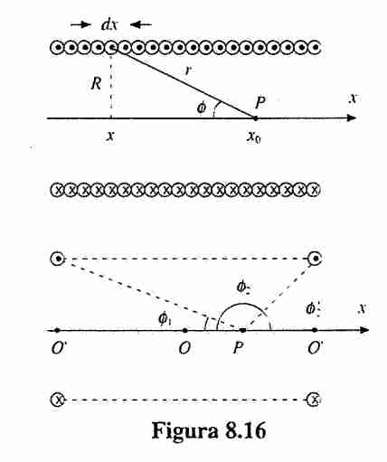
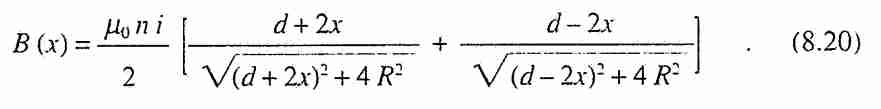
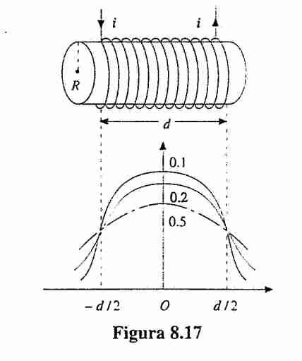
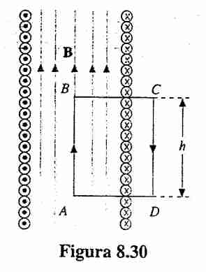
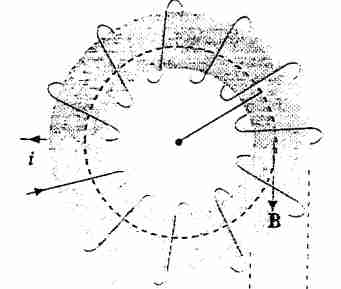
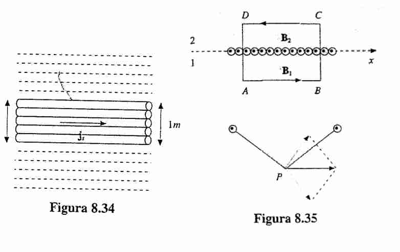
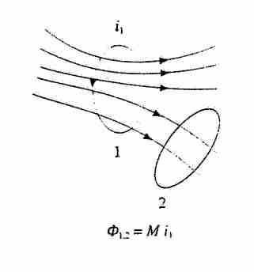
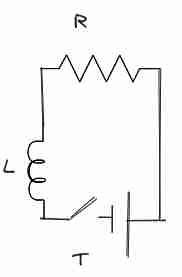

### Spire

#### Spira quadrata
Questo è descritto nell'esempio 8.1 del Mazzoldi.
È stato descritto anche in un esercizio in classe (non è importante).

#### Spira circolare 🟩
Vedere pagina 245
Vogliamo cercare il valore del campo sull'asse della spira circolare.
![[Geometrie di spire-1704296692075.jpeg | 500]]
Questo è semplice, basta usare la prima di Laplace e trovare l'apporto del campo magnetico al centro.
Si può anche pensare come momento magnetico, allora si utilizza sempre lo stesso discorso per la spira quadrata classica e il suo momento.

Proviamo a modellizzare il problema e risolvere ciò.
Utilizziamo la prima legge di Laplace
$$
d\vec{B} = \frac{\mu_{0}i}{4\pi} d\vec{l}\times \frac{\hat{r}}{r^{2}}
$$
Con le variabili dichiarate come in figura, possiamo scrivere
$dl = Rd\theta$ e che $r^{2} = R^{2} + x^{2}$
E sappiamo che il verso del campo sull'asse è sempre concorde sullo stesso verso (quindi i contributi si sommano, dobbiamo considerare per ragioni di simmetria solamente quella lungo l'asse.)

Allora abbiamo

$$
d\vec{B} = \frac{\mu_{0}i}{4\pi} \frac{R}{R^{2} + x^{2}} d\theta
$$
E dobbiamo moltiplicare per il coseno di $\varphi$ per avere la componente lungo l'asse:
$d\vec{B}_a = d\vec{B} \cdot \cos \varphi = d\vec{B} \cdot \frac{R}{r}$
Da cui abbiamo che 
$$
d\vec{B}_{a} = \frac{\mu_{0}i}{4\pi} \frac{R^{2}}{(R^{2} + x^{2})^{3/2}} d\theta
$$

E integrando su tutta la superficie della spira otteniamo

$$
\vec{B}_{a}(x) = \frac{\mu_{0}i}{4\pi} \frac{R^{2}}{(R^{2} + x^{2})^{3/2}} 2\pi 
= \frac{\mu_{0}i}{2} \frac{R^{2}}{(R^{2} + x^{2})^{3/2}}
$$

Da cui possiamo ricavare il caso specifico in cui $x = 0$, abbiamo il campo al centro della spira

$$
\vec{B}_{a}(0) = \frac{\mu_{0}i}{2R}
$$

Questo risultato ci sarà utile per l'analisi del solenoide in seguito.

#### Momento magnetico della spira
Prova a ricorda quanto fatto per la spira quadrata in [[Spettrometri di massa]]. ossia ancora da capire bene (la cosa con l'inerzia, e il momento di dipolo, una cosa che dipende solamente dalla struttura) descritta da $i \cdot S$ ossia dalla corrente e dalla superficie, da cui poi ha senso descrivere un concetto di flusso.

#### Componenti del campo magnetico 🟥+
Possiamo scriverlo in modo simile a quanto si ha precedentemente con il [[Dipolo elettrico]].
Quindi possiamo calcolare le componenti radiali e ad un certo angolo per questa spira, e data la somiglianza con essa sarà esattamente nella stessa forma
$$
B = \frac{\mu_{0}}{4\pi} \frac{m}{r^{3}}(2\cos \theta \hat{r} + \sin \theta \hat{\theta})
$$
Con componente radiale e trasversa.
Pg 254 Mazzoldi
### Solenoide

#### Descrizione del solenoide 🟩

Vogliamo cercare di definire quale sia il campo magnetico presente sull'asse

Utilizzando la funzione per la singola spira, abbiamo che basta integrare fra l'angolo formato fr ail primo e l'ultimo argomento del nostro solenoide, e facendo una cosa del genere dovrebbe venire molto più semplice.
La parte difficile qui è riscrivere le variabili in funzione delle variabili che abbiamo:
$$
\begin{cases}
r \sin \phi = R \\
x - x_{0} = R  \frac{\cos\phi}{\sin \phi} \implies 
dx = \frac{Rd\phi}{\sin ^{2}\phi}
\end{cases}
$$
Utilizzando queste e l'informazione sopra con la spira abbiamo che (utilizzando anche la prima di Laplace credo). 
$$
dB = \frac{\mu_{0}ni}{2} \sin \phi d\phi
$$
E integrando questo valore fra $\phi_{1}$ e $\phi_{2}$ ci viene una cosa clean, avremo che:

$$
	B =\frac{\mu_{0}ni}{2}(\cos \phi_{2} - \cos \phi_{1})
$$
Mettendo l'origine all'inizio della spira, e supponendo che la lunghezza della spira sia $d$ otteniamo questo per i valori di sopra e gli angoli di sopra, ma comunque spiega meglio il libro su questo.

#### Campo esterno del solenoide 🟨+

Se assumiamo che i raggi siano simili, allora prendiamo due contributi e abbiamo che 
$B = \frac{\mu_{0}i}{4\pi} (dl_{1} r_{1} \sin \theta + dl_{2}r_{2}\sin(\pi - \theta))$
E si elidono, e questo dovrebbe funzionare anche per cose un po' a lato!

#### Al centro del solenoide 🟩
Bisogna in primo momento scrivere la derivazione di sopra in altro modo, possiamo trovare il valore del campo elettrico al centro del solenoide e otteniamo (vedere 248 Mazzoldi):
$$
B_{0} = \mu_{0}ni \frac{d}{\sqrt{ d^{2} + 4R^{2} }}
$$
E si può dimostrare che questo è il punto massimo di $B$. 
E se supponiamo di essere molto molto distanti, con $d \gg R$ allora avremo che il campo magnetico è 
$$
B_{\infty} = \mu_{0}ni
$$
E si può dimostrare che all'interno il campo è sempre quello, lo stesso, costante.

#### Analisi tramite circuitazione del solenoide 🟩
Possiamo provare ad applicare Ampere [[Magnetismo]] per potere sapere quanto valga il valore del campo magnetico.
Noi sappiamo che il campo magnetico all'interno (da fare ancora) è sempre parallelo all'asse del solenoide

Se mettiamo dentro il quadratino, possiamo notare come la circuitazione sia nulla, perché la corrente concatenata è nulla, per questo motivo ad ogni momento è nullo, ed è sempre uguale a quello dell'a
Prendendo questa figura, abbiamo che BC e AD che nada non c'è niente, però in questo caso ci dovrà essere un po' di circuitazione.
Fuori abbiamo detto non c'è nessun campo, mentre dentro è uguale al campo. E si dimostra
$$
\oint Bds = Bh = \mu_{0}nih = > B = \mu_{0}ni
$$
Potrebbe essere interessante rifare l'analisi seguendo la 256, in cui si divide la corrente in circolare e lineare(falla e scrivi qui i risultati come esercizio al prossimo ripasso)
### Toroide

#### Campo esterno 🟩
Possiamo usare ampere e dire che corrente concatenata è nulla e concludere che il campo magnetico è nullo.
#### Campo magnetico del toroide 🟩
Possiamo fare la sequente analisi:
$$
\oint Bds = \mu_{0} Ni \implies B 2\pi r = \mu_{0} Ni \implies B = \mu_{0} \frac{Ni}{2\pi r}
$$
Quindi solo se $r$ è piccolo si può assumere che sia uniforme, altrimenti il valore cambia con quel valore.

Si può dire che 
$$
H = \frac{Ni}{2\pi r}
$$
Vedere descrizione in [[Magnetismo nella materia]]
#### Toroide pieno 🟩-

Supponiamo ci sia un materiale dentro al toroide, allora so che
$$
H = \frac{Ni}{2\pi r}
$$
Riprendendo il ragionamento di sopra.
Poi avendo questo posso sia calcolare B che M.

### Tanti fili carichi 

#### Simmetria su asse y 🟩
Dalla figura 8.35 si può dire che non abbiamo una componente $y$ , perché si eliminano.

Quindi non abbiamo circuitazione sui pezzi AD e BC, però abbiamo cose sullo stesso verso ma cose oppose sugli altri versi!

#### Discontinuità parallela 🟩-
Stiamo sempre considerando una linea carica di correnti come da esempio sopra.

Proviamo ad usare ampere, abbiamo allora:
$$
\oint B ds = \mu_{0}nhi \implies
2hB = \mu_{0}nhi \implies B = \frac{\mu_{0}ni}{2}
$$
Abbiamo sempre questo valore per il campo magnetico, ma **i versi sono diversi**. Questo giustifica anche una *discontinuità della componente parallela*, per il campo magnetico, di valore $\mu_{0}ni$.
Conviene talvolta scrivere $ni\hat{u} = \vec{J}$ e con $\hat{u}$ la direzione della corrente, così posso sapere subito quale sia la direzione diciamo.

#### Continuità perpendicolare 🟩
Prendo sempre il classico cilindro, avrò che
$$
\oint \vec{B} \hat{u}_{n} = \oint \vec{B}_{1} ds - \oint \vec{B}_{2}ds = B_{1\perp}A_{1} - B_{2\perp}A_{1} = 0 \implies B_{1} = B_{2}
$$

### Flusso concatenato campi magnetici 🟩

#### Setting delle spire

Poniamo di avere due spire. Vorrei sapere il flusso del campo magnetico indotto dentro la seconda superficie.

$$
\Phi (\vec{B}) = \int_{\Sigma(\Gamma_{2})} \vec{B} \cdot d\vec{s}
$$
Misurato in **Weber**, ossia Tesla per metro quadro.

Calcoliamo il contributo della prima spira utilizzando la prima legge di ampere:
$$
d\vec{B} = \frac{\mu_{0}i}{4\pi} d\vec{l} \times \frac{\hat{r}}{r^{2}}
$$
Integriamo tutti i contributi:

$$
\vec{B}_{1} = \oint_{\Gamma_{1}} d\vec{B}_{1} = \oint_{\Gamma_{1}} \frac{\mu_{0}i}{4\pi} d\vec{l} \times \frac{\hat{r}}{r^{2}}
$$
Quindi per avere il flusso "basta" fare l'integrale di nuovo poi sulla superficie aperta concatenata a quella spira.

#### Coefficiente di mutua induzione 🟩

$$
\Phi_{2} (\vec{B}_{1}) = \int _{\Sigma(\Gamma_{2})} \vec{B}_{1} \, \vec{dS_{2}}
= \int _{\Sigma(\Gamma_{2})} [\oint_{\Gamma_{1}} \frac{\mu_{0}i}{4\pi} d\vec{l} \times \frac{\hat{r}}{r^{2}}] \, \vec{dS_{2}}
$$
$$
\Phi_{2} (\vec{B}_{1}) = i_{1} \int _{\Sigma(\Gamma_{2})} [\oint_{\Gamma_{1}} \frac{\mu_{0}}{4\pi} d\vec{l} \times \frac{\hat{r}}{r^{2}}] \, \vec{dS_{2}} = i_{1} M_{12}
$$
Dove tutto quanto della seconda parte è un **fattore geometrico** dipendente da
1. Come sono disposti la prima e seconda superficie lineare
2. I materiali con cui son fatti.

Si può dimostrare che $M_{12} = M_{21} = M$.
La dimostrazione dovrebbe venire semplice con [[Vettore potenziale]]

**Dimostrazione che sono uguali:**

### Induttanza

#### Introduzione valore fisico 🟩

Consideriamo l'autoinduzione, si può applicare un concetto simile al precedente e possiamo scrivere che
$$
\Phi(\vec{B}) = i_{1} \int _{\Sigma(\Gamma_{1})} [\oint_{\Gamma_{1}} \frac{\mu_{0}}{4\pi} d\vec{l} \times \frac{\hat{r}}{r^{2}}]
=  i_{1}L
$$
Con $L$ l'induttanza della sfera, il cui verso della superficie lo intendo orientato secondo la regola della mano destra

Sia questo sia il coefficiente di mutua induzione è misurato in $\frac{W}{A}$. Questo si misura in **Henry**

Solitamente l'induttanza di un circuito di casa è $\approx 10^{-7} H$.

#### Induttanza su solenoide 🟩

Ora consideriamo l'induttanza con **l'auto-flusso**, abbiamo:
$$
\Phi(\vec{B}) = Li
$$
E consideriamo il campo magnetico in un solenoide: con $n = \frac{N}{l}$ e $B_{0} = \mu_{0}ni$
Allora il flusso in una singola spira è (poi calcoliamo per l'intero solenoide assumendo che sia costante il campo all'interno e poi ci ricaviamo )
$$
\Phi_{1}(\vec{B}_{0}) = B_{0}S = \mu_{0}niS
\implies
\Phi(\vec{B}_{0}) = NB_{0}S = N\mu_{0}niS
\implies
L = N\mu_{0}nS
= n^{2}\mu_{0}(Sl) = \mu_{0}n^{2}V
$$
Allora possiamo determinare una induttanza per unità di volume, che in questo caso è:
$$
\mu_{0}n^{2}
$$

#### Circuito con induttanza 🟩

Può essere opportuno confrontare questo circuito con quello trovato in [[Condensatori nel vuoto]] per la carica/scarica.

Consideriamo la relazione fra forza elettromotrice e campo magnetico, abbiamo che
$$
\varepsilon_{IND} = -\frac{d\Phi(\vec{B})}{dt} = -\frac{d(Li)}{dt}
$$
Da questo possiamo usare  le [[Leggi di Ohm]], in particolare la prima:

$$
\varepsilon + \varepsilon_{IND} = Ri
\implies
\varepsilon = Ri  + \frac{Ldi}{dt}
$$
Questo possiamo risolverlo separando le variabili in questo modo:
$$
\frac{\varepsilon}{R} = i + \frac{L}{R} \frac{di}{dt}
\implies -\frac{L}{R} \frac{di}{dt} = i- \frac{\varepsilon}{R}
\implies \frac{di}{i - \frac{\varepsilon}{R}} = -\frac{R}{L}dt
$$
Quindi ora abbiamo:
$$
\int_{0} ^{i(t)}  \frac{di}{i - \frac{\varepsilon}{R}} = -\frac{R}{L} \int_{0}^{t} \, dt
\implies
\ln\left( \frac{\left( i(t) - \frac{\varepsilon}{R} \right)}{-\frac{\varepsilon}{R}} \right) = -\frac{R}{L} t
$$
E l'ultimo passo questo ora si può esprimere come
$$
 \frac{\left( i(t) - \frac{\varepsilon}{R} \right)}{-\frac{\varepsilon}{R}} = e^{-\frac{R}{L} t} \implies
 i(t) = \frac{\varepsilon}{R} (1 - e^{-\frac{R}{L} t})
$$
Una corrente con andamento asintotico, con limite $\frac{\varepsilon}{R}$ Con un tempo caratteristico stavolta di $\frac{L}{R}$
Un buon esercizio è verificare le dimensioni di questo.

Con questo valore possiamo andare a calcolare il valore di $\varepsilon_{IND}$
$$
\varepsilon_{IND} = -\varepsilon e ^{- Rt/L}
$$
Che va a 0, asintoticamente abbiamo il caso classico

#### Energia dell'induttanza 🟨++
Facciamo un altro genere di analisi:
$$
\varepsilon = Ri + \frac{Ldi}{dt}
\implies
\varepsilon idt = Ri^{2}dt + Lidi
$$
Abbiamo che il primo termina è l'energia fornita dalla forza elettromotrice, l'energia dissipata per effetto Joule nella resistenza è quello con la resistenza, mentre l'ultimo è l'energia **immagazzinata** dalla induttanza.
Allora possiamo dire:
$$
dU_{l} = Lidi \implies U_{l} = \frac{1}{2}Li^{2}
$$
Che confrontasi, molto simile a quanto trovato per il condensatore, in cui abbiamo 
$\frac{1}{2}CV^{2}$l 

L'energia è spesa per la *costruzione del campo magnetico* dal nulla, mentre per il condensatore è stato usato per avere il campo elettrico.

#### Densità energetica dell'induttanza 🟩--
Abbiamo che
$$
B = \mu_{0}ni, L = \mu_{0} n^{2}(ls) \implies i = \frac{B}{\mu_{0}n}
$$
Da cui abbiamo che
$$
U_{L} = \frac{1}{2}Li^{2} = \frac{1}{2}(\mu_{0}n^{2} lS) \frac{B^{2}}{\mu_{0}^{2}n^{2}}
\implies
U_{L} = \frac{1}{2} \frac{B^{2}}{\mu_{0}} (lS)
$$
Da questo possiamo definire la **densità energetica magnetica come**
$$
u_{l} = \frac{1}{2} \frac{B^{2}}{\mu_{0}}
$$

E si può fare la stessa cosa con il vettore di spostamento, in questo caso con la magnetizzazione, che abbiamo studiato in [[Magnetismo nella materia]].
$$
u_{l} = \frac{1}{2} \mu_{0} H^{2} = \frac{1}{2 }HB
$$
## Note di ripasso

| Data | Commenti |
| ---- | ---- |
| 06/12/2023 | Dovrei fare la dimostrazione per induttanza e mutua induzione, per il resto credo sia ok. |
| 03/01/2024 | Sono forti dubbi riguardo alla derivazione di proprietà del solenoide (campo magnetico interno dico) Bisogna studiare npo meglio il calcolo di energia per l'induttanza, e scarica e carica di essa. |
| 12/01/2024 | Sono riuscito a fare Energia senza problemi direi. |
