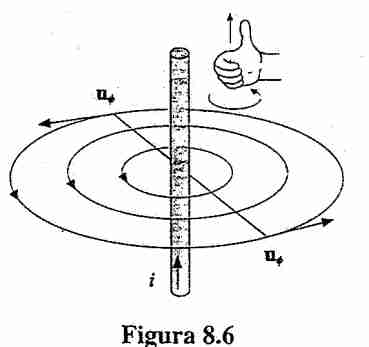
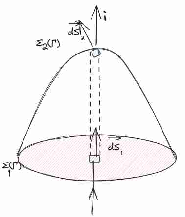
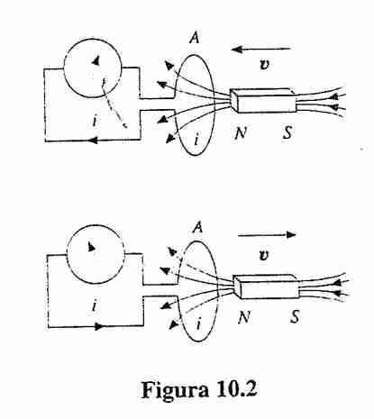
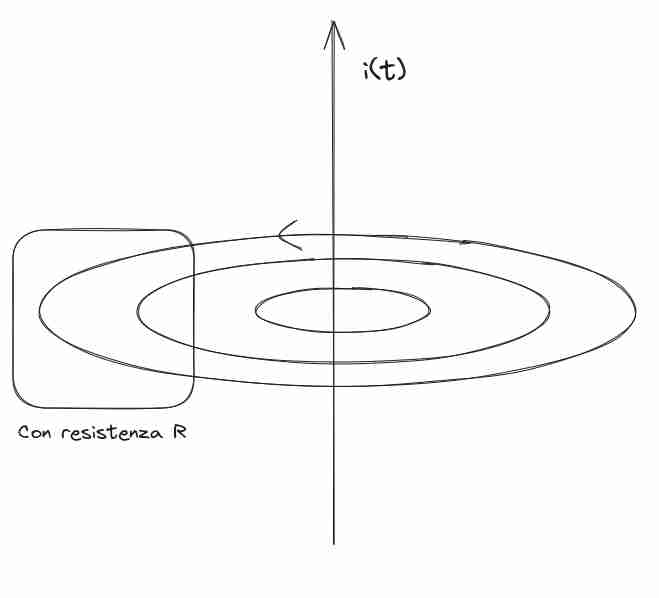
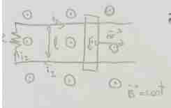
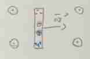

### Relazioni con fili - Ampere
#### Legge di Biot-Savart/Formalizzazione esperienza di Ampere 
Poniamo che ho due fili in cui scorra della corrente, voglia capire la forza per unità di lunghezza del filo uno su due e viceversa.
- So che entrambi generano campo magnetico
- So che il campo magnetico induce forza su correnti in movimento.
Supponiamo che la loro distanza sia $D$, allora avremo che:
Per la prima legge so:
$$
d\vec{B} = \mu_{0}i d\vec{l} \times \frac{\hat{r}}{4\pi r^{2}}
$$
da questo posso calcolare il campo magnetico totale, in un modo simile a quanto fatto in precedenza per il campo elettrico  (solo che in questo caso abbiamo il prodotto seno, quindi l'angolo che conviene scegliere è un po' diverso), e una volta che ho questo posso usare la seconda legge per avere la forza, questo è il piano.

Calcoliamo ora il valore del campo magnetico per una corrente di lunghezza infinita, una osservazione fondamentale è che **i contributi sono stesso verso** quindi posso solamente sommare e concentrarmi sul modulo:
$$
\vec{B} = \int _{Filo} \frac{\mu_{0}i}{4\pi}  d\vec{l} \times \frac{\hat{r}}{r^{2}}
= \hat{k} \frac{\mu i}{4\pi} \int_{-\frac{\pi}{2}}^{+\pi/2} \frac{dl}{r^{2}} \sin \theta
$$
Dovremo scrivere $dl$ e $r$ in funzione dell'angolo.
L'obiettivo è poi scomporre l'integrale in due  parti. metà sotto e metà sopra:
$$
r\sin \theta = D \implies r = \frac{D}{\sin \theta}
$$
E 
$$
\frac{D}{l} = \tan \theta \implies l = \frac{D}{\tan \theta} \implies dl = D \frac{d\theta}{\sin ^{2}\theta}
$$
Sostituendo tutto questo dentro otteniamo:
$$
\lvert \vec{B} \rvert = \frac{\mu_{0}i}{4\pi} \int _{\pi}^{0} \frac{\sin \theta}{D} d\theta \, dx 
= \frac{\mu_{0}i}{4\pi D} (-\cos \theta) ^{0}_{\pi} = \frac{\mu_{0}i}{2\pi D} 
$$
Da qui abbiamo ottenuto la legge di **Biot Savart**.
Qui notiamo che il campo magnetico circola intorno al filo (è tangente al campo magnetico in questo caso, molto simile).

Possiamo utilizzare questo per calcolare la forza applicata in un tratto di filo:

$$
d\vec{F} = i_{2}d\vec{l} \times (-\vec{k})\frac{\mu i_{1}}{2\pi D}
$$
Quindi otteniamo una forza
$$
d\vec{F} = \frac{i_{1}i_{2}}{2\pi D} d\vec{l}
\implies
\vec{F} = \frac{i_{1}i_{2}L}{2\pi D}
$$
Questo vale perché abbiamo considerato fili infiniti rettilinei.
Per la terza legge della dinamica la forza esercitata da due su uno è la stessa, invertita però, e questo conferma anche quanto sperimentalmente trovato con l'esperienza di ampere

#### Definizioni di dimensioni  
L'ampere posso definirlo in questo modo: corrente percorsa in due fili paralleli nel momenti in cui la distanza è un singolo metro, e la lunghezza è un metro e ho una forza uguale a $2\times 10^{-7} N$ .
Questo poi mi permette di definire il Coulomb in termini di corrente. È una definizione utile per anche avere in automatico il valore di $\mu_{0}$ (quindi molto artificiale secondo me).

**Osservazioni**
1. Linee chiuse del campo $\vec{B}$
2. il flusso è nullo, perché le linee sono chiuse (questo è coerente con Gauss)
3. Posso usare la regola della mano destra per sapere la direzione del campo magnetico
4. Posso calcolare la **circuitazione** del campo magnetico generato da una corrente

Posso calcolare la **circuitazione**, e scelgo una circonferenza chiusa:

#### Circuitazione del campo magnetico (!) 
$$
\oint_{\Gamma} \vec{B}d\vec{r} 
= \oint_{\gamma} \frac{\mu_{0}i}{2\pi} \frac{dr}{R} 
 =  \frac{\mu_{0}i}{2\pi} \frac{1}{R} \oint_{\gamma} dr
 =  \frac{\mu_{0}i}{2\pi} \frac{1}{R} 2\pi R
 = \mu_{0}i
$$
Ossia dipende dalla corrente.
La stessa relazione vale anche se scelgo un percorso spezzato! perché se scelgo il raggio, in quel caso la circuitazione è nulla, perché è perpendicolare alla direzione del campo! Il motivo è perché come sopra i raggi si semplificano, e rimane solamente l'angolo, che si semplificherà alla fine.

Proviamo a formalizzare questo discorso, poniamo di avere due circonferenze concentriche che rappresentano la direzione del nostro campo magnetico, poniamo che il tratto sul $R_{1}$ sia di $\theta_{1}$ e il tratto su $R_{2}$ sia di $\theta_{2}$ , e che $\theta_{1} +  \theta_{2} = 2\pi$, abbiamo allora che 

$$
\oint_{\Gamma} \vec{B} d\vec{r} = \frac{\mu_{0}i}{2\pi} \left( \frac{1}{R_{1}} \theta_{1}R_{1} + \frac{1}{R_{2}} \theta_{2}R_{2} \right) = \mu_{0}i
$$
Questo discorso ha delle similitudini con l'analisi del Potenziale elettrico in [[Campo elettrico]]. Anche lì spezzettavamo, e concludevamo conservatività per cose radiali.

#### Legge di Ampere 
> La circuitazione di $\vec{B}$ lungo una qualsiasi linea chiusa Gamma, è pari all'intensità di corrente **complessiva** **concatenata** alla linea chiusa moltiplicata per la permeabilità magnetica del vuoto

Questo è motivato da quanto fatto sopra per la circuitazione del campo magnetico, solo che quando l'abbiamo derivato l'abbiamo fatto per un filo rettilineo uniforme.

In un certo senso questa legge è simile a [[Legge di Gauss]] perché consideriamo solamente le correnti dentro alla nostra circuitazione (come per gauss si considerava solamente le cariche all'interno).

#### Corrente concatenata (!!) 
Dobbiamo capire il significato di corrente concatenata, possiamo riprendere la definizione di corrente elettrica che abbiamo dato durante [[Corrente Elettrica]], e considerare una superficie più ampia! Infatti considero la superficie aperta con bordo $\Gamma$, dalla definizione di densità di corrente, non mi importa che questa superficie sia oltre il nostro filo, può esser più ampio , e in questo senso la corrente è sempre quella, definita come
$$
i = \int _{\Sigma} \vec{J} \cdot d\vec{s}
$$

Considero una altra superficie a cappello come in figura (in cui il rosso è vuoto, perché è **superficie aperta**, ci piace questo perché non ci limita sulla forma della superficie), allora provo a calcolare il flusso su questo.
Definisco il verso di $ds$ come convenzione, in base alla circuitazione (stessa della corrente diciamo.)
Qualsiasi superficie aperta con bordo Gamma, riscrivendo l'equazione precedente:
$$
\oint_{\Gamma} \vec{B} \cdot d\vec{r} = \mu_{0} \int _{\Sigma(\Gamma)} \vec{J} \cdot d\vec{s} 
$$

#### Ampere in forma differenziale 
Guardare [[Divergenza e Circuitazione]], è il teorema di Stokes quello che utilizziamo:

$$
\oint_{\Gamma} \vec{B} \cdot d\vec{r} =  \int _{\Sigma(\Gamma)} \vec{\nabla} \times \vec{B} \cdot d\vec{s}=  \mu_{0} \int _{\Sigma(\Gamma)} \vec{J} \cdot d\vec{s} 
$$

Allora possiamo scrivere la legge di Ampere in forma differenziale e abbiamo:
$$
\vec{\nabla} \times \vec{B} = \mu_{0}\vec{J}
$$
Da cui abbiamo ancora che $B$ non è conservativo, e quindi non ha senso chiedersi del lavoro fatto dal campo.

#### Terza legge di Maxwell (Ampere-Maxwell) 
Come si gestisce il caso in cui l'intensità della corrente cambia?
Ricordiamo la legge di continuità della corrente, ossia abbiamo
$$
\begin{cases}
\vec{\nabla} \cdot \vec{J} + \frac{\delta \rho}{\delta t} = 0 \\
\vec{\nabla} \cdot \vec{E} = \frac{\rho}{\varepsilon_{0}} \implies \rho = \varepsilon_{0} \vec{\nabla}\cdot \vec{E}
\end{cases} \implies
\vec{\nabla} \cdot \vec{J} = -\left( \varepsilon_{0} \vec{\nabla} \frac{\delta \vec{E}}{dt} \right)
\implies
\vec{\nabla}\left( \vec{J} + \varepsilon_{0} \frac{\delta \vec{E}}{\delta t} \right) = 0

$$
Questa legge vale non solo per il caso stazionario (esteso).
In $J$ sono presenti le correnti concatenate, ma anche quelle atomiche (le correnti di magnetizzazione esplorate in [[Magnetismo nella materia]]).

Da questo possiamo ricavare la altra legge di Maxwell (inizialmente non considerato dalla Royal Academy, sarà utilizzabile solo per correnti non stazionarie)

$$
\vec{\nabla} \times \vec{B} = \mu_{0}\vec{J} + \mu_{0}\varepsilon_{0} \frac{\delta \vec{E}}{\delta t} 
$$
Si estende con la parte di Maxwell:
$$
\oint_{\Gamma} \vec{B} \cdot d\vec{r} = \mu_{0} \int _{\Sigma(\Gamma)} \vec{J} \cdot d\vec{s}  + \mu_{0}\varepsilon_{0} \frac{d\left( \int _{\Sigma(\Gamma)} \vec{E} \, ds  \right)}{dt}
$$

Questo è fondamentale! Perché basta far variare il campo elettrico e questo crea un campo magnetico!

Sono quattro equazioni differenziali a derivate parziali (stessa cosa per il campo elettrico), e con questo si può risolvere tutto.
#### Densità di corrente di spostamento 
Il termine nuovo che ha introdotto Maxwell è chiamato **densità di corrente di spostamento** e si può vedere che hanno le stesse dimensioni infatti
$$
\vec{J}_{s} = \varepsilon_{0} \frac{\delta \vec{E}}{\delta t}
$$
Guardare [[Condensatori nel vuoto]] per il ragionamento sul condizionatore e corrente di spostamento.
Si chiama corrente perché ha le stesse dimensioni delle correnti.

Una nota interessante è vedere questo come viene derivato:
Partendo dalla equazione di continuità della corrente, abbiamo che

$$
\vec{\nabla} \cdot \vec{J} = - \frac{\delta \rho}{\delta t} = -\frac{\delta}{\delta t} (\varepsilon_{0} \vec{\nabla} \cdot \vec{E})
\implies
\vec{\nabla} \cdot \left( \vec{J} + \frac{\delta}{\delta t} (\varepsilon_{0} \vec{E}) \right) = 0
$$
E dato che sommo anche quello è una densità, e la chiamo densità di corrente di spostamento.
### Campi magnetici non stazionari

Questi possono indurre una forza elettromotrice. Faraday ha indagato questa possibilità e attraverso molti esperimenti si cerca di verificare questo.

#### Esperimento di Faraday per campi magnetici non stazionari 

1. Magnete statico: Ha messo prima una calamita su un circuito, ma questo non genera corrente
2. Magnete in estrazione: genera una corrente che nel solenoide (comunque spira) ha un campo magnetico attrattivo
3. Magnete in inserimento: campo magnetico repulsivo generato dalla corrente

**Osservazioni:**
1. La corrente è più grande quanto è più grande la velocità v
2. Quando la calamita è dentro al solenoide, non si ha corrente
3. Si ha una forza opposta al movimento
4. Viene generata corrente
5. Invertendo i poli si ha la stessa cosa (solo con verso della corrente opposta).

Questi risultati sono uguali quando si usa un  circuito affacciato al primo (ci sono esattamente le stesse cose di prima). -> **Un flusso variabile può generare forza elettromotrice**.

#### Quarta legge di Maxwell (Faraday-Neumann-Lenz) 
$$
\varepsilon_{IND} = -\frac{d\Phi(\vec{B})}{dt}
\implies
\oint_{\Gamma} \vec{E} \cdot \vec{r} =  -\frac{d\Phi(\vec{B})}{dt} = - \frac{d}{dt} \left( \int _{\Sigma(\Gamma))} \vec{B} \cdot d\vec{s} \,  \right)
$$
Posso scrivere anche utilizzando il teorema del rotore (e il fatto che integro e derivo rispetto a variabili indipendenti) nella **forma differenziale**:
$$
\vec{\nabla} \times \vec{E} =  - \frac{\delta \vec{B}}{\delta t}
$$
In cui ho una informazione puntuale.

Enunciato in modo matematico da Ampere, e attraverso testo da Faraday. Che è in pratica il risultato sperimentale osservato precedentemente.

A volte il fatto che è **opposto** si dice che sia grazie agli esperimenti di **Lenz**. ed è necessaria per la *conservazione dell'energia*.
L'orientazione della superficie $\Sigma$ è data dalla regola della mano destra (e quindi decide il verso).

Possiamo individuare tre casi in cui la variazione non è nulla, li andiamo a discutere uno a uno.
1. $B = f(t)$
2. $\theta = \theta(t)$
3. $\Sigma = \Sigma(t)$

#### Angolo variabile nel tempo 
Supponiamo di avere un campo magnetico costante, vogliamo cercare di guardare quant'è la corrente indotta quando la spira ruota.
Supponiamo ruoti con $\omega = \frac{d\theta}{dt}$
Allora:
$$
\Phi(\vec{B}) = \int _{\Sigma} \vec{B} \cdot  \, d \vec{s} = BS \cos \theta(t) 
\implies \varepsilon_{IND} =  BS \sin \theta \omega
$$
Qui abbiamo una **corrente alternata**. È interessante notare che abbiamo corrente alternata anche se non c'è nessuna forza elettromotrice.

#### Flusso variabile nel tempo 

Supponiamo di avere un circuito in parallelo con una corrente che cambia intensità, così ho un flusso distante.

$i = kt$, $\lvert B \rvert = \frac{\mu_{0}i(t)}{2\pi r}$
$$
\varepsilon_{IND} = -d \frac{\Phi(\vec{B})}{dt} = i_{I}R
$$
Con $R$ la resistenza del circuito e $i_{I}$ la corrente indotta.
Per il verso della superficie è uguale, si fa una assunzione sul verso della corrente e poi si avrà il verso della corrente vera come segno.

calcoliamo il flusso allora:

$$
\Phi(\vec{B}) = \int _{\Sigma} \lvert \vec{B} \rvert  \, d\vec{S} = \int _{\Sigma} \frac{\mu_{0}i}{2\pi r}\, \vec{dS} = \frac{\mu_{0}i}{2\pi} \int_{D}^{D+L} \frac{1}{r}L\, dr
= \frac{\mu_{0}iL}{2\pi} \ln\left( \frac{D+L}{D} \right)
$$

Allora otteniamo che, sapendo che $i(t) = kt$
$$
\frac{d\Phi(\vec{B})}{dt} = \frac{\mu_{0}L}{2\pi} \ln\left( \frac{D+L}{D} \right)k
$$
Con questo poi posso descrivere la FEM indotta e quindi avere la direzione della corrente

#### Area variabile nel tempo 

Consideriamo un circuito con una barra che si muove di velocità costante, in questo senso varia l'area, e un campo magnetico uscente costante,
sappiamo che 
$A = x_{0} + vt$
Allora 
$$
\Phi(\vec{B}) = \oint_{\Sigma} \lvert \vec{B} \rvert d\vec{S} = -BS(t)
$$
Abbiamo allora che
$$
\varepsilon_{IND} = BLv
$$

Notiamo che abbiamo bisogno di una forza per continuare a tenerlo
La forza che viene applicata è

$$
\vec{F} = i_{I}lB \hat{r}
= \frac{BLv}{R} LB 
= \frac{B^{2}L^{2}v}{R}
$$
Per avere velocità costante, bisogna avere una *forza che annulli questo*, in modo che sia inerziale.

#### Barra in movimento 

Da questo esperimento proveremo che correnti vengono generati anche nel vuoto.
Consideriamo una barretta che si muove in un campo magnetico costante.
Allora abbiamo che deve valere
$$
qvB = qE_{IND} \implies E_{IND} = vB
$$
E sapendo che in questo caso semplice abbiamo
$$
\Delta V = \int_{\Gamma}\vec{E} d\vec{l} = El
$$

Che possiamo mettere dentro:
$$
\Delta V = vBl
$$
Questa è la differenza di potenziale generata all'interno.
Abbiamo una giustificazione che **la forza elettromotrice** è generata dalla **forza di Lorentz**, e questo funziona anche nello spazio vuoto.
E solitamente questo non è conservativo (se è indotto non è statico solitamente, perché ci sarà qualcosa che varia).

Vogliamo cercare di ricavare una equazione di conservazione dell'energia in elettromagnetismo classico

