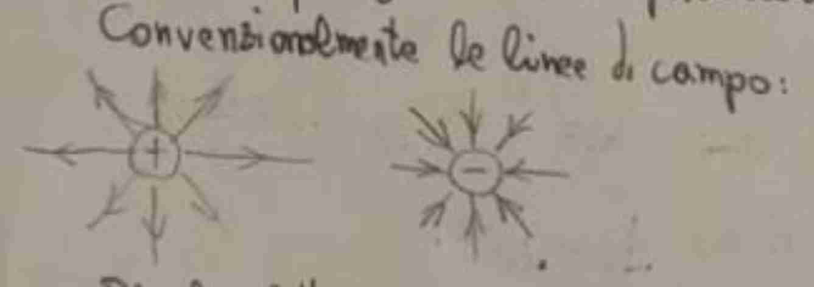
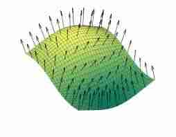
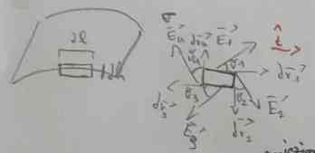
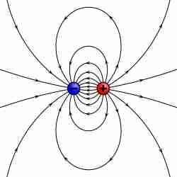
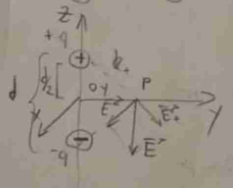
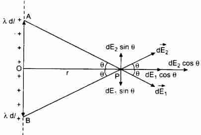
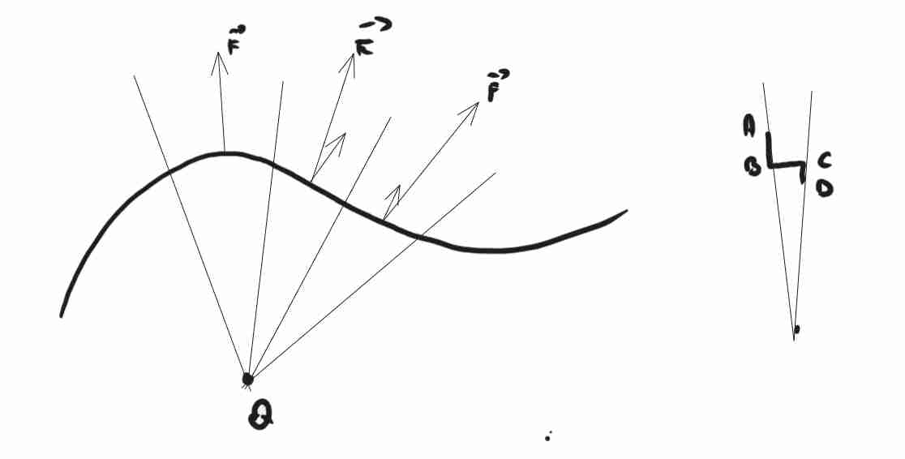
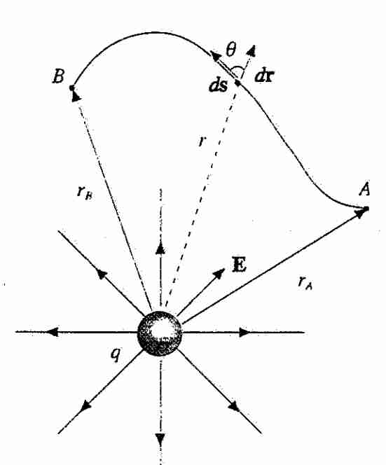

## Introduzione

### Intuizione del campo elettrostatico
#### Elettrostatico vs elettrodinamico 
Andiamo a chiamare **elettrostatico** perché nel nostro caso non si sta muovendo nessuna carica all'itnerno di questo campo.

#### Proprietà del campo elettrostatico (5) 
1. Le linee di forza in ogni punto dello spazio sono tangenti e concorde al campo in quel punto; 
2. le linee di forza si addensano dove l'intensità del campo e maggiore; 
3. le linee di forza non si incrociano mai, in quanto in ogni punto il campo è definito univocamente e non può avere due direzioni distinte.
4. le linee di forza hanno origine dalle cariche positive e terminano sul cariche negative; qualora ci siano solo cariche dello stesso segno le linee di forza si chiudono all' infinito;
5. nel caso di cariche di segno opposto, ma eguali in modulo, tutte le linee the partono dalle cariche positive si chiudono su quelle negative (**induzione completa**), alcune passando eventualmente per l'infinito; se invece le cariche non sono eguali in modulo, alcune linee terminano o provengono dall' infinito. 

#### Carica esploratrice 
È anche chiamata **carica di prova**, è una carica *fittizia* messa per esplorare la **struttura del campo elettrico** in un certo spazio

Talvolta (Mencuccini), si potrebbe definire il valore del campo come 
$$
\vec{E}(\vec{r}) = \lim_{ q \to 0 } \frac{\vec{F}}{q}
$$
in questo caso $q$ è una carica di prova, talmente piccola che non varia il campo, utilizzato per **sondare** il valore del campo in un certo punto.
Da un punto di vista intuitivo, costruiamo la linea passo passo, a **tratti infinitesimi**, e componiamo tutto lo spazio con queste.

#### Campo come grandezza 
Il campo elettrico è proprio una **grandezza fisica** (ossia una *proprietà misurabile di un oggetto* non è solo una cosa comoda matematicamente), che è solitamente utilizzata per conoscere la **forza** applicata dal campo elettrico in un certo punto. 
È una **caratteristica dello spazio** e una carica è in grado di modificare questo aspetto.

Si rappresentano *uscenti* se positiva, *entrante* se negativa

#### Definizione di campo elettrico 
$$
\vec{E}  = \frac{1}{4\pi\varepsilon_{0}} \frac{Q}{R^{2}} \hat{R}
$$
Dove $Q$ è la sorgente di carica, si può usare il [[Legge di Coulomb#Principio di sovrapposizione|principio di sovrapposizione]] anche in questo caso

#### Flusso di campo vettoriale 
Dato un certo campo vettoriale, il **flusso** studia la relazione fra questi e una superficie a scelta.
Intuitivamente si potrebbe dire *quante linee di campo* attraversano quella superficie.

Normalmente si indica così
$$
\phi_{S}(\vec{F}) = \iint_{S} \vec{F} \cdot d\vec{s} = \iint_{S} \vec{F} \cdot \hat{n} \, ds
$$
Con $\hat{n}$ indicato per marcare che deve essere **orientato** e perpendicolare alla superficie considerata.

Esempio di vettori normali alla superficie, nel nostro esempio il valore di $\hat{n}$.

#### Campo tangenziale e parallelo 
Questa parte la devo ancora scrivere per bene, in breve andiamo a trattare della **discontinuità** del flusso di fronte a una superficie carica, e il fatto che la circuitazione parallela è 0. La discontinuità è trattata a pagina 79 del Mazzoldi.

Questa parte serve per spiegare alcune proprietà del campo nei materiali conduttori trattata in [[Conduttori elettrici]].

Alla fine possiamo andare a concludere che 
$$
\Delta \vec{E}_{\parallel} = 0
$$
Questo è necessario per poter spiegare la rifrazione nei mezzi, vedi [[Condensatori con dielettrici]].

## Problemi classici
### Dipolo elettrico
Fatto (molto) meglio in [[Dipolo elettrico]]

#### Introduzione al problema del dipolo elettrico 
Questo sarà uno dei nostri primi problemi (e probabilmente anche fra le più semplici che ci permetteranno di analizzare il campo).
Abbiamo due cariche (stessa carica assoluta), una positiva e una negativa, vogliamo andare a capire come è fatto il campo elettrico attorno a queste cariche.

#### Modellizzazione del problema dipolo elettrico +
Consideriamo un punto esattamente a metà fra le due cariche, sia $d$ la distanza fra le due cariche, mettiamo il nostro sistema di riferimento come in figura. 

il campo elettrico in quel punto è dato da.
$$
\vec{E}_{tot} = \vec{E}_{+} + \vec{E}_{-} = \frac{Q}{4\pi \varepsilon_{0}}\left( \frac{\hat{R}_{+}}{R^{2}_{+}} + \frac{\hat{R}_{-}}{R^{2}_{-}} \right)
$$

Usiamo ora l'ipotesi che il punto sia a metà, abbiamo allora che la distanza in modulo sia uguale, avremo che
$$
\vec{E}_{tot} = \frac{1}{4\pi\varepsilon_{0}} \frac{Q}{R^{3}}\left( \left( y \hat{j} - \frac{d}{2} \hat{k} \right) - \left( y \hat{j} + \frac{d}{2} \hat{k} \right) \right) = \frac{1}{4\pi\varepsilon_{0}} \frac{Q}{R^{3}} (-d \hat{k})
$$

Il valore $-d Q\hat{k}$ avrà un significato speciale, sarà il **momento di dipolo**

#### Il momento di dipolo (2) 
- Direttamente proporzionale fra $d$, la distanza fra le cariche e $q$ la quantità di carica delle due.
- Mi da informazioni sulla **geometria** e sulla **carica** del sistema

Per questo è comodo poter analizzare un caso così semplificato di dipolo

### Distribuzione di carica uniforme lineare infinita
Questa sarà la nostra seconda applicazione del concetto di campo e di sovrapposizione che conosciamo
#### Introduzione problema carica uniforme lineare 

Abbiamo sull'asse $Z$ una distribuzione uniforme lineare, vogliamo cercare di capire come è fatto il campo in questo caso
#### Modellizzazione problema carica uniforme lineare infinita 
Consideriamo un punto $P$ come in figura, sia dato un piccolissimo contributo di campo $d \vec{E}$, vogliamo cercare di capire come è fatto questo contributo per l'intera linea lineare.
Possiamo fare una osservazione di simmetria e affermare che la componente $z$ si elimina (ad ogni carica corrisponde una uguale e contraria)., mentre la componente $x$, quella che esce o entra dal piano è inesistente per come è fatto il sistema

la soluzione diventa quindi $\vec{E} = E_{y} \hat{j}$ ossia
$$
E_{y} = \int \lvert d\vec{E} \rvert \cos \theta  = \frac{\lambda}{4\pi\varepsilon_{0}} \int _{-\infty}^{+\infty} \frac{dz}{r^{2}} \cos \theta
$$

Le ultime tre sono strettamente relazione fra di loro, quindi le possiamo esprimere con cose di angoli, ora l' integrale finale diventerebbe, con $r'$ la distanza del punto con la linea retta.
Questo funziona perché si può osservare che 
$$
dz = r' \, \frac{ d \tan\theta}{d\theta}
$$
Perché così abbiamo espresso totalmente l'altezza in funzione dell'angolo, è un trick che è stato usato molto spesso quindi è molto importante che te lo impari.

$$
\int _{-\infty}^{+\infty} \frac{dz}{r^{2}} \cos \theta = \int _{-\frac{\pi}{2}}^{+\frac{\pi}{2}} \frac{\cos\theta}{r'}d\theta
$$

La soluzione diventa quindi
$$
E_{y} = \frac{1}{2\pi\varepsilon_{0}} \frac{\lambda}{r'}
$$

#### Osservazione variare campo elettrico al variare dei problemi visti 
Un osservazione interessante è che il campo elettrico è
- Singola carica -> $\frac{1}{r^{2}}$
- Dipolo elettrico -> $\frac{1}{r^{3}}$
- Lineare -> $\frac{1}{r}$

### Miscellanea: problemi semplici

#### Flusso in una sfera 
Questa è una semplicissima applicazione della definizione di flusso.
Consideriamo una sfera, poniamo il sistema di riferimento al centro di questa sfera, ci chiediamo quanto è il flusso del campo radiale che varia come $\vec{F} = k \vec{r}, \vec{r} = (x, y , z)$?

Applicando la definizione di flusso abbiamo:
$$
\phi_{s}(\vec{F}) = \oint \vec{F}  \cdot d\vec{s} = \iint k \vec{r} \cdot d\vec{s} = kr \iint ds =4\pi r^{3}k
$$

## Potenziale elettrostatico
### Introduzione al potenziale elettrostatico
Abbiamo studiato in dinamica che il potenziale è un concetto strettamente legato al Lavoro, ossia dalla quantità di energia necessaria per spostare un oggetto da un punto all'altro, vogliamo cercare di definire le relazioni che intercorrono nel caso della forza elettromagnetica

#### Rotore nullo => forza conservativa 
Teorema:
$$
\vec{\nabla}  \times \vec{F} \implies \vec{F} \text{ è una forza conservativa}
$$

Il motivo è che per il teorema presente in [[#Teorema di stokes]], abbiamo che 
$$
\oint_{L} \vec{F} \cdot d\vec{l} = \iint_{S} \vec{\nabla} \times \vec{F} \,d\vec{s}
$$
E se abbiamo che il rotore è nullo, allora la forza è conservativa perché per definizione è conservativa se non dipende dal percorso, e la cosa che un circuito chiuso è sufficiente per dimostrare il sopra.

**Note mie che non ho ben capito:**
Questo si può dimostrare senza molta difficoltà se scriviamo la forza di coulomb nella forma cartesiana, alla fine facendo la derivata si dovrebbe cancellare tutto.
#### Forza radiale => forza conservativa 
Consideriamo una qualunque forza radiale e qualunque percorso lineare

Consideriamo il setting come in immagine, abbiamo un qualunque percorso, e una carica che crea forza in modo radiale diciamo.

Allora possiamo osservare se prendiamo un segmentino infinitesimale, ci sembrerà una scaletta, ma la forza coseno è attiva solamente in $\bar{AB} \text{ e } \bar{CD}$ questo ci permette di affermare che il lavoro (quella cosa potenziale) è **solamente dipendente dalla distanza**

#### Formula dell'energia potenziale elettrostatica 

Proviamo in questo momento a derivare la formula per il potenziale elettrostatico, valido per praticamente ogni percorso

$$
L_{AB} = -\int _{A}^{B} \vec{F} \cdot d\vec{r} = -\int _{A}^{B} \lvert \vec{F} \rvert ds \cos \theta = -\int _{A}^{B} \frac{1}{4\pi\varepsilon_{0}} \frac{Qq}{r_{p}^{2}} \cos \theta \, ds = -\frac{Qq}{4\pi\varepsilon_{0}}   \int _{A}^{B} \frac{1}{r_{p}^{2}} \, dr_{p} = \frac{Qq}{4\pi\varepsilon_{0}} \left( \frac{1}{r_{a}} - \frac{1}{r_{b}} \right)
$$
(col coseno dello spazio percorso, abbiamo che il valore dipenden solamente dalla distanza, per questo motivo è semplice, un altro motivo per spiegare questo è spezzettare il percorso con **zigzag infinitesimi**).
E dall'ultimo possiamo capire il potenziale classicamente definito

$$
U(r) = \frac{1}{4\pi\varepsilon_{0}} \frac{Qq}{r} + const
$$
Quindi dipende solamente dalla distanza a meno di una costante additiva.
Il motivo per cui (credo) possiamo utilizzare la costante additiva è che ci basta fissare un altro punto ad hoc, fissato un altro punto, diventa allora possibile definire il potenziale o l'energia potenziale in ogni punto dello spazio prendendo quello come riferimento.

#### Forza elettromotrice 
Spiegato in maggiore dettaglio in [[Leggi di Ohm]], dove iniziamo a parlare di circuiti.
La circuitazione per un **campo elettrico** è definito in modo molto simile a quello di una forza qualunque

$$
\mathbb{\varepsilon} = \oint_{L} \vec{E} \cdot d\vec{l}
$$

E valgono esattamente le stesse proprietà che abbiamo dimostrato sopra riguardo al rotore.

### Potenziale elettrostatico

#### Definizione 
Questa non è una energia, si potrebbe dire che è la capacità di creare energia potenziale per singole cariche

Definiamo
$$
V(A) = \frac{U(A)}{q}
$$
Che in un certo senso è il lavoro fatto dal campo, non dalla forza (NOTA: non è corretto dire lavoro di un campo, non credo sia un concetto ben definito).
#### Analisi di dimensionalità per potenziale elettrostatico 
$$
V(r) = \frac{1}{4\pi \varepsilon_{0}} \frac{Q}{r} \implies \left[ V \right]  = \left[ U \right] \left[ Q^{-1} \right] =\left[ M \right] \left[ L^{2} \right] \left[ T^{-2} \right]  \left[ Q^{-1} \right]
$$
E quindi potremmo misurare il campo elettrico anche come volt su metri, per la definizione con gli integrali

#### Principio di sovrapposizione per potenziale elettrostatico 
L'esatto principio che abbiamo descritto in precedenza per il campo elettrico vale anche il per il potenziale elettrostatico, anzi *potrebbe essere utile nel calcolo del campo elettrico stesso* se possiamo derivare in un singolo punto, otteniamo il campo elettrico in quel punto.

#### Superfici equipotenziali 
Possiamo definire delle sfere che abbiamo tutti lo stesso potenziale elettrostatico, che da un punto di vista matematico **basta stessa r** ma serve il concetto di **angolo solito** per poter caratterizzare matematicamente questo concetto.

TODO: avere superficie della sfera con angoli solidi, perché questa è l'analisi più semplice per superfici equipotenziali di singola carica

#### Equazione di Poisson

$$
\vec{\nabla} \cdot \vec{E} = \vec{\nabla} \cdot (-\vec{\nabla}V) = \frac{\rho}{\varepsilon_{0}}
$$
Quindi l'equazione di poisson è

$$
\nabla^{2} V = -\frac{\rho}{\varepsilon_{0}}
$$
Nel caso in cui non ci sia carica in un punto nello spazio abbiamo l'**equazione di Laplace**

$$
\nabla^{2} V = 0
$$
Per qualche motivo a me oscuro, la soluzione dell'equazione di Poisson in coordinate cartesiane è:

$$
V(x, y, z) = \frac{1}{4\pi\varepsilon_{0}} \int _{\Sigma} \frac{\rho(x', y', z')\, dx'dy'dz'}{\sqrt{ (x - x')^{2} + (y - y')^{2} + (z - z') ^{2} }}  
$$
Questo risulta utile per caratterizzare la soluzione dell'equazione di Poisson per il [[Vettore potenziale]].
