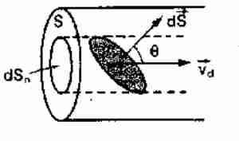
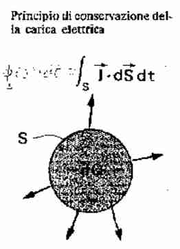

## Introduzione alla corrente elettrica

### Considerazioni generali

#### Elettroni liberi nei materiali
Ricorda che è un **reticolo cristallino**, con un elettrone nell'ultimo orbitale poco legato, quindi facilmente ionizzabile, in cui gli elettroni si possono muovere facilmente, e abbiamo che $n \approx 8.5 \times 10^{28} \frac{e^{-}}{m^{3}}$ nel rame
Per l'argento abbiamo 5.9 con stesso ordine di grandezza.

#### Velocità media elettroni senza campo elettrico 
Se è isotropo, gli elettroni si muovo in generale a caso e la velocità media dipendente dall'eccitazione termica (in teoria cinetica dei gas è studiata sta cosa).
$$
\vec{v}_{m} = \sum_{i = 1} ^{N} \frac{\vec{v}_{i}}{N} = 0
$$
**Analisi che segue i gas:**
$$
\frac{1}{2}  m_{e} v^{2} = \frac{3}{2} k T
$$
Con $k = 1.38 \times 10 ^{-23} J / K$ questo da studiare in altro posto...

Comunque abbiamo che
$$
\vec{V} = \sqrt{ \frac{3kT}{m_{e}} } \approx 1.16\times 10^{5} \frac{m}{s} = 116 \frac{km}{s}
$$
Assumendo che $T = 293K$ con la **teoria cinetica dei gas classica**. Ma probabilmente questa analisi non è corretta, perché serve la meccanica quantistica per spiegare questo (Fermi-Sommerfield, calcola meglio questa parte), con questa otteniamo che è ti tipo $1580 \frac{km}{s}$ che è un ordine di grandezza più grande.

In assenza di campo sembra assistere a urti anelastici in giro, che vanno a caso e si scontrano con atomi molto più pesanti.

#### Velocità di deriva 

Proviamo a considerare questo esperimento:
Sia $\vec{v}_{i}$ la velocità di un elettrone prima di un urto, e $\vec{v}_{i + 1}$ la velocità dopo un urto. Facciamo finta che in un campo elettrico venga acceso un campo elettrico nell'intervallo fra $i$ e $i + 1$, allora sarà sottoposto a una forza 

$$
\vec{F} = -e\vec{E}
$$
Allora abbiamo che
$$
m \frac{dv}{dt} = -eE \implies
\vec{v} = -\frac{e\vec{E}}{m} t
$$
Allora sappiamo che in ogni urto, si avrà in generale sempre una componente verso la direzione del campo (questa è la parte che influenza la velocità di deriva che ricordiamo è molto basso). Questo è nell'ordine di metri all'ora.

Allora provando a riconsiderare la velocità media:

$$
\vec{v}_{media} = \frac{1}{N}\sum \vec{v}_{i} - \frac{e\vec{E}}{m}t
= -\frac{e\vec{E}}{m}t
$$
Dato che la velocità che proviene solamente da agitazione termica è 0, e che ogni singola particella è soggetta alla stessa forza (si semplifica il numero diciamo per il secondo addendo).

#### Similitudine velocità di deriva con caduta 
Molto brevemente se sottoposti a un campo elettrico, gli elettroni si spostano, ma questa cosa dura molto poco, quindi non era poi utile a utilizzare.

Dopo Alessandro Volta abbiamo un campo elettrico costante all'interno di un conduttore. Riusciva a **generare una differenza di potenziale costante** sui capi dell'oggetto.
Questo è **pila, fem, generatore**.
Allora in questo caso la loro velocità media è diversa da 0, iniziano quindi ad urtare gli urti (elastici) gli atomi, molto casuale, ma in media è sempre accelerato verso la direzione del campo.
Questo caso sembra simile a quello di un corpo che fa urti con atomi dell'atmosfera, non fanno altro che *rallentare il moto di caduta libera* in quel caso avevamo
$$
\vec{F} = \vec{P} = m\vec{g} - \beta \vec{v} \implies
\vec{V}_{lim} = \frac{m\vec{g}}{\beta} = \text{constant}
$$
Anche in questo caso ci sarà una velocità constante media degli elettroni, quando continuamente cominciano a sbattere.

Nel caso delle correnti si chiama effetto di **RESISTENZA** ossia l'effetto di urti sugli atomi del mezzo conduttore, che rallentano, qui il *baricentro delle cariche* si sposta all'interno del campo, che va in modo costante.

#### Superconduttori 
Sono materiali in cui **non c'e resistenza**, solitamente leghe di metalli rari (boruro di metallo tipo), in cui vicino allo 0 assoluto non hanno resistenza.

#### Semiconduttori 
Sono dei dielettrici **drogati** con aggiunta di ioni che siano in grado di liberare carica, come sali disciolti nell'acqua. Hanno una densità di elettroni molto molto minori rispetto ai conduttori, ma sono sufficienti per condurre
La caratteristica principale è che hanno molti meno elettroni liberi, ma ne hanno alcuni.
### Introduzione con definizioni

#### Definizione della corrente 
**Intensità di corrente**
$$
i = \lim_{ \Delta t \to 0 }  \frac{\Delta q}{\Delta t} = \frac{dq}{dt}
$$
Questo si può mettere in relazione con la densità di corrente che sarà spiegata subito dopo, abbiamo che

#### Grandezza della corrente 
$$
[i] = [Q][T]^{-1} = [A]
$$
Ossia $1A = 1C / 1s$ che è una quantità enorme.

### Densità di corrente
#### Definizione di densità di corrente 

Perché la $\vec{J}$ che è definita ha stesso verso del campo elettrico.
È la quantità di corrente che attraversa una superficie qualunque, quindi è un flusso.

Definito come
$$
\vec{J} = ne \cdot \vec{v}_{d}
$$
Con la velocità di deriva.

#### Densità di corrente motivazione (!) 

Vogliamo capire, quanta corrente in un intervallo $dt$ attraversa quella superficie?
Tutta la carica che sta a distanza $v_{d}dt$ riesce a passare la superficie.
abbiamo quindi che il volume è
$$
d\tau = v_{d} \Delta t dS \cos \theta
$$
in cui $v_{d}\Delta t$ è il parallelepipedo, o comunque la zona di spazio delle cariche che passeranno attraverso la superficie.

E allora il numero di elettroni lì dentro è $n_{e}\cdot \tau$ 
Quindi

$$
dq = qn_{e} \cdot d\tau
$$
Con questo possiamo ri-caratterizzare la definizione di corrente:

$$
i = \lim_{ \Delta t \to 0 } \frac{\Delta q}{\Delta t} = ne v_{d} S \cos \theta = ne \vec{v}_{d} \cdot \vec{S} = \vec{J} \cdot \vec{S}
$$
che è proprio ciò che abbiamo ragionando per first principles.

Più in generale:
$$
i = \int _{\Sigma} di = \int _{\Sigma} \vec{J} \cdot d\vec{S}  
$$

E chiamo la nuova grandezza $\vec{J}$ con lo stesso verso del campo elettrico come **densità di corrente**
Di valore $\frac{[A]}{[m]^{2}}$ Quindi la $i$ è il flusso all'interno di quello, come se fosse acqua in tubo.
Dal punto di vista del flusso però è *impossibile distinguere fra positivi e negativi*, perché tanto si annullano
Questo è vero considerando questa semplice osservazione:

$$
\vec{J} = nqv
$$
$$
\vec{J} = n (-q) (-v)
$$
In ogni caso è sempre positivo, quindi possiamo usare la parte positiva come carica giustificato da questo artificio matematico.

#### Stima densità di corrente (no impo)
Supponiamo di avere un tubo di rame per cui abbiamo $n \approx 8.5 \times 10^{28} \frac{e^{-}}{m^{3}}$, $r = 0.8 mm$ con una corrente $i = 15 A$, consideriamo una superficie perpendicolare. Applichiamo i concetti:

$$
i = \int _{\Sigma} \vec{J} \cdot \vec{dS}  = J \int _{\Sigma} \, dS = J \cdot S = J \pi r^{2}
= nev_{d} \pi r^{2} 
\implies v_{d} = \frac{i}{neS}
$$
Sappiamo che $S \approx 2 \times 10^{-6} m^{2}$ e sappiamo che $ne$ è la densità volumetrica di carica, dipendente la carica di conduzione $\rho$ che è il valore di n che abbiamo descritto sopra.
$ne = \rho = 8.5 \times 10^{28} \cdot  1.6 \times 10^{-19} \approx 13.6 \times 10^{9} \frac{C}{m^{3}}$

Sostituendo sopra abbiamo che $v_{d} \approx 5 \times 10^{-4} \frac{m}{s} = 2\frac{m}{h}$
Quindi due metri all'ora, avendo gli elettroni che si muovono a 1k chilometri a secondo, la velocità di deriva è molt lenta, ed è corrente.
Ma essendo la carica enorme, alla fine ho grandi valori!

Facendo tutto questo calcolo abbiamo che 

#### Equazione di continuità della densità di corrente (!) 

$$
i = \int _{\Sigma} \vec{J} \cdot \vec{S}  = -\frac{dq}{dt}
$$
Perché sto considerando la carica positiva che sta uscendo, quindi dentro sto perdendo carica.

**Regime stazionario** si ha quando $i = 0$, quindi non ho carica che gira, nel senso che stessa carica esce, e stessa carica esce durante il circuito.

#### Continuità in forma differenziale 
Questo è l'equivalente di conservazione di carica per la corrente.

Noi abbiamo per il teorema della divergenza (vedi [[Divergenza e Circuitazione]]) che 

$$
\oint_{\Sigma} \vec{J} \cdot d\vec{S} = \int _{V(\tau)} \vec{\nabla} \cdot \vec{J} \, d\tau 
$$
Abbiamo anche per definizione di densità di flusso che
$$
 \frac{dq}{dt} 
 =  \int _{V(\tau)} \frac{\delta\rho}{\delta t} \, d\tau
$$
Quindi ho che 
$$
  \int _{V(\tau)} \frac{\delta\rho}{\delta t} \, d\tau = - \int _{V(\tau)} \vec{\nabla} \cdot \vec{J} \, d\tau 
$$
Questa è l'equazione di continuità in forma differenziale:

$$
\vec{\nabla} \cdot \vec{J} + \frac{\delta \rho}{\delta t} = 0
$$

