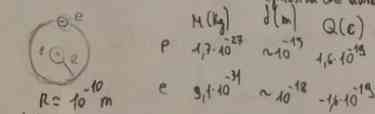
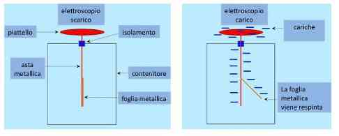
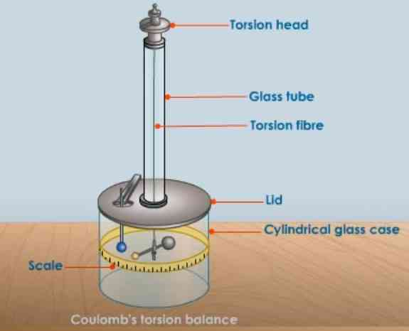
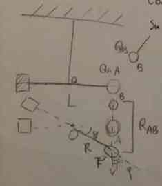
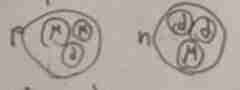

## Introduzione elettromagnetismo

### Note storiche: triboelettricità

Il concetto di **campo** è fondamentale per l'elettromagnetismo (vs forza in meccanica)
da un punto di vista storico è nato tramite l'osservazione in fenomeni come lo strofinio fra vetro e pelle, dopo il quale hanno osservato ci fosse una forza nascosta (appunto **ombra** dal greco di electron).
Il vetro si caricava poi abbastanza da poter attrarre carta per esempio. [esempio dell'esperimento](https://youtu.be/iHBNWiHJaQQ?si=0GPKmcE2Oeh69zXj).  Se viene fatto invece fra due lastre in vetro invece diventa *repulsiva* invece che attrattiva.
Questo effetto è chiamato **triboelettricità**.

### Dimensioni atomo
#### Misure classiche dimensione atomo 
Questa è una piccolissima sezione per dare l'intuizione su quanto sia grande in generale un atomo, confronto fra protone ed elettrone:

#### Forza di gravità vs elettromagnetico 
TODO: in questa parte viene fatto un confronto fra quanto è grande la forza di gravità contro la forza elettrica in un atomo
Fatto da esempio 1.1 pagina 9 del Mazzoldi
Abbiamo che la differenza in modulo della forza di gravità e forza elettrica sia molto differente (circa $10^{39}$ di differenza, quindi troppo per dire.)
### Esperimenti classici
#### Elettroscopio a foglie 

[Video per l'esperimento](https://youtu.be/XXVUuW5F0xU?si=eKnTMxnoIitJdTB_) in cui vengono presentati tre casi (e tre cariche risultanti diverse).

1. avvicinando un oggetto carico, le foglie si separavano, questa è una **carica indotta** dalla presenza di un altro oggetto, allontanando rimaneva poi uguale.
2. Se tocco, caricherò con la stessa carica del mi oggetto (scambio di elettroni)
3. Se scarico a terra, la carica presente sarà l'opposta.

L'angolo di separazione fra le foglie hanno permesso di **misurare la carica per la prima volta**. (poi probabilmente qualcosa di meccanica per calcolare).

#### Bilancia a torsione -
Questo è un setting un po' più complesso anche se l'idea è ancora quella presente in [[#Elettroscopio a foglie]] di misurare un angolo per avere la distanza.
[video esempio](https://youtu.be/FYSTGX-F1GM?si=PLB61tg1ljz-XbRb).

L'unica cosa importante era l'angolo di torsione, da cui si poteva dedurre la forza.
Poi la palla blu è di metallo, e si può caricare.

Proviamo a considerare il setting:

Sappiamo che il momento torcente è dato da $\vec{m} = \vec{R}\vec{F}$ e si può dire che in modulo abbiamo $\lvert \vec{m} \rvert = \frac{L}{2} \lvert F \rvert \sin \varphi$ (questo da semplice meccanica), ma poi abbiamo anche che il momento torcente del setting (quello che va in alto è solamente $\lvert \vec{M} = k \theta \rvert$) Quando raggiunge l'equilibrio si avrà
$$
\frac{L}{2} \lvert F \rvert \sin \varphi = k \theta \implies \lvert F \rvert = \frac{2k\theta}{L \sin \varphi}
$$
Da cui si può derivare la forza, e quindi sperimentalmente anche i valori di questa carica elettrica.

## La legge di coulomb
### Enunciato a parole 
> Date due cariche elettriche poste a una distanza $r$, tra di esse esercita una forza che è direttamente proporzionale al prodotto delle cariche ed inversamente proporzionale al quadrato della distanza, tale forza è diretta fra la congiungente delle cariche elettriche, repulsiva se i segni sono concordi e attrattiva se discordi.

### I risultati di coulomb 
Grazie al suo lavoro metodico di sperimentazione è riuscito ad elaborare la legge che viene presentata subito sopra, è riuscito a ridurre il tutto a tre proprietà fondamentali
1. la forza è diretta sulla congiungente
2. A volte è attrattiva, altre volte repulsiva
3. Varia inversamente al quadrato della distanza e direttamente al prodotto (questo è riuscito a farlo con palle di metallo che spezzano la carica in due)

$$
\lvert \vec{F} \rvert = k \frac{Q_{0}Q_{1}}{r^{2}}
$$

Con questa costante qui che non è più adimensionale come nel caso della costante elastica di torsione, ma è stato nel tempo scoperto essere dipendente dalla **costante dielettrica del vuoto**, di cui capiremo un po' meglio quando andremo a parlare di dielettrici in seguito.
Una analisi dimensionale ci darà che l'unità di misura di quello è $\frac{Nm^{2}}{C^{2}}$.

### Costante dielettrica del vuoto 
Bisogna ricordarsi il valore della costante a memoria! Anche la sua dimensione!

Altra analisi di cui non so la derivazione si avrà che 
$$
k = \frac{1}{4\pi \epsilon_{0}} = 8.99 \cdot 10^{8} N \frac{m^{2}}{c^{2}}
$$

Mentre la $\epsilon_{0}$ costante dielettrica del vuoto vale
$$
\varepsilon_{0}=8.85 \cdot 10^{-12}\frac{C^{2}}{N m^{2}}
$$

## Sulla carica

### Come proprietà della materia
#### Proprietà (2) 
La carica è una **proprietà intrinseca della materia**, esattamente come la massa, se consideriamo protoni ed elettroni, questi sono la più piccola unità di carica possibile.

- **Costante**, questo significa che se il sistema è **isolato**, la quantità di carica non cambia mai
- **Invariante** fra *sistemi di riferimento*, se lo guardo da un sistema di riferimento che si muove e non (quindi stiamo parlando di meccanica), questa carica non cambia.

#### Subatomica (no)
Si può dire che un protone e un neutrone è formato da quark, anche se non so esattamente cosa siano, puoi trovare una immagine negli appunti di Matti in questo modo:

#### Carica protoni ed elettroni 
Stiamo provando a rispondere alla domanda *perché la carica di elettroni e protoni è uguale?* Proviamo a ragionare per assurdo, assumendo le costanti che conosciamo già sopra in [[#I risultati di coulomb]].

Supponiamo ci sia una differenza di carica fra protoni ed elettroni, anche piccolissima, mettiamo caso sia $1.6 \cdot 10^{-28}C$, e consideriamo due palle di ferro puro di massa $1Kg$ e raggio $1m$, allora dato che la $\Delta q \neq 0$ si avrà una forza, che sarà di $k \Delta q \frac{\Delta q_{2}}{r^{2}}$,  considerando che il ferro nella tavola periodica ha $Z=26$ ossia il numero totale di protoni e $A=55$, il numero di massa, avremo che $\Delta Q = N_{protoni}\cdot \Delta q$, e da questo si può ricavare un valore simile a $0,0455 C$, e considerando che $N_{p} = z \cdot N_{atomi} = Z \cdot \frac{M}{A} N_{a}$ dove l'ultimo è il numero di avocadro credo, la forza che sarebbe presente sarebbe di circa $1.7 \cdot 10^{7} N$, e si avrebbe il terzo principio della dinamica, ma sperimentalmente non esiste questa forza
### Principio di sovrapposizione

#### Enunciato del principio di sovrapposizione 
Questo è uno dei metodi principali che sarà utilizzato per calcolare il [[Campo elettrico]], dice semplicemente che i vettori della forza di Coulomb si possono semplicemente sommare fra di loro
$$
\frac{1}{4\pi\varepsilon_{0}} Q_{p} \sum_{i=1}^{N} \frac{q_{i}}{r_{i}^{2}} \hat{r}_{ip}
$$

Questa stessa idea si può utilizzare senza nessun problema anche nel caso in cui ho volumetti carichi

#### Densità volumetrica di carica 
$$
\rho(\vec{r}) = \lim_{ \Delta \tau \to 0 } \frac{\Delta q}{\Delta \tau} = \frac{dq}{d\tau} \implies \rho(\vec{r}) d\tau = dq
$$
Andando a considerare gli infinitesimi

#### Densità superficiale di carica 
Il concetto è uguale al precedente, solo che ora andiamo a considerare una superficie, e non un volume infinitesimale
$$
\rho(\vec{r}) = \lim_{ \Delta s \to 0 } \frac{\Delta q}{\Delta s} = \frac{dq}{ds} \implies \rho(\vec{r}) ds = dq
$$

#### Densità lineare di carica 
 
Stesso concetto per la lineare, ma anche qui non lo riscrivo però, scrivo però l'equivalente dell [[#Enunciato del principio di sovrapposizione]] per più facile comprensione.
$$
\vec{F}_{l} = \frac{1}{4\pi \varepsilon_{0}} Q_{p} \int _{l} \frac{\lambda(\vec{r})}{\Delta r^{2}} \hat{\Delta}r \, dl 
$$
Integrale lineare

