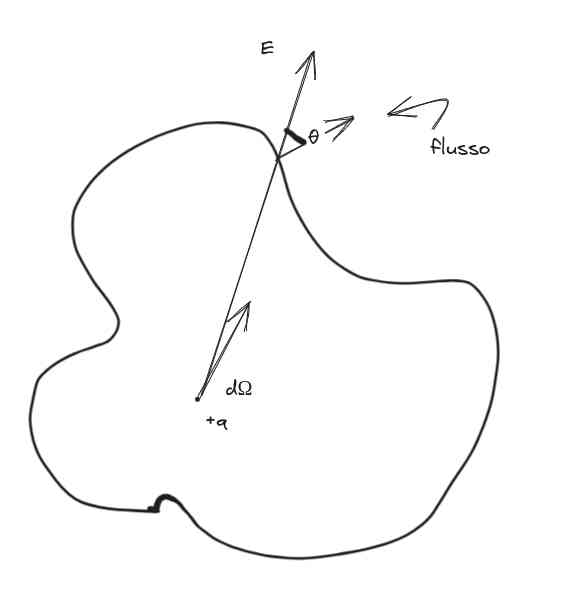
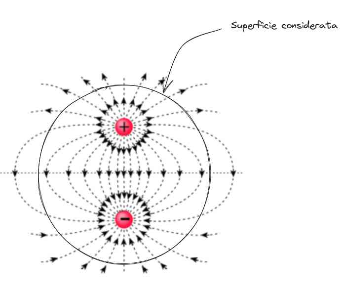

### Introduzione alla legge di gauss

#### Giustificazione con angoli solidi --
Pagina 69 del Mazzoldi.
Vogliamo chiederci quanto sia il flusso in qualunque superficie
Da un punto di vista infinitesimo abbiamo che (perché il flusso è, intuitivamente, la parte perpendicolare rispetto la superficie che abbiamo)
$$
d\Phi = \vec{E}\cdot  \vec{dS} = \lvert \vec{E} \rvert \lvert \vec{dS} \rvert \cos \theta = \frac{1}{4\pi\varepsilon_{0}}\frac{1}{r^{2}} ds = \frac{Q}{4\pi\varepsilon}d\Omega 
$$
Il secondo passaggio è giustificabile andando su coordinate polari considerando **l'angolo solido** di un oggetto quindi non dovrebbe essere un problema.

Dall'equazione di sopra abbiamo il flusso che è da dentro un punto interno, sommando tutti questi infinitesimi abbiamo che
$$
\Phi = \int _{\sum} \, d\Phi= \int _{\sum}  \frac{Q}{4\pi\varepsilon}\, d\Omega =  \frac{Q}{4\pi\varepsilon}\int _{\sum}  \, d\Omega   = \frac{Q}{4\pi\varepsilon} 4\pi = \frac{Q}{\varepsilon}
$$
Nota **il flusso dipende solamente dalla CARICA**, indipendente dalla singola posizione.

#### Enunciato legge di Gauss (linguaggio naturale) 

> Il flusso attraverso qualunque superficie **chiusa** $\sigma$ eguaglia la *somma algebrica* delle cariche contenute all'interno della superficie *comunque esse siano distribuite* divisa per ma costante dielettrica del vuoto $\varepsilon_{0}$

(praticamente scritto in linguaggio ambiguo naturale quello che viene espresso in formule, niente di più e niente di meno).

#### Legge di Gauss in forma integrale 

$$
\oint_{\sum} \vec{E} \, \vec{ds} = \frac{Q}{\varepsilon_{0}} 
$$

E se ci sono più cariche, per **principio di sovrapposizione** posso *sommare* tutte le cariche sopra, e quindi ho $Q_{T} = \sum_{i=1}^{N}q_{i}$ questo vale per distribuzione di cariche discrete, se è continuo è leggermente diversa la cosa (per cose viste precedentemente il contributo delle cariche esterne è zero.)

#### Legge di Gauss e divergenza 
Guarda il teorema della divergenza dimostrato più generalmente in [[Divergenza e Circuitazione]].
Flusso di campo vettoriale su superficie chiusa sigma è  uguale a qualcosa sulla divergenza 

$$
\oint_{\Sigma} \vec{E} \, \vec{d}s= \int_{V(\Sigma)} \vec{\nabla}\vec{E} \, dt 
$$

In qualche modo posso dire che la densità di carica sul volume si può fare senza problemi,
Sappiamo sempre per gauss che 

$$
\frac{1}{\varepsilon_{0}}\int _{V(\sigma)}\rho \, dt = \frac{Q_{T}}{\varepsilon_{0}} 
$$
Abbiamo quindi che 
$$
\int _{V(\Sigma)}\vec{\nabla}\vec{E} \, dt  = \int_{V(\Sigma)} \frac{\rho}{\varepsilon_{0}} \, dt \implies \vec{\nabla}\cdot\vec{E} = \frac{\rho}{\varepsilon_{0}}
$$

#### Legge di Gauss in forma differenziale (locale) 

Esiste anche una altra forma, che è si può vedere sopra la dimo [[#Teorema della divergenza]] riguardo alle motivazioni.
$$
\vec{\nabla}\cdot\vec{E} = \frac{\rho}{\varepsilon_{0}}
$$
$\rho$ è la **densità** volumetrica di carica.

Che mi da informazione sul valore del campo **sul singolo punto**, ossia se in quel punto c'è il campo.

**Osservazione 1** È ovvio osservare che questa forma del teorema di Gauss è applicabile solo nei casi in cui la funzione è **differenziabile** ovunque nello spazio, cosa che non è mai detto. Se ho un punto di discontinuità, devo usare la forma integrale

**Osservazione 2**: questa è una **forma locale** perché nel caso la densità cambiasse, questa legge non può essere utilizzata, non è immediato che il campo cambi infatti, però è utile per **calcolare il campo nella singola posizione**.
### Utilizzi della legge di Gauss
#### Esempio: flusso dipolo 

Essendo che altre parti escono, altre entrano, il flusso totale è zero.
Questo è anche un modo per dimostrare che **non esiste nessuna linea che entra o esce dall'infinito**, andandosi quindi a trattare di induzione completa.

#### Metodi per calcolare il flusso 
1. sommo tutte le cariche che sono presenti (quanto fatto sopra)
2. Uso Gauss (superficie)
3. Sommo potenziali (gradiente cambiato di segno (recuperare))

#### Considerazioni sulla legge vs Coulomb 
Questa legge di gauss è direttamente dipendente dalla [[Legge di Coulomb]], (probabilmente quello che si vuole dire è che da una puoi derivare l'altra) e funziona solamente per il fatto che scende in modo inversamente quadrato.
#### Caso particolare: campo costante 
Consideriamo il caso in cui il campo è costante su tutta la superficie, allora avrei che
$$
\oint_{\sum}\lvert  \vec{E} \rvert ds \cos \theta = \lvert \vec{E} \rvert \oint_{\sum}ds\cos \theta \implies \lvert \vec{E} \rvert = \frac{Q_{T}}{\varepsilon_{0}} \frac{1}{\oint_{\sum}ds\cos \theta}
$$
Un aspetto particolare è che questo integrale $\oint_{\sum}ds \cos \theta$ è **semplicemente l'area della superficie**. 

