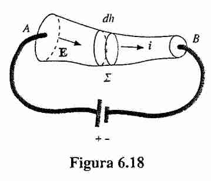
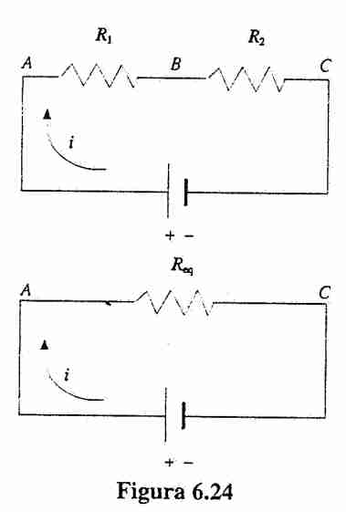
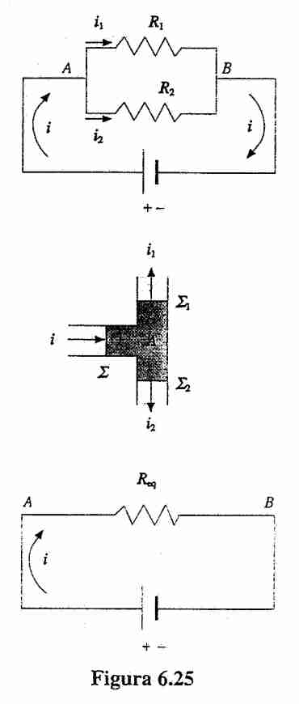
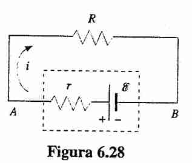
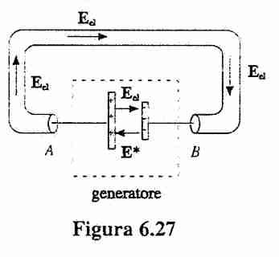

Gli argomenti della lezione 31 Ottobre sono circa da pagina 164 fino a 185 del mazzoldi.
### Leggi di Ohm

#### Introduzione microscopica 
Sappiamo che
$$
\vec{J} = -n e \vec{v}_{d}
=
ne^{2} t \frac{\vec{E}}{m}
$$
Vedi analisi della velocità di deriva col modello del 1900 in [[Corrente Elettrica]].

Dove abbiamo utilizzato la definizione di densità di corrente e la velocità fra collisioni ed altre
Questo è una motivazione per considerare la densità di corrente come se fosse nello stesso verso.

Da questo notiamo che **dipende solamente dal materiale** perché abbiamo $t$ che è il tempo che intercorre fra collisione uno e due, mentre $n$ è la densità di elettroni per unità di volume, anche questo dipendente dal materiale, poi $e$ ed $m$ sono costanti universali.

Possiamo rispondere a questo assumendo un parametro dipendente dal mezzo, e la regola diventa allora:
$$
\vec{J} = \sigma \vec{E}
$$
Dove $\sigma$ è il **tensore di conducibilità elettrica**
Questo si può riscrivere anche in
$$
\vec{E} = \rho \vec{J}
$$
Dove $\rho$ è la **resistività**, e si ha $\rho = \frac{1}{\sigma}$

Nota: c'è qualcosa con i semiconduttori o cose drogate, che puoi scomporre la parte di sopra con cariche negative o positive, questa cosa è da approfondire sul libro, perché non la ho capita oggi a lezione
Vedi 6.7 mazzoldi c'è scritto.

#### Potenza e densità elettrica --
Chiamiamo $P_{\tau}$ come la potenza per unità di volume, che ricordiamo la derivata del lavoro per il tempo.
Ricordando che $P = \frac{dW}{dt} = \frac{\vec{F}ds}{dt} = \vec{F} \cdot \vec{v}$

$$
P_{\tau} = nP = n\vec{F}\cdot \vec{v}_{d}
= ne\vec{v}_{d} \cdot \vec{E}
= \vec{J} \cdot \vec{E}
$$

Si può riscrivere con la legge di Ohm, e abbiamo che
$$
P_{\tau} = \vec{J} \cdot \vec{E} = \sigma E^{2} = \rho J^{2}
$$

#### Resistenza nei fili 
Consideriamo un *cilindro* (che sarà il nostro filo) con superficie $S$ verticale e lunghezza $L$, consideriamo due lati $A$ e un lato $B$
Assumiamo di avere una batteria che crea un campo costante:
Allora abbiamo:
$$
V_{A} - V_{B} = \int _{A}^{B}\vec{E} \, d\vec{l} = EL
$$
Abbiamo che che
$$
I = \int \vec{J} \cdot d\vec{s}  = J S \implies J = \frac{I}{S}
$$
Ora usiamo la relazione fra campo elettrico e densità di corrente, e otteniamo che

$$
V_{A} - V_{B} = \rho J L
= \rho L \frac{I}{S}
= \frac{\rho L}{S} I
= R I
\implies
V = RI
$$

Chiamo la **resistenza questo valore**
$$
R = \frac{\rho L}{S}
$$
Perché dipende solamente dalla **geometria** del filo che abbiamo preso.
Possiamo definire anche lo stesso concetto per conduttori non lineari (quindi forme a piacere)
Per questo si può generalizzare con
$$
R = \int _{A}^{B} \frac{\rho}{\Sigma} \, dl 
$$

Seguendo quanto c'è in immagine.

Quando abbiamo ai capi di un conduttore una differenza di un volt, si ottiene una corrente di un ampere, e questo è l'ampere.

#### Legge di Ohm della conduzione elettrica ++
Vedi mazzoldi pagina 170.
$$
\sigma = \frac{ne^{2}\tau_{+}}{m_{+}} + { \frac{ne^{2}\tau_{-}}{m_{-}}}
$$
È semplicemente un modello vecchio in cui andiamo a distinguere i portatori di carica negativa e positiva con delle masse diverse (e quindi velocità di deriva diversa).
Per il resto resta la stessa derivazione di sopra.

La legge in question (**legge di Ohm della conduzione elettrica**) è:
$$
\vec{J} = \sigma \vec{E}
$$
Dove la densità di corrente è relazionata al campo elettrico generato solamente da variabili fisiche riguardanti la composizione del metallo e costanti elementari come massa di portatori di carica.

#### Il regime stazionario 

Che ha senso solo in **regime stazionario** ossia in cui il campo elettrico non varia, ed è costante.
Un altro modo per dirlo è che **in ogni punto passa sempre la stessa corrente** quindi il flusso del $\vec{J}$ è 0.
Ossia
$$
\oint \vec{J} d\vec{S} = 0
$$

$$
\vec{\nabla} \cdot \vec{J} = 0
$$

#### Resistività e temperatura +
Intuitivamente se aumenta l'agitazione termica, aumenta la resistività perché c'è più agitazione, quindi più incontri, si ha una legge del tipo:

$$
\rho = \rho_{20}(1 + \alpha \Delta T)
$$
Il grafico è piatto fino a un certo punto, poi va su in modo lineare.
Nei semiconduttori il coefficiente è negativo.

Supponiamo di avere una forma cilindrica a piacere, abbiamo che 
$$
dP = P_{\tau} \Sigma dh
=
\rho J^{2} \Sigma dh
= \frac{\rho i^{2}}{\Sigma}dh
\implies
P = \int  \, dP
= \int _{\tau} \frac{\rho i^{2}}{\Sigma} \, dh
= I^{2} \int _{\tau} \frac{\rho}{\Sigma} \, dh
= RI^{2}
$$
integrando questo riesco a trovare la **potenza dissipata in conduttore**
Si può fare anche in altro modo partendo con la potenza
$$
P = \frac{dW}{dt} = \frac{Vdq}{dt} = \frac{Vidt}{dt} = VI
$$

E si può scrivere anche come 
$$
P = \frac{V^{2}}{R}
$$

Noi paghiamo in $W = RI^{2}t$ che sono ikilowattora.
il riscaldamento si chiama **effetto Joule**.

#### Legge di Ohm generalizzata 
Per ogni ramo dovrei mettere la differenza di potenziale più tutte le forze elettromotrici meno tutte le cadute.
Si scrive:
$$
V_{A} -V_{B} + \Sigma_{k}\varepsilon_{k} = R_{T}i
$$
Questa è un caso generale della legge di Kirchhoff alle maglie descritta dopo
#### Potenza per unità di volume 
Vedi Mazzoldi pagina 170
$$
P_{\tau} = nP = \rho J^{2} = \sigma E^{2}
$$

Questo si può riscrivere come 
$$
P_{\tau} = \vec{J} \cdot \vec{E}
$$
L'abbiamo ricavato anche in [[Magnetismo]] parlando di Poynting, in qui possiamo relazionarlo utilizzando le equazioni di Maxwell anche col campo magnetico.
### Resistori in serie e parallelo
Una cosa da notare è che saldare assieme è una **altra resistenza** non considerata, comunque è piccola, quindi approssimiamo che ciò che è filo non la valutiamo, è trascurabile.
Una cosa importante da notare è che in questi casi è *utile utilizzare resistenze di valore simile* altrimenti in serie prevarrà la resistenza grossa, in quella parallela la resistenza piccola.
#### Serie 
L'osservazione principale per spiegare questo è il fatto che **la corrente che passa è la stessa**
Abbiamo $V_{A} - V_{B} = iR_{1}$ e $V_{B} - V_{C} = iR_{2}$

Quindi:
$$
iR_{eq} = V_{A} - V_{C} = R_{1}i + R_{2}i
$$

Anche la potenza è semplicemente una cosa lineare!

#### Parallelo 

In questo caso la differenza di potenziale è la stessa dato che $V_{A} - V_{B}$ è un valore condiviso, in questo caso la corrente si dividere in modo inversamente proporzionale alla resistenza. Quindi abbiamo

Sia $V = V_{A} - V_{B}$, allora
$V = i_{1}R_{1}$ e che $V = i_{2}R_{2}$, quindi

$$
i = \frac{V}{R_{1}} + \frac{V}{R_{2}} 
\implies
\frac{1}{R_{eq}} = \frac{1}{R_{1}} + \frac{1}{R_{2}}
$$
Che è esattamente il contrario di quanto abbiamo visto nei [[Condensatori nel vuoto]] per quanto riguarda i circuiti.
Riguardo la potenza si comporta bene lo stesso, seguendo questa relazione.

## Generatori di FEM

### Introduzione ai generatori FEM

#### Def forza elettromotrice 
si basano sul concetto introdotto molto tempo fa:
$$
\varepsilon = \oint_{\Sigma} \vec{E} d\vec{l}
$$
Ed è qualcosa che permette di scorrere la corrente per tanto tempo.
Un condensatore non sarebbe buono perché si scarica.
È presente nel circuito un campo elettrico che non è conservativo, diverso rispetto a quello costante che viene sentito all'interno del circuito!
Dato che applicando le leggi di sopra non c'è la circuitazione nulla.

Questo è un caso in **non valgono le leggi conservative** che abbiamo studiato per un mese e mezzo, trattate in [[Campo elettrico]] nella sezione elettromotrice.

#### Derivazione forza elettromotrice -

Esiste una *piccola corrente interna del generatore*
Allora il nostro generatore produrrà una forza uguale a
$$
W = Pt = i^{2}(R + r) t
$$
O in altro modo:
$$
W = \varepsilon q = \varepsilon i t
$$
Questo è valido perché 
$$
P = \frac{dU}{dt} = \frac{dqV}{dt} = iV
$$
Quindi abbiamo una relazione sulla potenza spesa da un circuito in relazione alla variazione di differenza di potenziale elettrico.

Messi insieme queste due equazioni abbiamo:
$$
\varepsilon = (R + r) i
$$
Che notiamo è lo stesso valore per la **differenza di potenziale elettrico** per un circuito semplice

#### Campo elettrico elettromotore +
Trattato a pagina 181 del Mazzoldi

Dentro ai poli il campo elettrico è opposto rispetto a quello del campo elettrico esterno!
Il capo interno è il **campo elettrico elettromotore** che non è conservativo, siamo fuori dall'elettrostatica.
$E^{*}$ è solamente il campo interno.

Abbiamo allora

$$
\varepsilon = \oint_{\vec{E}} d\vec{l} = \int _{A}^{B} \vec{E}_{esterno} \, d\vec{l} + \int _{B}^{A} \vec{E}_{\text{interno}}+\vec{E}_{conservativa} \, d\vec{l}
$$

Il primo è elettrostatico, quindi sappiamo che rimane solamente zero (con anche il suo apporto all'interno della fem), quindi abbiamo che

$$
\varepsilon = \int _{B}^{A} \vec{E}_{\text{interno}} \, d\vec{l}
$$
Quindi internamente abbiamo un campo $E = E^{*} + E_{el}$ mentre all'esterno c'è solamente il campo statico.

#### Misura fem 

Nel caso in cui $i = 0$ è molto semplice, basta prendere la differenza di potenziale ai due capi:
$V_{A} - V_{B} = \varepsilon$ e sappiamo che il campo elettrico all'interno della fem è 0
Ossia $E^{*} + E_{el} = 0$

A differenza se c'è corrente avremo dei risultati diversi.

### Ramo
#### Definizione --
Una parte di filo, parte del circuito fra più nodi, in cui circola una certa corrente.

#### Prima legge di Kirchhoff ai nodi 
>La somma algebrica delle correnti che confluiscono in un nodo è nullo

La corrente che entra è uguale a quello che esce

$$
\Sigma_{k}i_{k} = 0
$$
È causa del principio di conservazione della carica, espressa alla fine in modo diverso.

#### Seconda legge di Kirchhoff alle maglie 
> La somma algebrica delle f.e.m. presenti nei rami della maglia è uguale alla somma algebrica dei prodotti $R_{k}i_{k}$

$$
\Sigma_{k}R_{k}i_{k} = \Sigma_{k}\varepsilon_{k}
$$
Questo vale solo se il ramo è chiuso, altrimenti bisogna aggiungere in RHS una componente per la differenza di potenziale in quei due punti.

