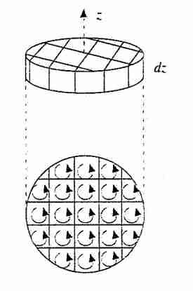
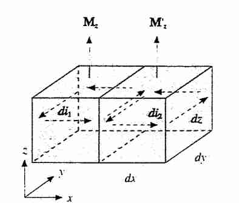
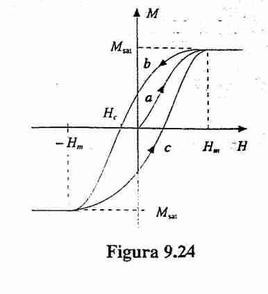

### Analisi macroscopica

#### Setting dell'esperimento 

Provare a guardare 269 del Mazzoldi. (227 per la defivazione della forza.)
Si può dimostrare che 
$$
\vec{F} = -\vec{\nabla} \cdot U \implies F 
= -\vec{\nabla}(\vec{m} \cdot \vec{B})
= \pm m \frac{dB}{dx}
$$
La prima relazione si deriva da definizione di lavoro e forza. (esteso al caso di una forza applicata su spira che non è banale, facciamola brevemente).

Sappiamo che $U = - m \cdot B$, quindi è vero che $dW = -dU = i d \Phi (B)$ e poi utilizzando una proprietà del gradiente in [[Divergenza e Circuitazione]] abbiamo
$$
Fds = dW = -dU = i \nabla \Phi(B) ds \implies F = i\nabla \Phi(B) = m \cdot \nabla B = -\nabla U
$$

La cosa da notare è che per campi uniformi abbiamo che si può definire il lavoro.

Comunque questo esperimento è stato importante per dire che se metto un materiale nella bobina, a volte viene attratta, altre volte respinta, quindi faceva pensare che esiste qualcosa nel materiale che induceva queste cose.

#### Magnetizzazione 
Considerando la forza per unità di volume si può introdurre la densità del momento magnetico, anche chiamata **magnetizzazione**.

$$
M = \frac{m}{\tau}
$$

### Campo magnetico in materiali
Possiamo misurare il campo magnetico tramite una sonda di Hall, e otteniamo se il solenoide è immerso in un campo magnetico abbiamo:
$$
\frac{B}{B_{0}} = k_{m}
$$
Simile a quanto abbiamo fatto in [[Condensatori con dielettrici]].
#### Permeabilità magnetica relativa 

$$
\mu = \mu_{0} k_{m}
$$
In modo simile a quanto fatto per la costante dielettrica.

#### Interpretazione correnti Amperiane 
Quindi vengono create delle sorte di correnti sul nostro materiale quando questa viene sommersa in un certo campo magnetico, che hanno modulo
$$
\vec{B}_{m} = \mu_{0}\chi_{m}ni
$$
Vedere pagina 272 del Mazzoldi.
Ed effettivamente ci sono delle correnti così indotte su questo materiale. Si potranno studiare da un punto di vista microscopico dopo.
#### Suscettività magnetica 
Ci dice quanto è cambiato il campo magnetico passando di mezzo, e quindi abbiamo:
$$
\chi_{m } = k_{m } - 1
$$
### Classificazione di sostanze magnetiche
#### Diamagnetiche 

Se $k_{m} < 1$
Ossia le correnti amperiane hanno verso opposto.

#### paramagnetiche 
Se $k_{m} > 1$. In cui si ha anche una dipendenza con la temperatura. A temperatura normale questo sono piccolissime

#### Ferromagnetiche 
Quando la differenza è tipo $10^{3}$, ed è una relazione non lineare.

### Considerazioni microscopiche
#### Analisi del momento angolare
Questa analisi è verso pagine 234 del Mencuccini, da fare un po' meglio.

Proviamo a considerare il modello di Rutherford (credo), in cui abbiamo un atomo centrale e poi roba (elettroni) che ci girano attorno.

Considerando un singolo elettrone abbiamo, che il momento angolare (credo si chiami così, da controllare) è
$$
\vec{L} = \vec{r} \times m\vec{v}_{e} \implies L = rm v_{e}
$$
Dove $v_{e}$ è la velocità dell'elettrone e anche  $m$ è la massa dell'elettrone.
Inoltre sappiamo, per definizione che $m = i\pi r^{2} = -\frac{evr}{2}$
Dove abbiamo preso $i = -\frac{e}{T} = -\frac{ev}{2\pi r}$ 
Combinando le equazioni del momento magnetico e della corrente elettrica si ha
$$
\vec{m}= -\frac{er}{2} \left( \frac{\vec{L}}{rm} \right) = -\frac{e}{2m} \vec{L}
$$
Dove si ha una chiara relazione fra momento magnetico (quella cosa necessaria per magnetizzazione) direttamente nel nucleo di un atomo.

#### Magnetone di Bohr
Seguendo il modello di Sommerfield-Bohr  in cui il momento angolare viene quantizzato, esiste anche un momento magnetico intrinseco dovuto allo spin dell'elettrone, che segue praticamente la stessa legge di sopra:
$$
\mu_{e} = \frac{e}{2m} \hbar 
$$
dove lo spin è uguale a $\lvert S \rvert = \frac{1}{2}\hbar$
Questa costante trovata di sopra è detta **magnetone di Bohr** che è da notare opposta al momento magnetico precedente.
Infatti nella maggior parte dei materiali questo si cancella, mentre in alcuni materiali non succede, e abbiamo il **paramagnetismo**.

#### Modello diamagnetismo
In questo modello si assume che non ci sia momento magnetico intrinseco degli atomi, si può dimostrare che abbiamo un moto di precessione:

Abbiamo

$$
\vec{M} = \vec{m} \times \vec{B} = -\frac{e}{2m} \vec{L} \times \vec{B}
$$
E che
$$
M = \frac{dL}{dt} = \vec{\omega_{L}} \times \vec{L} \implies  \vec{\omega_{L}} = \frac{e}{2m}\vec{B}
$$

Dove il secondo è una velocità angolare indotta dal campo magnetico che implica un moto di precessione. Questa è la **precessione di Larmor**.

Questa precessione di Larmor induce una corrente uguale a:
$$
\Delta i = -\frac{e}{T_{L}} = -\frac{e}{2\pi}\omega_{L} = -\frac{e^{2}}{4\pi m}B
$$
Che induce un momento magnetico
$$
\Delta m = i\pi r^{2} = -\frac{e^{2}r^{2}}{4m}B
$$
Ora conviene analizzare questo dato da un punto di vista *mean field theory* e assumere un raggio medio perché non conosciamo il valore di $r$ nell'orbita di precessione nemmeno il verso rispetto al campo magnetico esterno.
Quindi prendiamo una media, assumiamo una simmetria sferica $x^{2} + y^{2} + z^{2} = r^{2}$ che che i tre assi siano equamente equiprobabili, quindi $x^{2} = y^{2} = z^{2} = \frac{r^{2}}{3}$

Con questo abbiamo che il raggio medio sulla stessa orbita dell'elettrone (piano xy) diventa ora $r_{i}^{2} = x^{2} + y^{2} = \frac{2}{3} r^{2}$
Se messo dentro lì sopra abbiamo ora

$$
\Delta m = -e^{2} \frac{r^{2}}{6m} B
$$

E nel caso ci siano più elettroni prendiamo un raggio medio, e si avrà lo stesso valore.

#### Approccio in classe non compreso (non fare)
Possiamo da questo ricavare la velocità angolare di cui troviamo il valore sia
$$
\omega_{0} = \frac{v}{r} = \frac{L}{r^{2}m_{e}}
$$
Poi notiamo che $\vec{m} \parallel \vec{L}$ perché entrambi perpendicolari alla nostra spira-elettrone.
abbiamo poi che 
$$
i = -\frac{e}{T}, \vec{m}_{0} = -\frac{e}{T} \pi r^{2} \hat{u}_{n}, v = \omega r, L = r m_{e} \omega r = m_{e} \omega r^{2}
$$
Poi abbiamo anche che:
$$
T = \frac{2\pi}{\omega} = \frac{2\pi}{L} r^{2}m_{e}
$$
Utilizzando quanto avevamo ricavato prima sulla velocità angolare dell'elettrone.

Questo si può mettere dentro al momento magnetico
$$
\vec{m}_{0} = i \Sigma =  -\frac{e \vec{L}}{2m_{e}}
$$

Nel momento in cui una sostanza è in un campo magnetico, sarà generata una **corrente che si oppone**, e si avrà una forza repulsiva, questo c'è sempre in tutto.
> Ogni atomo crea un momento magnetico all'interno del suo atomo.

Altre cose, abbiamo che 

$$
\vec{M} = i\vec{S} \times \vec{B} = \vec{\omega_{L}} \times \vec{L}
$$
Noi dovremmo essere in grado di sapere quanto sia la corrente e la superficie e in questo modo dovrei riuscire a ricavare omega.

Le sostanze **diamagnetiche** vengono *solo respinte*. (??)

$$
\vec{m}_{L} = -\frac{e^{2}}{6m_{e}} \left( \sum_{i=1}^{z} r_{i}^{2} \vec{B} \right)
$$

Facciamo una altra analisi, fra la frequenza di Larbor e quella originale, Larbor è. Poi sapendo che $T_{0} = 1.5 \cdot 10^{-16}s$ e abbiamo che la massa è $9.1 \cdot 10^{-31} kg$.
$$
\omega_{L} = \frac{eB}{2m_{e}}
$$
E vorremmo chiederci se la frequenza di Larbor sia maggiore o minore rispetto a quella iniziale.
E si scopre in qualche modo che se $B \ll 5 \times 10^{5} T$ si avrà che il periodo di Larbor è molto piccolo rispetto a quello iniziale. E nella realtà max 100 tesla, e non si riesce a raggiungere.

Tutta la parte sopra dovrebbe essere fatta prima pagina 274 del mazzoldi.

##### Larmor --
Quando proviamo a definire il momento angolare, tramite una velocità angolare e inerzia, introduciamo la velocità angolare di Larbor

$$
\vec{M} = \vec{\omega}_{L} \times \vec{L}
$$
Questo si può mettere in relazione con 
$$
\vec{M} = \vec{m}_{0} \times \vec{B} = \vec{\omega}_{L} \times \vec{L}
$$
E troviamo il risultato
$$
\omega_{L} = \frac{eB}{2m_{e}}
$$
Con questo possiamo andare a definire un **momento di Larmor**.

Ossia:
$$
m_{L} = i_{L}S_{L} = -\frac{e}{T_{L}} S_{L}
$$
E abbiamo che 
$$
T_{L} = \frac{2\pi}{\omega_{L}} \implies \frac{4\pi m_{e}}{eB}
$$
E questo si può sostituire si sopra e otteniamo che il momento di Larbor è:

##### Precessione di Larmor --
Abbiamo detto che abbiamo un fattore di momento angolare che è dipendente dal campo magnetico, per questo motivo possiamo spiegare l'effetto del campo magnetico nel creare correnti (in questo caso l'elettrone che si muove).

#### Momento magnetico per unità di volume --
momento magnetico per unità di volume è uguale al momento magnetico del nostro atomo per il numero di atomi per unità di volume, e abbiamo un valore di **magnetizzazione** che è in pratica una corrente amperiana.
In formule:
$$
\vec{M} = \frac{\Delta \vec{m}}{\Delta \tau}, \Delta \vec{m} = <m> n
$$
Con N il numero di atomi per unità di volume e $\vec{m}$ il momento magnetico per unità di volume.

$\vec{M}$ descritto sopra è il **momento magnetico per unità di volume, chiamato anche MAGNETIZZAZIONE**.

Consideriamo ora un cilindro con un certo momento magnetico. Per un certo principio di equivalenza di Ampere, possiamo dire che il momento magnetico... (vedere pagina 275 Mazzoldi).

$$
dm = di_{m}dS\hat{u} = M dSdz\hat{u} \implies di_{m} = Mdz
$$

Ma tutte le correnti interne si elideranno, e questo sarà equivalente a un circuito esterno (una spira per dire), questo motiva anche l'utilizzo del solenoide, perché sembra simile a questo setting. Vedere [[Geometrie di spire]].

allora:
$$
i_{m} = \int  \, di_{m} = \int M \, dz = Mh  
$$
Possiamo definire il concetto di **densità lineare di corrente amperiana** come $j$ 
$$
j_{m} = \frac{i}{h} = \lvert M \rvert  = \vec{M} \times \hat{u}
$$

#### Caso Magnetizzazione non uniforme --
Questo rende la cosa un po' più compelssa perché le correnti amperiane non si cancellano. Consideriamo il setting in figura:

abbiamo che
$$
di_{1} - di_{2} = (M_{z} - M'_{z})dz = -\frac{\delta M_{z}}{dx} dxdz
$$
Così abbiamo la corrente che scorre lungo $y$ nel disegno di sopra, ma ho un contributo lungo $y$ anche dal cubo di una altra direzione!
Si può ripetere la stessa cosa, su una direzione diversa.
$$
di_{3} - di_{4} = (M'_{x} - M_{x})dx = \frac{\delta M_{x}}{\delta z}dzdx
$$
E possiamo considerare ora il valore totale:

$$
di =  di_{1} - di_{2} + di_{3} - di_{4} = \left( \frac{\delta M_{x}}{\delta z} - \frac{\delta M_{z}}{\delta x} \right) dxdz
$$
E si può estendere questo concetto il  rotore facendo praticamente la stessa cosa anche per altri e abbiamo:

$$
j = \vec{\nabla} \times \vec{M}
$$
dove $j$ è la densità lineare di corrente.

In forma integrale abbiamo:
$$
\oint_{\Gamma} \vec{M} d\vec{l} = i_{m}
$$

### Equazioni del campo magnetico revisited -

abbiamo che
$$
\oint_{\Gamma} \vec{B} \cdot d\vec{l} 
= \mu_{0} (i_{c} + i_{m}) 
= \mu_{0}i_{c} + \mu_{0} \oint_{\Gamma}  \vec{M} \cdot d\vec{l}
$$
Dove aggiungiamo anche la **corrente di ampere** oltre la corrente concatenata.

Portando dall'altra parte abbiamo:
$$
\oint_{\Gamma} (\vec{B} - \mu_{0} \vec{M}) \cdot d\vec{l} = \mu_{0}i_{c}
$$

E dividendo per $\mu_{0}$ si ha

$$
\oint_{\Gamma} \left( \frac{\vec{B}}{\mu_{0}} -\vec{M} \right) \cdot d\vec{l} = i_{c}
$$

In cui abbiamo **una altra sorgente del campo magnetico** che è dipendente dal materiale presente al campo magnetico.

#### Forma divergente 
$$
\vec{\nabla} \times \vec{B} = \mu_{0}(\vec{J} + \vec{J}_{M}) = \mu_{0}(\vec{J}_{c}  + \vec{\nabla} \times \vec{M})
= 
\vec{\nabla} \times (\vec{B} - \mu_{0} \vec{M}) = \mu_{0} \vec{J}_{c}
$$

#### Campo di magnetizzante -
In modo simile al campo di induzione elettrica o vettore di spostamento, è sensato definire una nuova dimensione
$$
\vec{H} = \frac{\vec{B}}{\mu_{0}} - \vec{M}
$$
In modo simile a quanto fatto in [[Condensatori con dielettrici]] in cui definiamo il vettore di spostamento, la cosa carina è che:
$$
\vec{\nabla} \times \vec{H} = \vec{J}_{c}
$$
E 
$$
\oint_{\Gamma} \vec{H} d\vec{l} = i_{c}
$$
Dimensione Ampere su Metro, la stessa del vettore di magnetizzazione.

#### Relazioni M, H, B --
> VALGONO SOLO PER MATERIALI NON FERROMAGNETICI!

E abbiamo anche la relazione:
$$
\vec{M} = \chi_{m} \vec{H}
$$
Poi abbiamo anche
$$
\vec{B} = \mu_{0} (\vec{H} + \vec{M}) = \mu_{0}(1 + \chi_{m}) \vec{H} = \mu \vec{H}
$$

Si ha anche la stessa relazione fra M e B rispetto a quello vecchio!

$$
\vec{M} = \frac{k - 1}{k} \vec{B}
$$

#### Discontinuità nelle superfici magnetizzate ++

Consideriamo il campo magnetico in due mezzi, queste saranno sottoposte a correnti amperiane diverse.
Applichiamo il classico cilindro sulla superficie di separazione.
Avremo allora che
$$
0 = \oint_{\Sigma}\vec{B} \cdot \hat{u}_{N} dS = B_{1}\cdot \cos \theta_{1} dS - B_{2} \cdot \cos \theta_{2} dS 
\implies B_{1} \cos \theta_{1} = B_{2}\cos \theta_{2}
$$
Ossia abbiamo che c'è una **continuità della componente normale**.
Questo possiamo dire che 
$$
k_{1} H_{1 \perp} = k_{2} H_{2\perp}
$$
E possiamo dire che la componente $H$ è discontinua.

Cambiamo setting, consideriamo un rettangolino di altezza infinitesima (anche questa stessa idea).
Allora abbiamo che 
$$
i_{c} = 0 = \oint_{\Gamma} H\cdot dS = H_{1}h - H_{2}h \implies H_{1} = H_{2}
$$
Quindi non abbiamo discontinuita per la componente tangente.
Abbiamo quindi:
$$
H_{1} \sin \theta_{1} = H_{2} \sin \theta_{2}
$$
Abbiamo quindi che c'è una **discontinuità per il campo magnetico** e il suo valore è:
$$
\frac{B_{1 \parallel}}{k_{1}} = \frac{B_{2\parallel}}{k_{2}}
$$

calcoliamo il modulo di $B_{2}$ in funzione di $B_{1}$ che mi serve per calcolare il rapporto:

$$
B_{2}^{2} = B_{1}^{2} \cos ^{2} \theta_{1} + B_{1}^{2} \frac{\cos ^{2}\theta_{1}}{\cos ^{2} \theta_{2}}
$$

Scriviamo in modo chiaro le componenti normali e non per $H$
Allora abbiamo che 

$$
H_{1t} = H_{2t}
$$
E 
$$
k_{1}H_{1n} = k_{2}H_{2n}
$$
E allora abbiamo:

$$
 \frac{\tan \theta_{2}}{\mu_{2}} = \frac{H_{2t}}{\mu_{2}H_{2n}} = \frac{H_{1t}}{\mu_{1}H_{1n}} = \frac{\tan \theta_{1}}{\mu_{1}}
$$
Quindi abbiamo che 
$$
\frac{\tan \theta_{1}}{\tan \theta_{2}} = \frac{\mu_{1}}{\mu_{2}}
= \frac{k_{1}}{k_{2}}
$$

#### Schermi magnetici 
Pensiamo di avere un materiale ferromagnetico, e facciamo finta che abbiamo campo magnetico entrante.
Per questa relazione abbiamo che probabilmente per ogni angolo, questo sarà deflesso in modo praticamente parallelo alla superficie.
E se c'è un buco, allora non ci passa praticamente campo magnetico, e possiamo costruire **schermi magnetici** in questo modo.
Quindi se il materiale del conduttore è fatto di roba ferromagnetica, questa scherma sia campo magnetico che elettrico.

### Materiale ferromagnetico

Certi materiali si magnetizzano velocemente quando si mettono vicino a campi magnetici forti

Consideriamo un toroide, uguale a quello descritto in [[Geometrie di spire]], abbiamo che quando mettiamo un materiale, $H$ non cambia, perché dipende solo da correnti concatenate.

#### Magnetizzazione in funzione di H 

Lo **stato vergine** è lo stato iniziale del materiale.
POi si ha la **curva di prima magnetizzazione** che è la curva $a$ in figura.
Per **magnetizzazione residua** si indica il valore di $M_{sat}$ quando $H = 0$ dopo aver salito la prima curva $a$.

Abbiamo questo grafico (che poi si spiega con teorie quantistiche), che se aumento la corrente oltre un certo punto la magnetizzazione non aumenta. Questo si chiama **magnetizzazione di saturazione**.
La cosa particolare è che dopo che sono state magnetizzate, questi sono **magneti permanenti**.
Si parla di **campo coercitivo** quando abbiamo un campo che fa diventare 0 la magnetizzazione.

Ciclo di isteresi di smagnetizzazione:

In pratica devo fargli fare tanti giri (senza portarlo a saturazione!)
#### Ciclo di isteresi 

È il grafico che abbiamo visto di sopra, in cui il materiale va su e giù. e si potrebbero anche definire concetti come **permeabilità differenziale** che mi rappresenta come cambia in fretta se seconda dell'induzione magnetica

$$
\mu_{d} = \frac{dB}{dH}
$$
È un diagramma di stato questo ciclo, in un certo senso come quelli descritti da [[Unified Modeling Language]].

Una altra osservazione è che posso avere tutti i punti all'interno del ciclo, ed è per questo che posso smagnetizzare un magnete. Il metodo è accende e spegnere in un certo modo $H$.

#### Materiali duri e dolci 

Dolci sono usati solamente negli elettromagneti, perché sono facili da magnetizzare.
Quelli duri sono difficili da magnetizzare, e hanno solitamente un ciclo di isteresi molto lungo.

#### Seconda legge di curie (non importante) ++

Questa è la relazione per materiali dolci, e lega la temperatura con la suscettibilità magnetica ()

$$
\chi_{m} (T - T_{c}))/\rho = C
$$
dove $\rho$ è la densità della sostanza.

#### Domini di Weiss --
Trattato pagina 316 del Mazzoldi:

Possiamo caratterizzare alcuni domini magnetici ($~10^{5}$ atomi per il prof, per il libro circa $10^{11}$ atomi, sono regioni di circa 0.001 picometri., che ha senso perché i ferromagnetici sono questo fattore più grandi rispetto agli altri., e poi vanno ad influenzare ed ingrandire, capire da Heisemberg (ma per il prof. difficili).

Una cosa strana è che $H$ dentro a un solenoide è verso giù all'interno, perché abbiamo che ... boh non ho capito però la cosa strana era che era direzione opposta.

**Solenoide infinitamente lungo**: non abbiamo vettore H perché la circuitazione è sempre 0.

