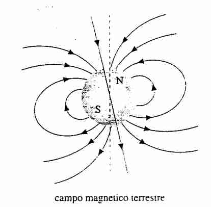
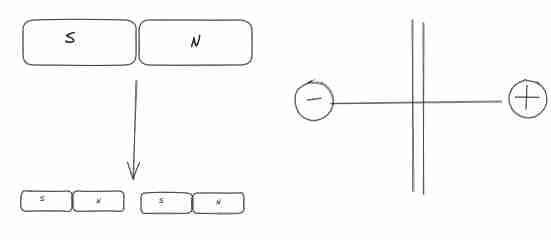
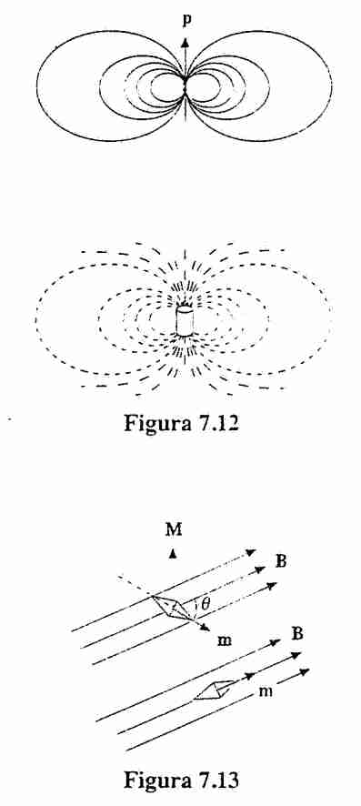
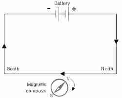
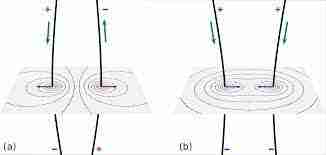
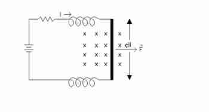
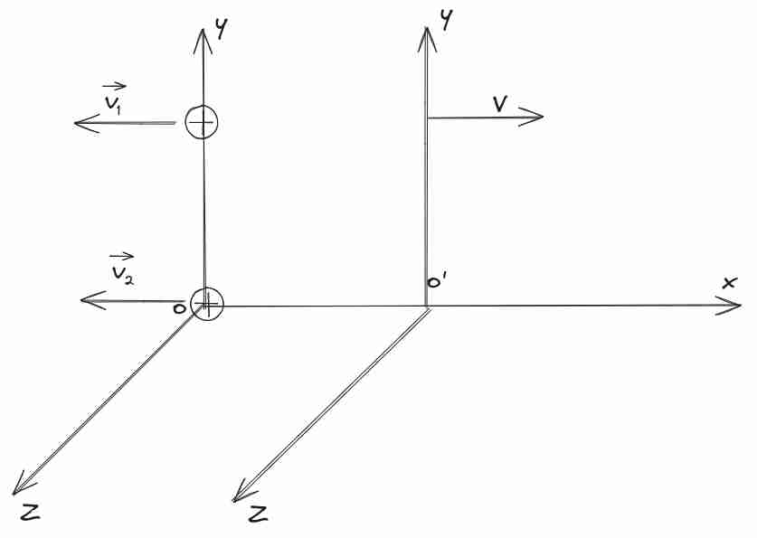
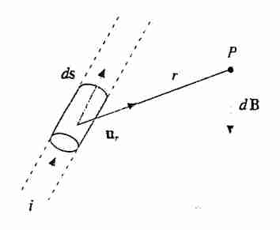

### Introduzione ai campi magnetici
#### Introduzione storica (non impo) 
Il magnetismo è stato in primi osservato e documentato da Greci, che hanno osservato che materiali metallici come *ferro*, questo è successo in *magnesia*, una penisola dell'Asia minore, mentre *elettro* era più sull'ambra, che credo fosse il nome dato a quel materiale.

Una cosa nota era che se vicino a un materiale magnetico, venivano create linee con materiale ferroso all'estremità (limatura magnetica).

Una altra cosa, conosciuta dai cinesi, era che un materiale magnetico si orientava sempre sullo stesso verso, per cui possiamo chiamare **polo magnetico** sulla barretta. E si chiamavano poli nord e sud *geografici*. Si può paragonare a un [[Dipolo elettrico]]. E permette di analizzarlo come se fosse una *carica magnetica*. abbiamo quindi un **dipolo magnetico**, almeno matematicamente analizzabile in questo modo.

Sperimentalmente si è osservato che *poli stesso segno si **respingevano*** e di valore opposto si **attraevano** in modo simile a quanto succedeva per [[Legge di Coulomb]]. Solo che in questo caso non ha senso parlare di unità di carica che la genera diciamo. C'è la teoria del *monopolo* ma poi quella non so quanto sia effettivamente vero.

Fino al 1800 questo è quanto si sapeva, dopo si ebbe uno studio sistematico, permesso da un progresso tecnologico (forse direi ingegneristico), grazie alla **pila di Alessandro Volta**, con l'inizio dello studio dei circuiti.
Con lo studio dell'interazione del campo magnetico ed elettrico si hanno i bei risultati :).
#### Campo magnetico terrestre 
La terra si comporta come un **magnete gigante** :D. E creerà momenti di dipolo per i magnetini presenti sulla superficie. ma nota: il polo sud geografico, in realtà è il **polo nord magnetico!** E anche il contrario. Esiste anche una *versione periodica (non definita)*, ogni qualche milioni di anni.
Si nota da come si sono solidificati i magma nel tempo (si solidificherà in un certo modo).
La teoria più buona è che ci sono delle specie di *dinamo* all'interno della Terra che generano il campo.

#### Il monopolo magnetico 
Se esistesse il monopolo magnetico potremmo definirlo in modo simile a Coulomb, vedi [[Legge di Coulomb]]:
$$
\lvert \vec{F} \rvert  = k_{m} \frac{C_{m}^{1}C_{m}^{2}}{r^{2}}
$$
Per il [[Dipolo elettrico]] è facile questo, basta prendere il dipolo e separarlo!
Come si fa per il monopolo?
Se taglio una calamita in due, avrò due nuove calamite, questa caratteristica continua anche a livello atomico -> **non esistono monopoli magnetici** secondo questa scia

La ricerca del monopolo magnetico è molto sentita, perché il modello standard prevede l'esistenza di questi monopoli però sperimentalmente non sono stati rilevati ancora.
Questa cosa motiva che la legge simile a Coulomb è abbastanza inutile.
NOTA: essendo la legge sperimentalmente sempre inversamente proporzionale a $r^{2}$ si può utilizzare la [[Legge di Gauss]]. Condizione necessaria per far funzionare la dimostrazione con angoli solidi.

#### L'induzione magnetica e dipolo magnetico 

Partendo da conoscenze presenti per il [[Dipolo elettrico]] possiamo andare a definire il campo magnetico come la **linea individuata dai dipoli** magnetici, perché i dipoli si allineeranno in qualche modo quando sono dentro un campo magnetico. Con la convenzione che *entra in sud ed esce in nord*.
In un certo senso il sud è equivalente al - del dipolo elettrico e il nord al +.

Questo è il campo di **induzione magnetica** chiamato $\vec{B}$ 

Figure descrittive di quanto detto sul campo magnetico, in ordine vediamo i campi, molto simili a quelli che si possono trovare per il dipolo, e l'allineamento di dipoli .
Si può anche avere un ferro di cavallo per avere un campo uniforme.

#### Campo solenoidale 
Essendo il monopolo magnetico non esistente, c'è ancora una proprietà simile alla [[Legge di Gauss]] anche nel nostro caso, ma la somma totale è sempre nullo (perché se divido un dipolo ho un altro dipolo).
$$
\oint_{\Sigma}\vec{B} \cdot \vec{s} = \frac{M_{tot}}{k} = 0
$$
Che è la definizione di un campo solenoidale, ossia sempre 0 per qualunque superficie.

Quindi immediatamente possiamo usare il teorema della divergenza -> [[Divergenza e Circuitazione]] e otteniamo
$$
\vec{\nabla} \cdot \vec{B} = 0
$$
È anche chiamata la **seconda legge di Maxwell**.

Riguardo alla circuitazione, basta prendere un percorso sulla stessa linea (il campo è sempre sullo stesso verso, anche fra i poli (cosa che invece per dipoli elettrici non è vero)), è **diverso da zero**, quindi il campo che abbiamo **non è conservativo**, questo è sempre vero per **campi solenoidali**.
Questo è quanto si sapeva all'inizio del 800, fine 700.

Ci dice che non ci sono monopoli magnetici, perché è una parte della materia (è il singolo atomo che è un dipolo, per questo si distrugge tutto), i dipoli non sono altro che **correnti** elettriche in materiali!

Da approfondire:
In Diamagnetici è Larmor in [[Magnetismo nella materia]].
In paramagnetici è corrente intrinseco
In ferromagnetici è lo spin degli elettroni

### Esperimenti storici
Facciamo una carrellata fra esperimenti storici che hanno relazionato correnti e cambi magnetici e hanno contribuito a una migliore comprensione del motivo per cui abbiamo certi fenomeni.
Attorno al 1820 questi esperimenti, poi nel 1865 **Maxwell enuncia le leggi**, in poco tempo conosciamo del tutto tutti i fenomeni di elettromagnetismo classico.
#### Esperimenti di Oersted 
> Un filo percorso da corrente genera un campo magnetico

Questo è un primo collegamento col campo elettrico! Come fanno cariche che si muovono a creare campo elettrico?

Oersted ha messo un magnete vicino a un filo. E ha osservato che se si chiude lo switch del circuito, l'ago magnetico gira.

#### Esperimenti di Faraday -
Faraday ha poi l'intuizione che un magnete più magnete è in grado di influenzare la corrente, vede che se non c'è corrente è tutto ok, non succede niente, se però ci fa scorrere corrente, vede una **forza perpendicolare al filo**.

> Un filo percorso da corrente si **comporta come un magnete**

Ossia il filo è in grado di attrarre il magnete.
#### Esperimenti di Ampere 

Ampere ha avuto l'intuizione che può trattare fili come magneti, quindi due fili con corrente vicina dovrebbero essere soggette a forza, ed è effettivamente ciò che nota.
E nota anche quanto presente in immagine: se sono verso diverso sono repulsive, altrimenti attrattive.
Questo veramente sembra motivare **l'utilizzo del filo per studiare il campo magnetico.** il vantaggio di usare questo è che
1. Facilità di costruzione rispetto alla calamita
2. La geometria del filo è sotto mio controllo
3. L'intensità di corrente è modulabile, quindi posso definire l'intensità del campo nei magneti.

#### Seconda legge di Laplace e Esperimento 
Definiamo l'esperimento come segue, una sbarretta metallica libera di scorrere fra le due e due supporti sopra, sotto abbiamo una batteria. Ci metto un dinamometro, e così ho la misura della forza esercitata sulla sbarretta metallica mi serve per **misurare la forza del campo magnetico**.

Nel nostro sistema avremo che la barretta ha lunghezza $d\vec{l}$, e una corrente che sale e scende (proprio come circuito)
Le osservazioni sono: 
1. $\lvert d\vec{F} \rvert \propto i \lvert d\vec{l} \rvert$
2. $d\vec{F} \perp d\vec{l}$
3. $\lvert d\vec{F} \rvert = f(\theta)$, dove $\theta$ è l'orientazione nello spazio di $d\vec{l}$, e ho sempre un angolo in cui è 0, che quello uscente dal piano credo.
Allora così ho definito l'interazione del campo $\vec{B}$ con un filo percorso da corrente $i$.

allora abbiamo con le osservazioni di sopra possiamo dire
**Seconda legge di Laplace**:
$$
d\vec{F} = id\vec{l} \times \vec{B} = i\lvert d\vec{l} \rvert \lvert \vec{B} \rvert \sin \theta
$$
Questo permette ricavare il *modulo della forza di B*. Posso anche misurare la direzione con l'angolo. Questo è utile per dare la definizione del campo magnetico. 
Probabilmente la forza è sulla nuvola di elettroni o portatori di carica dentro al filo quando si muovono.
Questo motiva chiedersi quanto sia la forza sul singolo elettrone che si muove:

### Campo magnetico
Anche qui vale il **principio di sovrapposizione!** vedi [[Campo elettrico]].
#### Analisi forza su cariche in movimento -

Dall'esperimento di Laplace abbiamo modo di derivare la forza esercitata sul singolo elettrone in movimento
$$
d\vec{F} = \vec{J} \cdot d\vec{S} \cdot d\vec{l} \land \vec{B}
$$
Ho che $J$ e $dS$ hanno stessa direzione e verso per costruzione, e sarebbe bene prendere stesso verso anche per la lunghezza, mi permette di scrivere $dS$ e $dl$ stesso verso, quindi è solamente uno *scalare*, e posso spostarlo in giro nel prodotto vettoriale:

$$
d\vec{F} = \vec{J} \land \vec{B} (d\vec{s} \cdot d\vec{l}) = \vec{J} \land \vec{B} d\tau
$$
Quindi ora abbiamo la forza in funzione al volume, ma io conosco il volume e conosco $J$ quindi abbiamo:
$$
d\vec{F} = nq\vec{v}_{d} \land \vec{B} d\tau
$$
Ma ricordiamo da [[Corrente Elettrica]] che $n$ è il numero di cariche per unità di volume, ma abbiamo l'unità di volume, quindi $n d\tau = N$ il numero totale di elettroni in uno spazio molto piccolo $dl$!, quindi abbiamo che

$$
d\vec{F} = dNq\vec{v}_{d} \land \vec{B}
$$
Questa è relazione diretta fra chi si muove dentro e la quantità di forza che ho!
Questa è la su un segmento di filo infinitesimale!

#### Forza di Lorentz 
Abbiamo che la forza esercitata su una singola carica è uguale a:
$$
\vec{F} = q\vec{v} \land \vec{B}
$$
$$
\lvert  \vec{F} \rvert  = \lvert q \rvert \lvert \vec{v} \rvert \lvert \vec{B} \rvert \sin \theta
$$
E la forza totale è la somma di tutte queste particelle in una sezione di filo!.
La nota importante è che una **forza perpendicolare** alla direzione della velocità, quindi è una **forza centripeta** che implica che non può cambiare il modulo della forza di $v$. può solo cambiare la *direzione*, il che implica che *non fa lavoro!*.

-> La forza di Lorentz non è posizionale, quindi **non ha senso chiedersi se è conservativa**, perché tanto lavoro è sempre 0.

-> È una forza media sul portatore di carica, perché non posso andare a misurare il singolo portatore, da un punto di vista qualitativo la forza di Laplace è molto meglio!

Questo ci permette di definire una nuova unità, che è il **Tesla**, ossia quanto campo magnetico per avere 1N di forza su una singola particella di $q$
#### Forza di Lorentz generalizzata 
possiamo generalizzare la Forza di Lorentz per una forza su una carica, dovuta ai due campi:
$$
\vec{F} = q\vec{E} + q\vec{v} \land \vec{B}
$$
Se ho due cariche che stanno ferme, tutta la teoria sviluppata in elettrostatica funziona ancora!
Se una delle due, invece, si muove c'è solo elettrostatica ancora 

### Sistema di due cariche
Se entrambe si muovono ho entrambe le forze

#### Introduzione al problema 
Una cosa strana è che **dipende dal sistema di riferimento** perché la velocità può cambiare col sistema. È un hint sulla correlazione fra i due campi. Come si può risolvere questo?
Se ho due cariche ferme, ma io mi muovo, allora per me loro si muovono entrambe, e dal mio punto di vista sono soggette anche di forza magnetica sulle cariche.

Quindi succede che per una carica ho sia forza elettrica, e anche in questo caso una forza magnetica opposta!

Mentre per il filo si vede sempre non cambiando anche sistema di riferimento!

#### Analisi della forza caso per caso  -
Proviamo ad analizzare secondo due sistemi di riferimento, una in cui il sistema è solidale con le due cariche, una altra con riferimento inerziale, con velocità $v$ lungo asse $x$.
Per il principio di relatività di galileo, dovrei osservare la stessa cosa, vediamo nei due cosa si vede.

**O:** Agisce solamente la forza di coulomb.
$$
\vec{F} = q_{1}\vec{E}_{2} = \frac{1}{4\pi\varepsilon_{0}} \frac{q_{1}q_{2}}{R_{2}} \hat{d}
$$

$O'$: dal mio sistema di riferimento, le due cariche si muovono con velocità $-v$ verso la parte opposta.
$$
\vec{v}_{1} = \vec{v}_{2} = -v
$$
Allora per la forza di Lorentz abbiamo:
$$
\vec{F}' = q_{1}\vec{E}_{2} + q_{1}\vec{v}_{1} \times \vec{B}_{2}
$$
Quindi abbiamo un campo magnetico generato dal movimento dell'altra carica in più.

Proviamo a guardare il campo magnetico generato, possiamo usare la relazione del *campo magnetico generato da singola carica e abbiamo:*
$$
\vec{B}_{2} = \mu_{0} \frac{q_{2}}{4\pi} \frac{ \vec{v}_{2} \times\hat{r}}{r^{2}}
= \mu_{0} \frac{q_{2}}{4\pi} \frac{ \vec{v}_{2} \times -\hat{k}}{r^{2}} \implies
\vec{F} = \frac{1}{4\pi\varepsilon_{0}} \frac{q_{1}q_{2}}{R^{2}} \hat{d} + \frac{1}{4\pi\varepsilon_{0}} q_{1} v \cdot \mu_{0}\varepsilon_{0} \frac{q_{2} v \cdot (-\hat{d})}{R^{2}}
$$
in cui la direzione è dentro il foglio, per il campo magnetico.
Raccogliendo l'ultima abbiamo

$$
\vec{F} = \frac{1}{4\pi\varepsilon_{0}} \frac{q_{1}q_{2}}{R^{2}} [1 - \varepsilon_{0} \mu_{0} v^{2}] \hat{d}
= \frac{1}{4\pi\varepsilon_{0}} \frac{q_{1}q_{2}}{R^{2}} \left[ 1 - \frac{v^{2}}{c^{2}} \right] \hat{d}
$$
Questo è vero perché per velocità molto piccole è simile al normale, ma la cosa strana si ha quando cominciamo ad avvicinarci alla velocità della luce, perché lì cambia! Abbiamo forze diverse in due sistemi di riferimento inerziali!

#### Correlazione E e B per relatività galileiana -
Proviamo a utilizzare la relatività galileiana (che è una legge prima presente, e affinché valga i campi elettrici e magnetici devono essere correlati), per questo ragionamento deve essere necessariamente che le due forze siano uguali, ma allora abbiamo questo risultato:
$$
\vec{F}' = \vec{F} \implies q_{1}\vec{E}_{2} = q_{1}\vec{E}_{2}' + q_{1}\vec{v}_{1} \times \vec{B}_{2}' \implies
\vec{E}_{2} = \vec{E}_{2}' + \vec{v}_{1} \times \vec{B}_{2}'
$$
Ossia che il campo elettrico cambi a seconda del sistema di riferimento, e la stessa cosa per il campo magnetico.
Proviamo a capire in che modo cambiano questi a a seconda del sistema di riferimento.
Questo lega strettamente i valori di $E$ e $B$ in due sistemi di riferimento inerziali.
Possiamo fare la stessa cosa per i campi magnetici
$$
\vec{B}_{2} = 0 = \vec{B}_{2}' - \frac{1}{c^{2}} \vec{v} \times \vec{E}_{2}'
$$
Cosa che si deriva utilizzando la relazione campo magnetico ed elettrico. Fino al 1905 si è convinti di questo.

#### Correlazione E e B per relatività ristretta (non fare).

La forza tridimensionale non è un invariante relativistico, ma la forza che conta anche il tempo. (per quella relatività non c'è problema che la forza vari).

La teoria di Einstein afferma che:
$$
\begin{cases}
F_{x}' = F_{x}  \\
F_{y}' = F_{y} \sqrt{ 1 - \frac{v^{2}}{c^{2}} } \\
F_{z}' = F_{z} \sqrt{ 1 - \frac{v^{2}}{c^{2}} }
\end{cases}
$$
Nel momento in cui la velocità è lungo $x$, quindi la forza cambia secondo la radice.
Ma nell'analisi di sopra non abbiamo il rapporto con la radice, ma velocità senza radice, come mai?
Anche qui $E$ ha dipendenze con $B$, ma le relazioni sono diverse.

E sono (li ha dati così il prof. senza giustificarli):
$$
\begin{cases}
E_{x}' = E_{x} \\
E_{y}' = \gamma [E_{y} - v B_{z}] \\
E_{z}' =  \gamma [ E_{y} + v B_{z}] \\
B_{x}' = B_{x}' \\
B_{y}' = \gamma [B_{y} + \frac{v}{c^{2} }E_{z} ] \\
B_{z}' = \gamma \left[  B_{z} - \frac{v}{c^{2}} E_{y} \right]
\end{cases}
$$
Dove $\gamma = \frac{1}{\sqrt{ 1 - \frac{v^{2}}{c^{2}}} }$
Applicando queste trasformazioni nel nostro sistema a due cariche abbiamo che

$$
E_{y}' = \gamma E_{y} = \frac{\gamma}{4\pi\varepsilon_{0}} \frac{q_{2}q_{1}}{R^{2}}
$$
E che 
$$
B_{z}'  = \frac{\gamma v}{c^{2}} E_{y}
$$
E possiamo sostituirli dentro la legge generale di Lorentz per la forza finale, che è simile a quella versione di Galileo, un po' differente

$$
F' = q_{1}\gamma E_{y} + q_{1}v \frac{\gamma v}{c^{2}} E_{y} 
= \gamma q_{1} E_{y}\left( 1 + \frac{v^{2}}{c^{2}}\right)
= q_{1}E_{y} \sqrt{ 1 + \frac{v^{2}}{c^{2}} }
$$
Questo valore è proprio il valore predetto come trasformazione secondo la relatività?

### Prima legge di Laplace

#### Prima legge di Laplace 

Vogliamo sapere esattamente quale sia il valore del campo magnetico generato da un filo.
Il piccolo tratto di energia sarà di valore
$$
d\vec{B} = \frac{\mu_{0}i}{4\pi} \frac{d\vec{l} \times \hat{r}}{ r^{2}}
$$
Questa è la **prima legge di Laplace**.

**Osservazioni**:
1. Perpendicolare sempre a l e r, quindi al piano del nostro disegno
2. Permette di capire quale sia il modulo del campo magnetico, e si nota che cade su $\frac{1}{r^{2}}$ che è la cosa che permette l'utilizzo della legge di gauss per i monopoli magnetici
3. Sulla congiungente della retta dl, il valore del campo magnetico è 0!

#### Permeabilità magnetica del vuoto 
Il valore di $\mu_{0}$ verrà trovato sperimentalmente, e sarà: 
$$
\text{permeabilità magnetica del vuoto}: \mu_{0} = 4\pi \times 10 ^{7} \, \frac{Tm}{A}
$$
Scoperta direi in modo simile a quanto fatto per permeabilità elettrica nel vuoto! Per [[Legge di Coulomb]]

Il valore del campo magnetico e la forza di un altro filo definiscono il comportamento *qualitativo* per i campi magnetici!

#### Campo magnetico totale 
Per trovare il valore basta sommare tutti i contributi!

$$
\vec{B} = \int _{Filo} d\vec{B} = \int _{Filo} \frac{\mu_{0}i}{4\pi}  \frac{d\vec{l} \times\hat{r}}{r^{2}}
$$
In modo simile a quanto fatto in [[Campo elettrico]], se siamo in regime stazionario, la $i$ può essere portata fuori dall'integrale 

#### Campo magnetico da singola carica  +
La definizione precedente, con il $4\pi$ ci permette anche di scrivere in una forma carica utilizzando la densità di corrente [[Corrente Elettrica]].
$$
id\vec{l} = \vec{J} \cdot d\vec{s} d\vec{l} = \vec{J} \cdot d\tau = nq\vec{v}_{d} d\tau
= Nq\vec{v}_{d}
$$
Quindi ha un valore generato dal **totale di cariche** in movimento in un unità di volume infinitesimo.
Questa osservazione ci permette di scrivere la seconda legge in relazione alla **velocità di deriva**:
E isolare anche il campo magnetico per singola carica!

$$
\vec{B} = \frac{\mu_{0}q}{4\pi} \frac{\vec{v}_{d} \times\hat{r}}{r^{2}} 
$$

Da qui osserviamo che se si muovono più in fretta allora il campo magnetico va più in fretta! E sappiamo che la velocità è dipendente dal campo elettrico da cui sono sottoposti.

#### Legame col campo elettrico +
Dalla formula di sopra possiamo trovare la relazione col campo elettrico ponendo che 
$$
\vec{E} = \frac{1}{4\pi\varepsilon_{0}} \frac{q\hat{r}}{r^{2}}
\implies
\frac{q}{r^{3}} = \vec{E} 4\pi\varepsilon_{0}
$$
E questo valore si può sostituire sopra, e diventa
$$
\vec{B} = \frac{\mu_{0}\vec{v}_{d}}{4\pi} \times \vec{E} 4\pi\varepsilon_{0} 
= \mu_{0}\varepsilon_{0} \vec{v}_{d} \times \vec{E} = \frac{1}{c^{2}} \vec{v}_{d} \times \vec{E}
$$
E la relazione stupenda è con la velocità della luce, e si nota come queste sono veramente costanti fondamentali dell'universo!?
È da notare però che questo vale solo per valori della velocità tali per cui siano molto minori rispetto alla velocità della luce. (regimi non relativistici).

