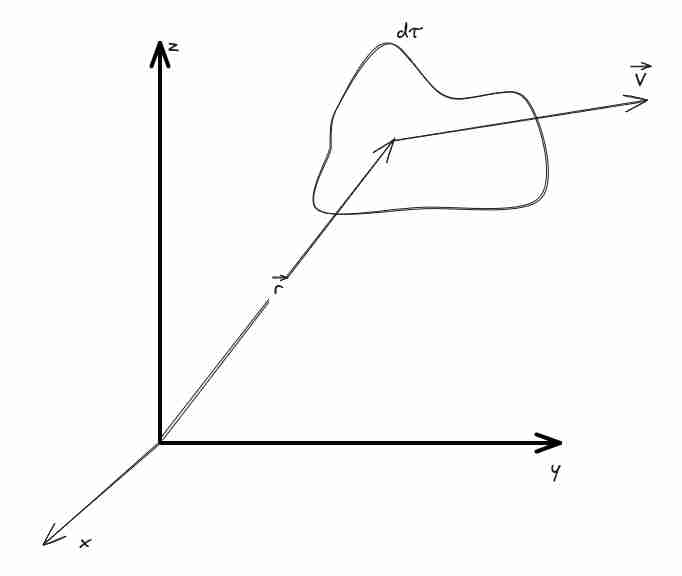

Prendiamo 
La legge di Ampere-Maxwell
$$
\vec{\nabla} \times \vec{B} = \mu_{0}\vec{J} + \mu_{0}\varepsilon_{0} \frac{\delta \vec{E}}{\delta t} 
$$
E la legge di Faraday neumann Lenz
$$
\vec{\nabla} \times \vec{E} =  - \frac{\delta \vec{B}}{\delta t}
$$
Con questi abbiamo le onde elettromagnetiche.

Nel vuoto possiamo dire che *non abbiamo densità di corrente*, per questo posso andare nel vuoto, sono due cose che si autosostengono.
Sono **simmetriche a meno di costante**.

Questo ci dice che
1. Preso un campo elettrico che varia nel tempo (tipo una carica oscillante).
2. Questo mi dice che si genera un campo magnetico prima non esistente
3. Questo campo che varia nel tempo va a creare un altro campo elettrico
4. Quindi abbiamo un processo che continua così all'infinito sostenendosi.
In queste due equazioni abbiamo la luce.

2 circuitazioni
2 Leggi di gauss
e le 4 equazioni di Maxwell sono in grado di descrivere tutti i fenomeni elettromagnetici.

#### Note storiche dei progressi in elettromagnetismo
Il risultato curioso il fatto che sembrasse relazionato alla velocità della luce quella costante. Poi 1885 Hertz dimostra l'esistenza delle onde elettromagnetiche (quindi soggetti ai fenomeni delle onde, come l'interferenza, e si capisce che sono la stessa cosa con la luce.
Una altra cosa curiosa è che tutto elettromagnetismo è fatto senza sapere l'esistenza di elettroni (solo all'inizio del '900 abbiamo iniziato a comprendere meglio come sono fatti e sono iniziati anche prodotti forti con queste)
1930 Fermi a Roma ha fatto una conferenza per la scoperta dell'elettrone da Thompson (Rutherford ha scoperto di più su atomi, il mini sistema planetario), in questa conferenza si studia i neutroni (che non esistevano), e si inizia a comprendere meglio la materia.
Strana cosa era che dal nucleo venivano emessi elettroni (questo è il decadimento radioattivo? Non si sapeva del neutrone, qui ).

### Teorema di Poynting

#### Setting del problema 

Consideriamo una distribuzione di cariche $dq = \rho dt$ che dipende dalla posizione $\rho = \rho(\hat{r}t)$, stessa cosa per la velocità in un campo elettromagnetico costante.
Voglio sapere il **lavoro** e **potenza** fatto dai campi sulla carica.

Applichiamo la legge di lorentz (ricorda [[Magnetismo]])
$$
\vec{F} = q\vec{E} + q\vec{v} \times \vec{B}
\implies
df = [\rho \vec{E} + \rho \vec{v}\times \vec{B}]d\tau
$$
Questa è la forza esercitata sul volumetto $d\tau$ 
Sapendo che la potenza è relazionata alla forza in modo conosciuto, sappiamo che 
$$
dW = d\vec{f} \cdot \vec{v}
\implies dW =  [\rho \vec{E}\cdot \vec{v} + \rho \vec{v}\times \vec{B} \cdot \vec{v}]d\tau
$$
Possiamo notare che **il campo B** non fa lavoro, perché la forza è perpendicolare al percorso (e lo si vede anche in formule, perché abbiamo un prodotto vettore seguito da uno scalare), da questo abbiamo che
$$
dW = \rho \vec{E} \cdot \vec{v} d\tau
$$

Ora, sapendo che $\vec{J} = ne\vec{v} = \rho \vec{v}$ (la seconda parte vale perché $n$ è il numero di particelle per unità di volume, mentre $\rho$ è la carica per unità di volume e assumendo la cosa corpuscolare è solamente la somma)
Allora abbiamo
$$
dW = \vec{J} \cdot \vec{E} d\tau
$$
Questa è la stessa formula, calcolata in modo diverso in [[Leggi di Ohm]] quando calcolavamo la potenza

#### Derivazione con Ampere e Faraday (tosta) 
Usando la legge di Ampere-Maxwell, presente in [[Ampere e Faraday]], possiamo continuare questa esplorazione.
$$
\vec{\nabla} \times \vec{B} = \mu_{0}\vec{J} + \mu_{0}\varepsilon_{0} \frac{\delta \vec{E}}{d\tau}
\implies
\vec{E}\cdot[\vec{\nabla} \times \vec{B}] = \mu_{0}\vec{E}\cdot\vec{J} + \mu_{0}\varepsilon_{0} \frac{\delta \vec{E}}{d\tau} \cdot \vec{E}
\implies
\vec{J} \cdot \vec{E} = \frac{1}{\mu_{0}} \vec{E}\cdot[\vec{\nabla} \times \vec{B}]  - \varepsilon_{0} \frac{\delta \vec{E}}{d\tau} \cdot \vec{E}
$$
Ora proviamo ad analizzarlo pezzo per pezzo, partiamo dalla parte magnetica e elettrica 

$$
\vec{\nabla} \cdot (\vec{E} \times \vec{B}) = (\vec{\nabla}\times \vec{E}) \cdot \vec{B} - (\vec{\nabla} \times \vec{B}) \cdot \vec{E}
\implies
(\vec{\nabla} \times \vec{B}) \cdot \vec{E} = - \vec{\nabla} \cdot (\vec{E} \times \vec{B}) + (\vec{\nabla}\times \vec{E}) \cdot \vec{B}
$$
Ora utilizziamo la legge di Faraday in [[Magnetismo]] in forma differenziale e otteniamo
$$

(\vec{\nabla} \times \vec{B}) \cdot \vec{E} = - \vec{\nabla} \cdot (\vec{E} \times \vec{B}) + \left( -\frac{\delta \vec{B}}{d\tau} \right) \cdot \vec{B}
$$
Questo risultato possiamo metterlo nella parte di sopra e così abbiamo espanso la prima parte (urca quanti calcoli però)

$$
W_{\tau} = \vec{J} \cdot \vec{E} = -\frac{1}{\mu_{0}} \vec{\nabla} \cdot (\vec{E} \times \vec{B}) + \frac{1}{\mu_{0}} \left( -\frac{\delta \vec{B}}{d\tau} \right) \cdot \vec{B}
 - \varepsilon_{0} \frac{\delta \vec{E}}{d\tau} \cdot \vec{E}
$$

Ora dobbiamo fare altre osservazioni strambe: -
$$
\frac{\delta B^{2}}{\delta t} = \frac{\delta}{\delta t} (\vec{B} \cdot \vec{B}) = \vec{B} \cdot \frac{\delta}{\delta t}(\vec{B}) + \frac{\delta}{\delta t}(\vec{B}) \cdot \vec{B} = 2 \vec{B} \frac{\delta}{\delta t}\vec{B}
$$

Questo ci permette di sostituire nelle forme di sopra come derivate seconde:

$$
W_{\tau} = \vec{J} \cdot \vec{E} = -\frac{1}{\mu_{0}} \vec{\nabla} \cdot (\vec{E} \times \vec{B}) - \frac{1}{2\mu_{0}} \frac{\delta B^{2}}{dt}
 - \frac{1}{2}\varepsilon_{0} \frac{\delta E^{2}}{dt}
$$

Questa è la **potenza trasferita** dai campi elettrici e magnetici a un volumetto $d\tau$ che si muove con velocità $v$ nello spazio.

Vogliamo sapere energia totale trasferita da $\vec{E}$ e $\vec{B}$ per far questo basterebbe integrare sul nostro volume:

$$
\int dW  = \int \vec{J} \cdot \vec{E} \, d\tau 
=  -\int   \frac{1}{\mu_{0}} \vec{\nabla} \cdot (\vec{E} \times \vec{B}) \, d\tau - \frac{1}{2}\int \left(  \frac{1}{\mu_{0}} \frac{\delta B^{2}}{dt}
 + \varepsilon_{0} \frac{\delta E^{2}}{dt}\right) d\tau
$$
Proviamo ad utilizzare il **teorema della divergenza** perché gli integrali di volume sono brutti.

Da questo sappiamo:
$$
 -\int_{\tau}   \frac{1}{\mu_{0}} \vec{\nabla} \cdot (\vec{E} \times \vec{B}) \, d\tau
 = - \int_{\Sigma(\tau)}   \frac{1}{\mu_{0}}\cdot (\vec{E} \times \vec{B}) \, d\vec{S}
$$

Quindi riscrivendo ancora abbiamo:
$$
\int_{\tau} dW  = \int_{\tau} \vec{J} \cdot \vec{E} \, d\tau 
=   - \int_{\Sigma(\tau)}   \frac{1}{\mu_{0}}\cdot (\vec{E} \times \vec{B}) \, d\vec{S}
- \frac{1}{2}\int_{\tau} \left(  \frac{1}{\mu_{0}} \frac{\delta B^{2}}{dt}
 + \varepsilon_{0} \frac{\delta E^{2}}{dt}\right) d\tau
$$
**Attenzione**: a volte tau è usato come tempo a volte come volume (fai attenzione a distinguerli bene)

#### Formulazione e interpretazione finale +

$$
W =  - \int_{\Sigma(\tau)}   \frac{1}{\mu_{0}}\cdot (\vec{E} \times \vec{B}) \, d\vec{S}
- \frac{\delta}{dt}\int_{\tau} \left(  \frac{1}{2\mu_{0}} B^{2}
 + \frac{\varepsilon_{0}}{2} E^{2}\right) d\tau
$$

Abbiamo due termini che descrivono il trasferimento di energia.
1. Energia trasferita alla distribuzione di carica dai campi $E$ e $B$, ossia abbiamo
Il concetto di **densità volumetrica di energia elettromagnetica**, quella che abbiamo studiato separatamente in [[Condensatori nel vuoto]] e [[Geometrie di spire]] (tipicamente sono statici questi campi)
 $$
du =  \frac{1}{2\mu_{0}} B^{2}
 + \frac{1}{2} \varepsilon_{0}E^{2}
$$
Che ha senso (somma di due energie, somma classica)), perché l'energia trasferita è uguale al valore dei campi in un certo *punto preciso* (somma dell'energia dei campi E ed B dentro al volume).

2. Si parla di integrale su una superficie chiusa che contiene il volume, e abbiamo un vettore perpendicolare ai campi $E$ e $B$, rappresenta **flusso del vettore di Poynting**, che è una **energia proveniente da fuori**. (tipicamente sono onde elettromagnetiche, perché entrano, forniscono energia, ed escono) -> **ONDA ELETTROMAGNETICA TRASPORTA ENERGIA**.

In pratica è un Or logico, l'energia o è presa da dentro, o da fuori, il primo termine è il dentro, il secondo è il fuori. Concettualmente è semplice, la derivazione è complessa e utilizza molte cose di algebra e analisi.

#### Il vettore di Poynting 
Possiamo definire ora il vettore di Poynting come
$$
S' = \frac{1}{\mu_{0}} \vec{E} \times \vec{B}
$$
in un certo senso è una densità superficiale di potenza elettromagnetica, perché per avere la potenza devo moltiplicare la superficie. Forse è con questo che utilizzo per costruire pannelli solari, è l'energia che riscalda al sole, che impatta superficie :D.

Energia per unità di tempo e superficie trasportata da una onda.

#### Quantità di moto 
Si può dimostrare che è
$$
d\vec{P} = \mu_{0}\varepsilon_{0} \vec{S}' d\tau
$$
Quantità di moto per unità di tempo e volume! Per questo posso far muovere oggetti sparandoci laser!

### Nel vuoto
Abbiamo che
$$
\vec{\nabla} \cdot \vec{E} = 0
$$
$$
\vec{\nabla} \cdot \vec{B} = 0
$$
$$
\vec{\nabla} \times \vec{E} = - \frac{\delta \vec{B}}{\delta t}
$$
$$
\vec{\nabla} \times \vec{B} = \mu_{0}\varepsilon_{0} \frac{\delta \vec{E}}{\delta t}
$$

Consideriamo $\vec{\nabla} \times \vec{\nabla} \times \vec{E} = -\vec{\nabla} \times  \frac{\delta \vec{B}}{\delta t}$
Si può vedere che

$$
-\nabla^{2}\vec{E} = -  \frac{\delta (\vec{\nabla} \times\vec{B})}{\delta t}
= -\mu_{0}\varepsilon_{0} \frac{ \delta^{2}\vec{E}}{\delta t^{2}}
$$
Che dovrebbe essere una equazione di onda.

#### Equazioni di D'Alambert -
$$
\nabla^{2}\vec{E} = \mu_{0}\varepsilon_{0}\frac{ \delta^{2} \vec{E}}{\delta t^{2}}
$$

E uguale per il campo magnetico:
$$
\nabla^{2}\vec{B} = \mu_{0}\varepsilon_{0}  \frac{\delta^{2}\vec{B}}{\delta t^{2}}
$$

Queste si possono scomporre, e abbiamo equazioni differenziali al secondo grado:
$$
\frac{\delta^{2}E_{x}}{\delta x^{2}} + \frac{\delta^{2}E_{y}}{\delta y^{2}} + \frac{\delta^{2}E_{z}}{\delta z^{2}}= \mu_{0}\varepsilon_{0}\frac{ \delta^{2} \vec{E}}{\delta t^{2}}
$$

In cui abbiamo anche la **velocità di propagazione** delle onde, infatti abbiamo che
$$
\mu_{0}\varepsilon_{0} = \frac{1}{v^{2}} \implies v = \frac{1}{\sqrt{ \varepsilon_{0}\mu_{0} }} = c
$$

Solo alla fine dell'800 si capisce che la luce è questo.

#### Extra: frontiers
Ma ci sono alcuni problemi aperti.
In gravitazione ho precessione di Mercurio che metteva sotto problema le predizioni della gravità di Newton.

1. Carica accelerata emette energia (come fa a non collassare nel nucleo?).
2. Radiazione corpo nero (problema di conservazione dell'energia (catastrofe ultravioletta)).
3. Non si sa in quale sistema di riferimento C valga

1. Espansione accelera
2. Neutrini non hanno massa zero
3. Galassia ruota in modo costante, nonostante rallentare.
4. Energia del vuoto predetto male da quantistica.

